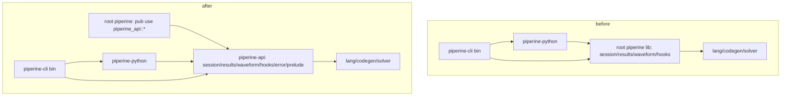

# api-crate Design

**Spec**: `.specs/features/api-crate/spec.md`
**Status**: Approved (constraints MD-20 as amended 2026-07-18)

---

## Architecture Overview

Pure relocation + shell. No behavior change anywhere.

No cycle: nothing depends back on the shell; root keeps a dev-dependency on
`piperine-python` for `tests/run_examples.rs` (dev-deps don't cycle).

## Code Reuse Analysis

| Component | Location | How to Use |
|---|---|---|
| Entire host API | root `src/{session,results,waveform,hooks,error,prelude}.rs` | `git mv` into `crates/piperine-api/src/` — content untouched except crate-internal paths (`crate::…` stays valid, files move together) |
| Root tests of record | root `tests/` | Untouched — they import `piperine::…`, which the shell re-exports |
| Workspace manifest | root `Cargo.toml` | Add member `crates/piperine-api`; root package deps shrink to `piperine-api` |

### Integration Points

| System | Integration Method |
|---|---|
| `piperine-python` | `Cargo.toml`: `piperine-api = { path = "../piperine-api" }`; `use piperine::` → `use piperine_api::` in `src/*.rs` |
| `piperine-cli` | Same retarget for any host-API import (grep-driven) |
| Docs | `CLAUDE.md` crate table row for `piperine-api` + root-as-shell; `docs/spec/part_viii_host_api.md` Rust-face section |

## Components

### `crates/piperine-api`

- **Purpose**: The complete external Rust view — session, results, waveform,
  lifecycle hooks, error, prelude re-exports of lang/codegen/solver faces.
- **Location**: `crates/piperine-api/src/`
- **Interfaces**: unchanged public surface (`SimSession`, `SolverConfig`,
  `OpResult`, `NetRef`, `Trace`/`AcTrace`/`NoiseTrace`, `Waveform`,
  `SimHooks`, `Error`, `prelude`).
- **Dependencies**: piperine-lang, piperine-codegen, piperine-solver,
  thiserror, num-complex (copy the exact dep list root uses today).
- **Reuses**: everything — this is a move.

### Root `piperine` (shell)

- **Purpose**: Name preservation for Rust hosts (`use piperine::…`).
- **Location**: `src/lib.rs` (only file)
- **Interfaces**: `pub use piperine_api::*;` — re-exports items *and* public
  modules (`prelude`, `session`, …) because they are `pub mod` in the api
  crate.
- **Dependencies**: piperine-api (+ dev: piperine-python, ngspice-test deps
  for `tests/`).

## Error Handling Strategy

| Error Scenario | Handling | User Impact |
|---|---|---|
| Missed re-export (item not covered by `pub use *`) | Impossible for public items of the api crate root; compile error in root tests otherwise | None — gate catches |
| Stale `use piperine::` inside python/cli after retarget | Compile error (root no longer a dependency of those crates) | None — gate catches |

## Risks & Concerns

| Concern | Location | Impact | Mitigation |
|---|---|---|---|
| `pub use piperine_api::*` does not re-export the *macro* namespace or items added later at api root only if they are `pub` | root `src/lib.rs` | A future non-`pub` addition silently absent from shell | None needed now (no macros); note in shell doc comment |
| Root package name/version published semantics (crates.io later) | root `Cargo.toml` | Shell must version-lock api | Post-V1 packaging concern; noted only |
| Doc drift (CLAUDE.md says root is the library face) | `CLAUDE.md`, part VIII | Confuses future agents | API-07 task updates both |

## Tech Decisions

| Decision | Choice | Rationale |
|---|---|---|
| Move mechanics | `git mv` root `src/*.rs` (except `lib.rs`) into the new crate | Preserves history; content identical |
| Root tests location | Stay in root, import via `piperine::` | Doubles as the shell's parity proof (API-03/AC2) |
| cli imports | Retarget to `piperine_api::` directly | Shell is for external hosts; in-repo crates use the real crate |
