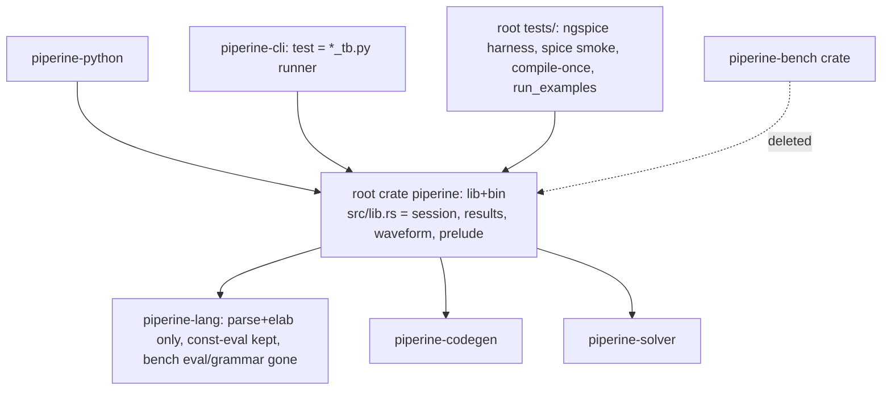

# bench-removal Design

**Spec**: `.specs/features/bench-removal/spec.md`
**Status**: Approved (user 2026-07-17)
**Sequencing**: execute after `solver-live-params` lands.

## Architecture Overview

Migration order matters: plumbing moves first (root lib), consumers retarget,
THEN the bench grammar/interpreter dies (fixtures with bench blocks must be
ported before the keyword stops parsing).

## Code Reuse / Move Map

| Today | Destination | Notes |
|---|---|---|
| `piperine-bench/src/session.rs` (SimSession, SolverConfig, run_op/tran/ac/noise/op_sweep, param staging) | root `src/session.rs` | Staging = param setting, NOT bench-specific — keep. Drop bench-task hooks (`fire_after_solve` bench callbacks) |
| `piperine-bench/src/objects.rs` + `waveform.rs` | root `src/results.rs` + `src/waveform.rs` | Result objects python wraps (PY-17 shapes frozen) |
| `piperine-bench/src/error.rs` (BenchError) | root `src/error.rs` as `piperine::Error` | Rename; no "bench" in names |
| `piperine-bench/src/{host,tasks,runner,plugins}.rs` (SimHost, BenchTask, BenchRunner) | **deleted** | Bench interpreter machinery |
| `piperine-bench/tests/{ngspice_validation.rs, ngspice/, spice_smoke.rs, spice/, compile_once_sweep.rs, run_examples.rs}` | root `tests/` | Fixtures with bench blocks ported to session-API calls / `.py` |
| `piperine-bench/tests/bench.rs` | **deleted** | Tests the thing being removed |
| `piperine-lang` `parse/` bench AST + grammar, `elab` benches, `eval/` Host trait + `tasks.rs` allowlist + statement interpreter | **deleted** | Keep the expression **const-eval** elab uses to pre-fold params/defaults — split verified by keeping all elab tests green |
| `piperine-cli/commands/test.rs` (BenchRunner) | rewritten: discover `*_tb.py` (project root + `tests/`), run via the same embedded-CPython path as `piperine run`, per-file report, timeout, nonzero exit on failure | User-decided contract |
| `piperine-plugin` BenchTask extension surface + manifest schema entries | **deleted**; manifest with bench tasks → loud "bench removed" error | CLI-script tier untouched |
| `piperine-python` dep `piperine-bench` | dep on root `piperine` lib | Root lib target stays lean; if the root's cli/bindgen weight leaks into the lib build, feature-gate the bin side |

## Components

### 1. Root library face (`src/lib.rs`) — lib-only (amended 2026-07-17)
- `pub mod session; pub mod results; pub mod waveform; pub mod error;`
  plus a `prelude` re-exporting the public faces (lang `parse_and_elaborate`/
  `Design`, codegen `CircuitCompiler`/`CompiledModule`, solver `prelude`).
  Workspace-level MD-17: root = the complete external view.
- **Root is lib-only.** The original lib+bin plan is a cargo package cycle:
  root(bin)→piperine-cli→piperine-python→root(lib) (cli embeds CPython via
  python for `piperine run`; lib/bin targets share one `[dependencies]`).
  Resolution (user choice B): `src/main.rs` moves to `piperine-cli` as
  `[[bin]] name = "piperine"`; root drops its cli/project deps and gains
  lang/codegen/solver. `cargo build --workspace` still emits
  `target/debug/piperine`; `cargo install` targets `crates/piperine-cli`.
- Dependency flow (acyclic): `root(lib) → {lang, codegen, solver}`;
  `python → root(lib)`; `cli → {python, root(lib), project}` + bin.

### 2. Language cleanup (piperine-lang)
- Remove: `bench` keyword/lexing, AST nodes, elab pass, `Design::benches()`,
  `eval/` interpreter+Host+tasks. Keep: const/param folding used by elab and
  codegen fn-inliner defaults.
- Grammar removal is total (user choice): a `bench` block is a generic parse
  error.

### 3. CLI `test`
- Discovery: `**/*_tb.py` under project root and `tests/` (no recursion into
  `.venv`/`target`). Runs each in order; captures traceback; per-file
  PASS/FAIL summary; timeout per file (default generous, e.g. 300 s);
  exit 1 on any failure; "no testbenches found" → exit 0 with notice.

### 4. Python sanitation + docs
- Sweep facade + pyclasses for bench-era vocabulary; docstrings everywhere
  public; a Python test walks the facade asserting `__doc__` non-empty and
  stub/impl parity.
- `docs/spec/`: host-API part/appendix covering load→Design→Module→analyses→
  results→LiveSession→CLI (`run`/`-i`/`test`), runnable snippets tested by
  run_examples where practical.

## Error Handling

| Scenario | Handling |
|---|---|
| `.phdl` with bench block | plain parse error (keyword unknown) |
| plugin manifest declaring bench tasks | loud "bench removed; use python testbenches" at manifest load |
| `_tb.py` raises / times out | traceback shown / killed; file FAIL; exit 1 |
| root lib pulling cli weight into python build | feature-gate bin-only deps |

## Risks & Concerns

| Concern | Impact | Mitigation |
|---|---|---|
| const-eval entangled with bench interpreter in `eval/` | breaks elaboration | split proven by full elab/codegen suites; T-order puts lang cleanup after consumers stop needing bench |
| spice_smoke fixtures are bench-block PHDL | lose smoke coverage | port to session-API Rust tests before grammar removal (same assertions) |
| PY-17 result shapes drift during move | breaks python users | shapes frozen; python tests + 21 examples as regression net |
| root lib+bin + bindgen build script complicates `piperine-python` dep | slow/fragile builds | measure; feature-gate if needed (design allows) |
| live-params LiveSession lands on piperine-python meanwhile | merge friction | this feature branches from live-params HEAD; sequencing enforced |

## Tech Decisions

| Decision | Choice | Rationale |
|---|---|---|
| Library face location | root crate lib target | User: complete external view at root |
| Testbench convention | `*_tb.py` | User choice |
| Grammar removal | total | User choice |
| BenchError → `piperine::Error` | rename on move | no bench vocabulary survives |

Project-level: root-crate-as-library-face is a new convention — record as
MD-19 in `.specs/STATE.md` when execution starts.
