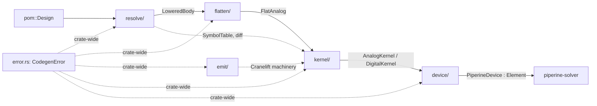

# Codegen Architecture Refactor Design

**Spec**: `.specs/features/codegen-architecture/spec.md`
**Status**: Draft — awaiting user review

---

## Approaches Considered (lead with recommendation)

All three deliver the same scoped thing (readability refactor, zero functional
change); they differ in how far the module tree is reshaped.

| # | Approach | Pros | Cons | Verdict |
| - | -------- | ---- | ---- | ------- |
| **A** ⭐ | **Pipeline-stage modules** — top-level `resolve` / `flatten` / `emit` / `kernel` / `device`; god-files/struct decomposed within | Tree = pipeline; MD-13 r4 satisfied ("glance → know where"); dissolves the confusing `jit`+inner-`codegen` pair | Most file moves; cross-crate call-site churn from dropping `ir` alias | **Recommended** |
| B | **Split-in-place** — keep `lower`/`jit`/`codegen`/`device`, only split god-files/struct inside each | Least churn | Keeps the false `jit` vs `codegen` split and the `codegen`-inside-`codegen` name — fails MD-13 r4; the core readability complaint survives | Reject |
| C | **Domain split** — reorganize by `analog/` vs `digital/` instead of by stage | Groups analog things together | Cross-cuts every pipeline stage (resolve/emit/kernel each have both domains); worse locality; a bigger, riskier move | Reject |

Approach **A** is detailed below. Confirm before Tasks.

---

## Architecture Overview

The crate compiles a resolved POM into solver `Element`s through four stages.
The target module tree names each stage, one module per stage:



- **`resolve`** owns the resolved form and the POM→resolved pass (was `lower`).
- **`flatten`** owns resolved-analog → `FlatAnalog` (was `jit/flatten.rs`).
- **`emit`** owns the reusable Cranelift emission machinery (`Builder`,
  `Codegen`, expr/stmt emission, CSE, `SimCtx` ABI) (was `codegen/`).
- **`kernel`** owns the compiled products `AnalogKernel`/`DigitalKernel`, which
  drive `emit` (was `jit/analog.rs` + `jit/digital/`).
- **`device`** owns kernels-as-`Element`s + `CircuitCompiler` (unchanged home).
- **`error.rs`** (crate root) owns `CodegenError`.

### File-move map (source → target)

| Current | Target | Note |
| ------- | ------ | ---- |
| `lower/` (mod, expr, stmt, symbols, diff, pom/) | `resolve/` (same files) | rename module; drop `pub use lower as ir` |
| `jit/flatten.rs` | `flatten/analog.rs` (+ `flatten/mod.rs`) | promote the stage out of `jit` |
| `jit/mod.rs` → `CodegenError` | `error.rs` (crate root) | fix `ModuleNotFound` message (drop "IrProgram") |
| `jit/mod.rs` → `SimCtx` | `emit/abi.rs` | analog JIT ABI belongs with emission |
| `codegen/builder.rs` | `emit/builder.rs` + `emit/resolver.rs` + `emit/stmt.rs` + `emit/cse.rs` | split by responsibility (see Components) |
| `codegen/analog_emit.rs` | `emit/analog_expr.rs` | split the 594-line `emit_analog` by expr category |
| `codegen/trait_.rs` (`Codegen` trait) | `emit/digital_expr.rs` | name by function, not `trait_` |
| `jit/analog.rs` (`AnalogKernel`) | `kernel/analog/` (mod + capability files + compile) | decompose god-struct |
| `jit/digital/` (compile, network, abi, layout) | `kernel/digital/` (same files) | move under `kernel` |
| `device/analog.rs` (1595) | `device/analog/` (mod + forces/limits/operators/events) | split by **capability** (`Stamps` trait seam) |
| `device/circuit.rs` (888) | `device/circuit.rs` + `builder.rs` + `fusion.rs` + `plugin.rs` | split by **responsibility** |
| `device/provider.rs` | folded into `device/plugin.rs` | plugin concern belongs with plugin assembly |
| `device/{mod,digital}.rs` | unchanged homes | `PiperineDevice` stays flat (MD-01) |

---

## Code Reuse Analysis

### Existing components to leverage

| Component | Location | How to use |
| --------- | -------- | ---------- |
| Existing test suite (analog_jit, digital_jit, codegen_ir, from_ir, silent_bugs, ngspice_validation, session) | `crates/piperine-codegen/tests/`, root `tests/` | The behavioral net — must stay green **unchanged** at every commit; this is the refactor's safety harness |
| `AnalogFn` (compiled-function handle) | `jit/analog.rs` | Reused as-is inside the capability sub-structs; only the *grouping* changes |
| `Codegen` trait + `Builder` | `codegen/` | Machinery is sound; only relocated/split, not rewritten |
| `LoweredBody`, `SymbolTable`, `NodeId` | `lower/` | The resolved contract is stable; `resolve` is a rename, not a redesign |
| MD-13 idiom rules | STATE.md | The acceptance bar for every changed file |

### Integration points

| System | Integration method |
| ------ | ------------------ |
| `piperine-solver` | consumes `device::PiperineDevice : Element` + `CircuitCompiler`; unaffected by internal moves except items it imports (relocated behind the same `lib.rs` re-exports) |
| `piperine-api` / root / cli | build circuits via `CircuitCompiler`; keep the `lib.rs` façade stable so hosts don't churn |
| sibling crates importing `piperine_codegen::ir::…` | must switch to `piperine_codegen::resolve::…` in the same commit that drops the alias (CGA-02 edge case) |

---

## Components

### `error` (crate root)

- **Purpose**: The single crate-wide error type.
- **Location**: `crates/piperine-codegen/src/error.rs`
- **Interfaces**: `enum CodegenError { ModuleNotFound, Invalid, Module, Unsupported, ConstEval, Function }`; `CodegenError::unsupported(impl Into<String>)`.
- **Dependencies**: `thiserror`.
- **Reuses**: the current enum verbatim; **fix** `ModuleNotFound` message (remove "in IrProgram"); audit for overlapping variants (`Invalid` vs `Unsupported` vs `ConstEval`).

### `resolve` (was `lower`)

- **Purpose**: POM → resolved codegen-private form (interned ids, symbolic diff) + the POM→resolved pass.
- **Location**: `crates/piperine-codegen/src/resolve/`
- **Interfaces**: `lower_bodies`, `LoweredBody`, `SymbolTable`, `AnalogBody`, `DigitalBody`, `Port`, `diff::*` — **unchanged signatures**, new module path.
- **Dependencies**: `piperine_lang::pom`.
- **Reuses**: everything; this component is a rename + alias removal, no logic change.

### `flatten`

- **Purpose**: Resolved `AnalogBody` → `FlatAnalog` (contributions/forces/events/noise/ac_stim hoisted for emission).
- **Location**: `crates/piperine-codegen/src/flatten/analog.rs`
- **Interfaces**: `AnalogFlattener::new(&LoweredBody)`, `AnalogFlattener::flatten() -> Result<FlatAnalog, CodegenError>`; the `Flat*` structs.
- **Dependencies**: `resolve`, `error`.
- **Reuses**: `jit/flatten.rs` moved verbatim; only its home changes.

### `emit` (was `codegen`)

The reusable Cranelift emission machinery, split by responsibility:

- **`emit/builder.rs`** — `Builder<'a,'f,'m>` (Cranelift `FunctionBuilder`
  wrapper) + `Tape`; `new_analog`/`new_digital` constructors; low-level arith,
  quad logic, control flow. *Owns: the Cranelift function under construction.*
- **`emit/resolver.rs`** — `Resolver` (name→id), `Typed`, `DigTy`. *Owns: name
  resolution + typed-value tagging.*
- **`emit/stmt.rs`** — `Builder::emit_stmt`, `emit_guarded_block`,
  `emit_if_branch`. *Owns: statement-level emission.*
- **`emit/analog_expr.rs`** — `Builder::emit_analog`, split into private
  category helpers (arithmetic, `V`/`I` access, call/syscall, conditional,
  literal) dispatched by a lean top matcher. *Owns: analog expression emission.*
- **`emit/digital_expr.rs`** — the `Codegen` trait + `impl Codegen for Expr`
  (was `trait_.rs`). *Owns: digital expression emission contract.*
- **`emit/cse.rs`** — `CseKey`, `SimField`, `expr_structural_eq`. *Owns:
  common-subexpression bookkeeping.*
- **`emit/abi.rs`** — `SimCtx` (the `#[repr(C)]` analog JIT ABI struct).
  *Owns: the live-simulator ABI record.*
- **Dependencies**: `resolve`, `error`, Cranelift.
- **Reuses**: all logic verbatim; `emit_analog` and `builder.rs` are *split*,
  not rewritten — same emitted IR.

### `kernel` (was `jit/analog.rs` + `jit/digital/`)

- **Purpose**: The compiled products; each drives `emit` at compile time and
  exposes a fixed-ABI eval surface at run time.
- **Location**: `crates/piperine-codegen/src/kernel/analog/`, `kernel/digital/`
- **Interfaces**: `AnalogKernel::compile(&LoweredBody)`, the `eval_*` surface
  (residual/jacobian/charge/force/noise/limit/ac_stim/state) — **unchanged
  signatures**; `DigitalKernel::compile`.
- **Dependencies**: `flatten`, `emit`, `resolve`, `error`.
- **Reuses**: the compile logic and FFI wrappers verbatim; only regrouped (see
  Data Models). `kernel/analog/compile.rs` holds the long compile routine;
  `kernel/analog/mod.rs` holds the lean struct + eval dispatch.

### `device` (decomposed — in core scope)

Kernels as solver `Element`s + circuit assembly. The two god-files split along
different axes — `analog.rs` by **capability**, `circuit.rs` by
**responsibility**.

- **`device/mod.rs`** — `PiperineDevice` (the flat `Element`/`AnalogDevice`/
  `DigitalDevice`/`Introspect` impls) + `CompiledModule`. *Unchanged role; the
  `Element` object stays flat — MD-01 is preserved, capability traits are
  internal, never new Element facets.*
- **`device/analog/`** (was `device/analog.rs`, 1595) — `AnalogInstance` split
  by capability, each owning its runtime state **and** its MNA stamping:
  - `device/analog/mod.rs` — `AnalogInstance` (core: terminals, `collect_volts`,
    `eval_rhs_jac`, `nodal_stamps`, the `load_dc`/`load_ac`/`load_transient`/
    `noise_current_psd` dispatch that folds each capability's stamps).
  - `device/analog/forces.rs` — `ForceStamper` (`force_stamps`,
    `force_branch_target`).
  - `device/analog/limits.rs` — `Limiter` (`limited_volts`, `update_limits`,
    `limiting_active`).
  - `device/analog/operators.rs` — `Operator` (delay/slew/transition, `accept`,
    `pending_edges`).
  - `device/analog/events.rs` — `EventDetector`, `apply_event_actions`,
    `fire_initial_events`.
  - (reactive/ac_stim stamping stays inline in `mod.rs` where it is a few lines
    inside `load_transient`/`load_ac`, unless it earns its own file.)
- **`device/circuit.rs`** split by responsibility:
  - `device/circuit.rs` — `CircuitCompiler` (public: `compiled`,
    `build_circuit*`, kernel cache).
  - `device/builder.rs` — `InstanceBuilder` (`add_instance`,
    `resolve_connections`, `resolve_overrides`, `node_identifier`, `finish`).
  - `device/fusion.rs` — `FusionCandidate` + `fuse_comb_cones`.
  - `device/plugin.rs` — `add_plugin_instance` + `provider.rs` contents
    (`DeviceProvider`, `PluginDeviceSpec`, …).
- **Interfaces**: `PiperineDevice`, `CircuitCompiler`, `CompiledModule`,
  `AnalogInstance`, `DigitalInstance` — **unchanged signatures**, new file homes.
- **Reuses**: all stamping logic verbatim; regrouped, not rewritten.

---

## Data Models — `AnalogKernel` decomposition (CGA-04)

Today: one struct, ~40 fields, capability presence tracked by `Option<AnalogFn>`
scattered among terminals/params/limits/forces/noise + `has_reactive()`-style
bool-ish queries. Target: a lean core + one `Option<CapabilityStruct>` per
optional analog capability. **Option-presence IS the capability contract.**

```rust
struct AnalogKernel {
    core: AnalogCore,                 // always present
    reactive: Option<Reactive>,       // ddt/charge path
    forces:   Option<Forces>,         // V-source / branch forces
    limits:   Option<Limits>,         // $limit (pnjlim/fetlim)
    noise:    Option<Noise>,          // noise sources
    ac_stim:  Option<AcStim>,         // ac_stim rows
    events:   Vec<CompiledEvent>,     // (already collection-shaped)
    diagnostics: Vec<FlatDiagnostic>,
    runtime_states: Vec<RuntimeStateSpec>,
}

struct AnalogCore {                   // the residual system every device has
    terminals: Vec<NodeId>,
    digital_terminals: Vec<bool>,
    read_bounds: (usize, usize, usize),
    param_names: Vec<String>,
    presence_mask: u64,
    residual: AnalogFn, jacobian: AnalogFn, state_inputs: AnalogFn,
    num_vars: usize, num_state_slots: usize,
}

struct Reactive { charge: AnalogFn, charge_jacobian: AnalogFn,
                  ac_idt_jacobian: Option<AnalogFn>, flux_terms: Vec<(usize,NodeId,NodeId)> }
struct Forces   { terminals: Vec<(NodeId,NodeId)>, value: AnalogFn, jacobian: AnalogFn,
                  ac_mag: Option<AnalogFn>, ac_phase: Option<AnalogFn>,
                  current_terms: Vec<(usize,NodeId,NodeId)>, initial_conditions: … }
struct Limits   { base: usize, update: AnalogFn, seed: AnalogFn, vnew: AnalogFn,
                  branches: Vec<Option<(Option<usize>,Option<usize>)>> }
struct Noise    { source: AnalogFn, terminals: Vec<(NodeId,NodeId)>, exponents: Option<AnalogFn> }
struct AcStim   { terminals: Vec<(NodeId,NodeId)>, mag_phase: AnalogFn }
```

- `has_reactive()` → `self.reactive.is_some()`; `has_force_current()` →
  `self.forces.as_ref().is_some_and(|f| !f.current_terms.is_empty())`; every
  `has_*` bool query becomes a presence/emptiness check on the sub-struct.
- The `eval_*` methods stay on `AnalogKernel` (same signatures) but delegate
  into the relevant `Option` capability — an empty capability path is a no-op,
  identical to today's `None`/`has_*==false` branch.
- **Layout**: one file per capability under `kernel/analog/`
  (`reactive.rs`, `forces.rs`, `limits.rs`, `noise.rs`, `ac_stim.rs`), the
  struct + eval dispatch in `mod.rs`, the compile routine in `compile.rs`.

**Relationships**: each capability struct is produced by `compile.rs` from the
`FlatAnalog` (flatten stage) and consumed by `device::AnalogInstance` via the
unchanged `eval_*` surface — so the decomposition is invisible below the ABI.

---

## Capability Traits (the decomposition tool, CGA-04/05)

A capability spans **two sides**: compiled data in `kernel/analog/` and runtime
stamping in `device/analog/`. Each side gets a small trait so the god-struct
and god-file split *along the capability seam* instead of by accident. Both
traits are **internal to codegen** — they are NOT new `Element` facets; the
solver-facing `Element` object stays flat (MD-01 upheld, no downcast, no
per-capability trait objects crossing the ABI).

**Kernel side** — what a compiled capability *is*:

```rust
/// A compiled analog capability: JIT'd functions + the terminal/branch
/// metadata the stamper needs. Presence of the capability == `Some(_)`.
trait AnalogCapability {
    /// Slots this capability reads from the state/vars banks (for read_bounds).
    fn read_bounds(&self) -> ReadBounds;
}
```

Implemented by `Reactive`, `Forces`, `Limits`, `Noise`, `AcStim`. `compile.rs`
builds each from `FlatAnalog`; `AnalogKernel` holds them as `Option<T: AnalogCapability>`.

**Instance side** — how a live capability *stamps* MNA:

```rust
/// One capability's contribution to an MNA load at a given analysis point.
/// `AnalogInstance::load_dc/ac/transient` iterate the present capabilities
/// and fold their stamps — no monolithic 200-line load method.
trait Stamps {
    fn stamp(&self, cx: &LoadCtx<'_>, volts: &[f64], out: &mut StampSink);
}
```

Implemented by `ForceStamper`, `Limiter` (voltage limiting is a pre-stamp
transform of `volts`, so it may instead impl a narrower `VoltTransform`), and
the nodal/reactive cores. `load_dc` becomes: limit volts → eval residual/Jac →
`nodal.stamp()` → `forces.stamp()` — each line names a capability.

> **Refinement note:** the exact method set (`stamp` vs per-analysis
> `stamp_dc/ac/tran`, and whether `Limiter` is a `Stamps` or a `VoltTransform`)
> is settled during implementation against the real load paths — the *principle*
> (each capability owns its stamping, `load_*` folds them) is the locked
> contract; the trait signature is allowed to adjust to fit without a redesign.
> A capability that would force an awkward trait shape stays a plain struct
> method rather than a contrived trait (MD-13 r1 over cargo-culting traits).

---

## Error Handling Strategy

| Scenario | Handling |
| -------- | -------- |
| A lowering/emission cannot be represented | `CodegenError::Unsupported` (fail loud) — unchanged; only the type's home moves |
| Stale `ModuleNotFound` message ("in IrProgram") | Corrected to name the real lookup (module map), CGA-07 |
| Overlapping variants (`Invalid`/`Unsupported`/`ConstEval`/`Function`) | Audited during the move; merge only if provably 1:1 in use — else left as-is (behavior-neutral bar) |
| Cross-crate build break mid-refactor | Every commit updates all call sites it touches; `cargo build --workspace` green per commit |

---

## Risks & Concerns

| Concern | Location | Impact | Mitigation |
| ------- | -------- | ------ | ---------- |
| God-struct decomposition could subtly change a stamping branch | `jit/analog.rs` eval_* + `device/analog.rs` | wrong DC/tran/ac result | Each `has_*`→`Option` rewrite is 1:1; the full solver/ngspice suite must stay green per commit; no test weakened |
| Dropping `ir` alias ripples cross-crate | `lib.rs:26` + importers | build break | Grep all `::ir::`/`as ir` sites, fix in the same commit (CGA-02) |
| `emit_analog` split might reorder emission and change CSE / float results | `codegen/analog_emit.rs:25` | numeric drift | Split extracts pure sub-matchers with no reordering; `analog_jit.rs` value-for-value tests guard it |
| `device/analog.rs` (1595) & `device/circuit.rs` (888) are god-files | `device/` | the core readability debt | **In scope** — split by capability (analog) / responsibility (circuit); capability traits are the seam. Suite green per commit guards the stamping equivalence |
| Capability-trait shape may not fit every load path cleanly | `device/analog/` load_* | over-engineered trait | Principle locked (each capability stamps itself), trait signature refined against real code; a plain method is allowed where a trait would be contrived (MD-13 r1) |
| Item visibility could widen during moves | all split files | leaky surface | Default `pub(crate)`/private; re-export only through `lib.rs` façade; CGA edge case |
| Large mechanical diff hard to review | whole crate | review fatigue | Phase the work: contracts → renames → god-struct → god-fns, one atomic commit per task, suite green each step |

---

## Tech Decisions (non-obvious)

| Decision | Choice | Rationale |
| -------- | ------ | --------- |
| Module tree shape | Pipeline stages (Approach A) | MD-13 r4: glance at tree → know the stage; dissolves `jit`/inner-`codegen`. **Confirmed (user).** |
| Capability modeling | Per-capability **`Option<struct>` that implements a capability trait** (`AnalogCapability`) | MD-13 r1: presence *is* the contract; the trait gives each capability an owned stamping/compile method (see "Capability Traits"). **Confirmed (user — traits explicitly wanted).** |
| `SimCtx` home | `emit/abi.rs` | it is the analog emission ABI, not a `jit/mod.rs` catch-all |
| `CodegenError` home | crate-root `error.rs` | crate-wide contract; a stage module is the wrong owner |
| Public surface | **Single tidy `lib.rs` façade** (re-export the host-facing set) | codegen has **one** deliverable (unlike the solver's two → MD-17); a two-tier `prelude`/`abi` split would be ceremony. **Confirmed (user).** |
| `device/` decomposition | **In core scope** — `device/analog.rs` split by capability, `device/circuit.rs` by responsibility | god-files are "SUPER important" to fix; capability traits are the tool. **Confirmed (user — no defer).** |
| No macros / every helper owned | Enforced on every changed file | MD-13 r2, r5 |

> **Project-level decision to record:** only the **pipeline-stage module
> convention** becomes an `AD-NNN` in STATE.md (user choice). The
> capability-trait pattern is applied here but **not** locked as a global
> `AD-NNN` — it stays a feature-local design choice, free to evolve.

---

## Decisions Resolved (user review, 2026-07-20)

1. **Module names** — `resolve` / `flatten` / `emit` / `kernel` / `device`.
   **Accepted.** `lower` dropped (ambiguous name).
2. **Public surface** — single tidy `lib.rs` façade. **Accepted** (one
   deliverable; solver's two-tier split doesn't apply).
3. **`device/` god-files** — **in scope, no defer.** Decompose
   `device/analog.rs` (by capability) and `device/circuit.rs` (by
   responsibility); introduce capability traits as the decomposition tool.
4. **`AD-NNN`** — record **pipeline-stage modules only**; capability-trait
   pattern stays feature-local.
