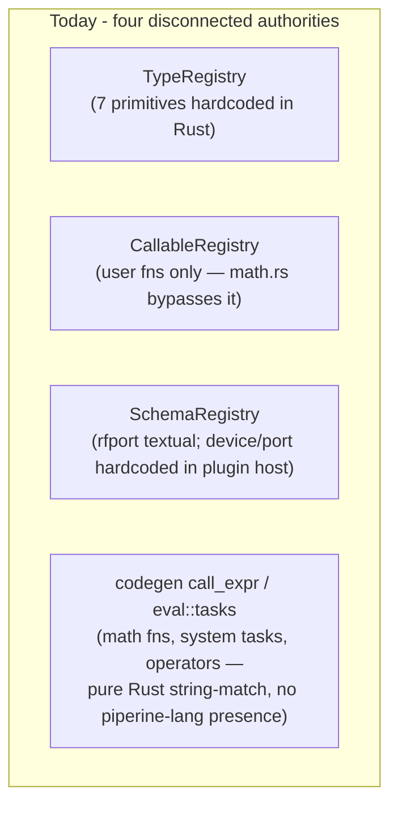
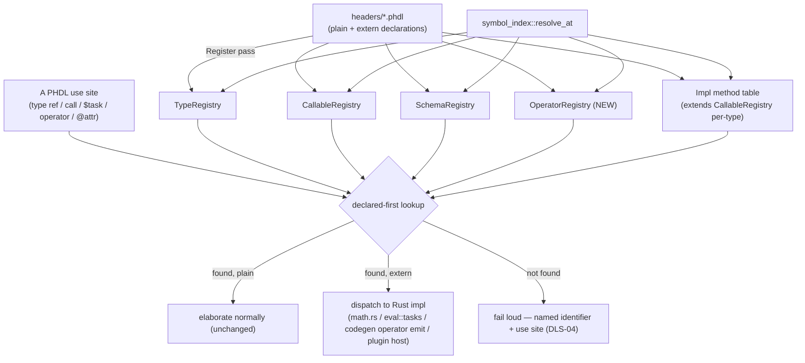

# Declared Language Surface Design

**Spec**: `.specs/features/declared-language-surface/spec.md`
**Context**: `.specs/features/declared-language-surface/context.md`
**Status**: Draft — awaiting user review

---

## Approaches Considered (lead with recommendation)

| # | Approach | Pros | Cons | Verdict |
| - | -------- | ---- | ---- | ------- |
| **A** ⭐ | **Existing registries become the single source of truth.** `TypeRegistry`/`CallableRegistry`/`SchemaRegistry` already exist and already anchor plain declarations; `extern` declarations register into the *same* tables (tagged `Extern`), sourced by parsing headers instead of hand-populating Rust tables. One new registry (`OperatorRegistry`) for runtime operators, which have no `piperine-lang`-level presence at all today. | Reuses proven infra; "declared-first" falls out for free — there is only ever one lookup path per kind, so nothing to keep in sync; smallest conceptual surface. | Requires touching each existing registry's population site (`ElabContext::new()`, plugin host, math/tasks/operator dispatch) — a real but bounded, mechanical migration. | **Recommended** |
| B | **New parallel `ExternRegistry`, consulted as a fallback alongside the existing ones.** A single new table holds all `extern` decls; lookup tries plain declarations, then `ExternRegistry`, then (still) the old Rust tables if neither hits. | Least code touched per file. | Leaves the exact hole this feature exists to close: a name can still resolve through a Rust table with zero textual declaration, "just in case." Fails DLS-01/04 outright. | Reject |
| C | **One monolithic `NameRegistry`** unifying types/callables/tasks/operators/attributes into a single map keyed by name. | Single lookup call everywhere. | Collapses structurally different contracts (a `CallableDef::validate_call` arity check is not the same shape as `SchemaShape`'s field list) into one lossy enum; violates MD-13 r1 (contracts first — the type itself should express what a "type name" vs "attribute schema" is, not a shared blob). | Reject |

Approach **A** is detailed below.

---

## Architecture Overview

Today, four independent authorities decide whether a name exists, and three
of them never consult text at all:



Target: every one of these becomes **populated from parsed declarations**
(plain or `extern`), and codegen/eval stop being resolution authorities —
they become *implementation lookups* for names elaboration already proved
exist:



Native Rust code (`math.rs`'s `MATH_FNS`, `eval/tasks.rs`'s `Task` impls,
codegen's `call_expr`/operator emission, the plugin host's schema
registration) stops being *asked* "does this name exist" — it becomes a
*keyed-by-name implementation table* that the already-resolved `extern`
declaration's binding points into. Existence and shape are decided once, at
the registry.

---

## Code Reuse Analysis

### Existing components to leverage

| Component | Location | How to use |
| --------- | -------- | ---------- |
| `TypeRegistry` / `TypeDefKind` | `elab/registry/types.rs` | Add `TypeDefKind::Extern { decl_span }`; `ElabContext::new()`'s hardcoded `prims` list is replaced by parsing `extern type` decls from a stdlib header (P4). |
| `CallableRegistry` / `CallableDef` | `elab/registry/callables.rs` | Already the right shape for `extern fn`; extend `CallableDef` (or add a sibling impl) for `ExternFnDecl`, carrying a `decl_span` and enough type info for arity/type validation (today `validate_call` is a stub returning `Ok(())` — needs a real body). |
| `SchemaRegistry` / `SchemaShape` | `elab/registry/schemas.rs` | Already has `Declared(Vec<AttrField>)` — the exact shape `extern attribute` needs. Add a `decl_span` to `SchemaShape::Declared`/`AttrField` so LSP can resolve it; `@rfport`'s current hardcoded `register_declared` call becomes "parse `extern attribute rfport {...}` instead." |
| `ComponentRegistry` pattern (`register`/`lookup`/trait-object-per-entry) | `elab/registry/components.rs` | Structural template for the new `OperatorRegistry` — same `register`/`lookup` shape, different payload. |
| `ElabPass` pipeline (`Register`, `AttachBehaviors`, `ResolveCalls`, `Typecheck`) | `elab/lower/passes.rs` | `extern` declarations are just another top-level item the `Register` pass indexes — no new pass *stage*, existing passes gain extern-aware branches. |
| `symbol_index::resolve_at` + `Resolution { decl_span, kind }` | `piperine-lang-server/src/symbol_index.rs` | Same return shape already used for module/param/wire/instance/etc — add match arms for the four registries + operator + impl-method lookups; no new LSP protocol surface, `goto_def.rs` needs zero changes (it already just forwards `decl_span`). |
| `ImplDecl` AST node (`impl [Capability for] TypeRef { fn ... }`) | `parse/ast.rs:366` | `extern impl` reuses this shape; only the "body-less method, `extern` flag" addition is new grammar. |
| Diagnostic system-task validation (`resolve.rs:25`'s hardcoded `valid_diagnostics` list) | `elab/resolve.rs` | Folded into the P4 system-task migration — this is a *second*, disconnected hardcoded list for the same category (`$display`/`$strobe`/…) found during Specify; migrating system tasks to `extern task` collapses both into one textual source. |

### Integration points

| System | Integration method |
| ------ | ------------------- |
| `piperine-codegen` (`emit::builder::call_expr`, `emit::analog_expr`, `flatten/analog.rs`'s operator recognition) | Stops string-matching for *existence* — receives an already-resolved "this identifier is `extern operator ddt`" fact from the POM (via a resolved-call annotation, see Data Models) and only looks up *how* to emit it. |
| `piperine-lang`'s `eval/tasks.rs`, `eval/interp.rs`, `math.rs` | `MATH_FNS`/`Task` impls become implementation tables keyed by name, populated once and cross-checked at registration time against the `extern fn`/`extern task` declarations (a native impl with no matching `extern` decl is a *build-time* assertion failure — a Rust-side bug, distinct from DLS-04's PHDL-authoring error, see Error Handling). |
| `piperine-plugin`'s `host.rs` (`register_declared("device", …)`) | Replaced by parsing a stdlib-shipped `extern attribute device {...}`/`extern attribute port {...}` header (P4-AC5); plugin-contributed dynamic schemas (P4-AC6) additionally parse each loaded plugin's published `extern.phdl` stub through the *same* `SchemaRegistry` population path. |
| `piperine-project` (header/module resolution, `use spice::…`) | Extern stub import mechanism (Context's "Agent's Discretion" item) resolved here: **recommend** auto-import — a loaded plugin's `extern.phdl` stub is parsed into the project's `ElabContext` alongside the stdlib headers, no explicit `use` required (mirrors how `headers/spice/` is available via `use spice::…` without per-plugin ceremony beyond the existing plugin-load step). |

---

## Components

### Grammar: `extern` modifier (P2)

- **Purpose**: Parse the six `extern` forms into distinct, span-carrying AST
  nodes.
- **Location**: `crates/piperine-lang/src/parse/` (lexer keyword `extern`,
  parser productions alongside existing `fn`/`mod`/`impl`/`bundle`).
- **New AST types** (see Data Models) — signature-only variants of the
  existing `FnDecl`/`ImplDecl` shapes plus two new leaf forms (`type`,
  `attribute` fields already mirror `bundle`'s field-list grammar).
- **Interfaces**: `ExternDecl` variants each carry `decl_span: SourceSpan`
  covering the full declaration; `ExternImpl`'s methods each carry their own
  `decl_span`.
- **Dependencies**: existing lexer/parser infra only — no new crate.
- **Reuses**: `FnParam`, `TypeRef`, existing `Attribute`/bundle-field parsing.

### Registry extensions (P1 mechanism)

- **Purpose**: Make `TypeRegistry`/`CallableRegistry`/`SchemaRegistry` (and
  the new `OperatorRegistry`) the single lookup path per kind, populated from
  parsed declarations only.
- **Location**: `crates/piperine-lang/src/elab/registry/`.
- **Interfaces**:
  - `TypeRegistry::register(TypeDefKind::Extern { name, decl_span })`,
    `lookup` unchanged signature (types are not overloadable — one type per
    name, unlike callables).
  - `CallableRegistry` becomes **overload-aware** (added 2026-07-21, per
    user decision): `callables: HashMap<String, Vec<Box<dyn CallableDef>>>`
    — every `register` call *appends* a candidate instead of replacing one.
    `register` accepts `FnDecl` (today, unchanged) and new
    `ExternFnDecl`/`ExternTaskDecl` implementing `CallableDef` with a real
    `validate_call` (full param-type match, not arity-only — required to
    disambiguate overloads, see Overload Resolution component below).
  - `SchemaRegistry::register_declared` gains a `decl_span` parameter;
    `AttrField` gains `decl_span` per field (so a field name inside
    `@device(plugin = …)` can itself resolve, not just the schema name).
    Attribute schemas are **not** overloadable (one schema shape per name).
  - **New** `OperatorRegistry` (mirrors `ComponentRegistry`'s
    `register`/`lookup` shape, **also overload-aware**:
    `HashMap<String, Vec<ExternOperatorDecl>>`): `register(ExternOperatorDecl)`,
    `lookup_candidates(name) -> &[ExternOperatorDecl]`. Lives alongside the
    other four in `ElabContext`.
  - **New** per-type impl-method table, **overload-aware**:
    `HashMap<(String, String), Vec<Box<dyn CallableDef>>>` keyed by
    `(type_name, method_name)` — `register_impl_method(type_name, method:
    ExternFnDecl)` / `lookup_impl_method_candidates(type_name, method_name)
    -> &[...]`, since `extern impl`'s methods are namespaced by their owning
    type, not global like `extern fn`.
- **Dependencies**: the `Register` `ElabPass` (extended, not replaced) walks
  `extern` items exactly as it walks `mod`/`fn`/`bundle` today; duplicate-name
  registration is no longer automatically a conflict — see Overload
  Resolution component for what *is* still a conflict (identical signature
  twice).
- **Reuses**: `ElabPass` pipeline, `ElabContext` struct shape.

### Overload resolution (added 2026-07-21, folds into P1)

- **Purpose**: Pick the correct candidate when a name (`fn`, `extern fn`,
  `extern task`, `extern operator`, or an `extern impl`/`impl` method) has
  more than one registered signature — the mechanism casts need for a single
  overloaded `TypeName::from(x)`, and any future multi-signature `fn`/`extern
  fn`/`extern impl` benefits identically.
- **Location**: `elab/resolve.rs` (the call-resolution path), shared by every
  registry kind that stores `Vec<CallableDef>`.
- **Why it's sound here** (the user's own reasoning, verified): by the time a
  call site is resolved, its argument expressions have already been
  const-evaluated/type-resolved (module instantiation resolves `const_args`/
  `type_subst` before body elaboration) — so candidate selection needs only
  *forward* type matching against already-concrete argument types, never
  bidirectional inference. This is materially simpler than general-purpose
  overload resolution (e.g. C++/Rust trait method resolution with inference)
  precisely because PHDL's elaboration order already eliminates the hard
  case.
- **Algorithm**: for a call `name(arg1, arg2, …)` against candidates
  `[C1, C2, …]` (all sharing `name`, arity may also differ — arity mismatch
  simply excludes a candidate, same as a type mismatch):
  1. Filter candidates whose arity matches `args.len()`.
  2. Among those, filter candidates whose declared param types structurally
     match each argument's resolved type (exact match; no implicit
     widening — mirrors the existing "implicit cast from Integer to Real not
     allowed" rule proven in `type_casts.rs`).
  3. Zero survivors → fail loud, naming the call site and **every** original
     candidate's signature (so the author sees what *was* available and why
     none fit).
  4. Exactly one survivor → that's the resolution; proceed exactly as a
     non-overloaded call would today.
  5. More than one survivor → fail loud as an **ambiguous call**, naming
     every matching candidate (this can only happen if two candidates have
     structurally identical param types — a duplicate-signature registration,
     itself rejected earlier at `Register`-pass time per "Registry
     extensions," so in practice this is a defensive backstop, not an
     expected runtime path).
- **Interfaces**: a single resolution helper, e.g. `CallableRegistry::resolve(
  name: &str, arg_types: &[ValueType]) -> Result<&dyn CallableDef, ElabError>`,
  reused verbatim by `OperatorRegistry` and the impl-method table (same
  algorithm, different backing map).
- **Dependencies**: requires argument types to already be resolved at the
  call-resolution point — confirms Open Design Item #2 below (full type
  matching, not arity-only, is no longer a "leaning," it's load-bearing).
- **Reuses**: `ValueType` (already the type PHDL expressions carry post
  const-eval/typecheck), the existing "duplicate declaration" error path for
  the identical-signature-twice case.

### Fail-loud resolution rule (P1)

- **Purpose**: Replace "silently defer to a Rust table" with "declared-first,
  else fail loud" at every call/reference site.
- **Location**: `elab/resolve.rs` (`resolve_calls_in_expr` — today only
  special-cases cast names), `elab/typecheck.rs` (type-reference resolution),
  a new pass step for system-task/operator identifiers.
- **Behavior**: For `Expr::Call(Ident(name), args)` and `$name(args)` /
  operator-shaped calls, the resolver now does exactly one lookup chain:
  user `fn`/`impl` method (existing) → `CallableRegistry`/`OperatorRegistry`/
  `SchemaRegistry` entry (plain or extern) → **fail loud** naming `name` and
  the call site. No branch reaches `math.rs`/`eval/tasks.rs`/codegen's
  operator match without first passing through this lookup.
- **Reuses**: the existing `ElabError`/`ElabErrorKind` fail-loud convention
  (CLAUDE.md "fail loud, never silently emit 0.0").

### LSP indexing (P3)

- **Purpose**: `symbol_index::resolve_at` gains match arms for the four+
  registries so any resolved name — plain or `extern` — returns a
  `Resolution { decl_span, .. }`.
- **Location**: `piperine-lang-server/src/symbol_index.rs`.
- **Interfaces**: `resolve_at` unchanged signature; internally, a use-site
  identifier resolved via `CallableRegistry`/`TypeRegistry`/`SchemaRegistry`/
  `OperatorRegistry`/impl-method-table returns that entry's `decl_span`
  exactly like today's module/param/wire arms do.
- **Reuses**: `goto_def.rs` needs **zero** changes — it already just forwards
  whatever `decl_span` `resolve_at` returns (confirmed: `handlers/
  goto_def.rs:19`, `decl_span?` is the only gate).

### Native implementation tables (P4, per sub-phase)

- **Purpose**: `math.rs`, `eval/tasks.rs`, codegen's operator emission, and
  the plugin host stop being resolution authorities; each becomes a
  name-keyed implementation lookup consulted *after* elaboration has already
  proven the name is `extern`-declared.
- **Location**: unchanged files, narrowed responsibility.
- **Reuses**: the tables themselves (`MATH_FNS`, `Task` impls, the operator
  match arms) survive as-is — only *how they're reached* changes. This is
  the same discipline as the `codegen-architecture` refactor: relocation of
  authority, not a rewrite of behavior.

### Cast functions (P4, `extern impl` — added 2026-07-21)

- **Purpose**: Delete the bare-name cast special case
  (`elab/resolve.rs:83-95`'s `real(x)`/`int(x)`/`bit(x)`/`Boolean(x)`/
  `Quad(x)` → synthetic `Expr::Cast` rewrite) and replace it with ordinary
  `extern impl` associated functions — no bare identifier ever carries
  compiler-special meaning again (user's explicit "do it the Rust way").
- **Location**: `elab/resolve.rs` (deletion), a stdlib header (new `extern
  impl` blocks per primitive type), `elab/typecheck.rs` (the `Expr::Cast`
  consumer — becomes an ordinary method-call consumer instead).
- **Mechanism**: `Type::method(...)` call syntax already parses today with
  **zero grammar change** — `Expr::Path` with `::`-segments composes with
  call-postfix parsing (`parse/parser/expr.rs:247-253`), the same path
  already used for qualified enum variants (`SarState::Idle`). A cast site
  like `real(x)` becomes `Real::from(x)` — a single **overloaded** `from`
  per target type (`extern impl Real { fn from(x: Integer) -> Real; fn
  from(x: Boolean) -> Real; fn from(x: Quad) -> Real; }`), resolved through
  the impl-method table's overload resolution (see "Overload resolution"
  component above) by the argument's type — **no new component beyond
  that**, casts are the first concrete consumer of both the impl-method
  table and overload resolution designed above.
- **What is explicitly NOT preserved**: the bare-call form itself. This is a
  breaking syntax change for any PHDL source using `real(x)`-shaped casts
  (known sites: `piperine-codegen/tests/analog_jit.rs`,
  `piperine-codegen/tests/digital_fusion.rs`,
  `piperine-lang/tests/examples/sar_adc.phdl`,
  `piperine-lang/tests/type_casts.rs` — enumerated in `context.md`); P4's
  cast sub-phase must update all four in the same commit that deletes the
  `resolve.rs` special case, per the "existing suite stays green" invariant.
- **Reuses**: `Expr::Path`/`DoubleColon` parsing, the impl-method table from
  the "Registry extensions" component above.

---

## Data Models

### AST — six `extern` forms (parser output)

```rust
/// Shared shape for extern fn/task/operator — signature only, no body.
struct ExternSig {
    span: SourceSpan,       // the decl_span LSP resolves to
    name: String,           // "sin", "$temperature", "ddt"
    params: Vec<(String, TypeRef)>,
    ret: TypeRef,
}

enum ExternItem {
    Type   { span: SourceSpan, name: String },
    Fn     (ExternSig),
    Task   (ExternSig),       // name retains "$"-prefix form
    Operator(ExternSig),
    Attribute { span: SourceSpan, name: String, fields: Vec<AttrFieldDecl> },
    Impl   {
        span: SourceSpan,
        capability: Option<String>,   // `extern impl Capability for T`
        target: String,               // the TypeRef the methods belong to
        methods: Vec<ExternSig>,      // each with its own span
    },
}
```

One `extern` keyword, five payload shapes reusing `ExternSig` for the three
signature-only kinds (fn/task/operator) rather than duplicating the
name/params/ret fields three times — the *kind* still fully determines
dispatch (no shared "mega-struct with unused fields").

### Registry-side: a resolved-call annotation the POM carries forward

To let codegen skip re-doing the string-match, the POM's resolved call site
carries which registry (and whether extern) satisfied it — a small enum, not
a new IR:

```rust
enum CallBinding {
    UserFn(FnId),                  // existing user fn — unchanged path
    ExternFn(String),               // name into math.rs's table
    ExternTask(String),             // name into eval/tasks.rs's table
    ExternOperator(String),         // name into codegen's operator table
    ImplMethod { ty: String, method: String },
}
```

Elaboration resolves this once; codegen reads it instead of re-matching
strings. (Exact plumbing point — annotate `Expr::Call` in place vs. a
side-table keyed by span — is a Tasks-phase implementation detail, not
locked here.)

**Relationships**: `ExternItem` values populate the four registries +
impl-method table at `Register`-pass time; `CallBinding` is produced by the
new fail-loud resolution pass (P1) and consumed by codegen (P4, once each
category's native table is cut over).

---

## Error Handling Strategy

| Scenario | Handling |
| -------- | -------- |
| Name has no declaration anywhere (plain or `extern`) | Fail loud at elaboration, naming the identifier + use site (DLS-04) — this is the core new behavior. |
| `extern` declaration exists but its Rust-side table has no matching entry | Fail loud, but a **distinct** error (DLS-05) naming the `extern` declaration and the missing native binding — this is a stdlib-authoring bug (a header author wrote `extern fn foo` with nothing backing it), not a PHDL-user bug; kept distinct so the two failure modes are diagnosable separately. |
| A native Rust table entry has no matching `extern` declaration (the *reverse* mismatch) | **New, recommended**: a debug-assertion / startup self-check in `ElabContext::new()` (or an integration test) that every `MATH_FNS`/`Task`/operator/schema entry has a corresponding `extern` header declaration — catches the migration regressing back into "magic" during P4, cheap to keep permanently as a regression guard. |
| `extern fn`/`extern task`/`extern operator`/`extern impl` method given a body | Parse error (DLS-14 grammar AC), naming the declaration — `extern` is signature-only by construction. |
| Duplicate declaration (plain vs `extern`, or two `extern`s) for the same name | Ordinary duplicate-declaration error — no shadowing (per Assumptions). |
| Plugin loaded without a published `extern.phdl` stub | Fail loud naming the missing stub (Edge Cases in spec) — Out of Scope to auto-migrate existing plugins, but the failure itself must be loud, not a silent revert to dynamic registration. |

---

## Risks & Concerns

| Concern | Location | Impact | Mitigation |
| ------- | -------- | ------ | ---------- |
| **Flag-day risk**: flipping "no declaration = fail loud" globally before P4 has authored the extern headers would break the entire stdlib (nothing resolves) | Sequencing between P1 and P4 | Every existing PHDL file fails to build the moment P1 lands, if enforcement is global from day one | **Per-category progressive enforcement** (Tech Decision below) — P1 ships the mechanism *inert* per category until that category's P4 sub-phase lands its `extern` declarations, then flips; never an all-or-nothing switch. |
| `resolve.rs`'s `valid_diagnostics` hardcoded list and `eval/tasks.rs`'s `Task` registry are two disconnected sources for the same system-task category today | `elab/resolve.rs:25` | A task valid in one list but not the other is a latent inconsistency (not confirmed to currently misbehave, but structurally fragile) | P4's system-task sub-phase collapses both into the one `extern task` source — flagged now so Tasks doesn't miss it. |
| `CallableRegistry::validate_call` is currently a no-op stub (`Ok(())` always) | `elab/registry/callables.rs:7` | Arity/type checking for calls has never been centrally enforced here — today's real checking (if any) happens deeper, likely in codegen/typecheck | P1 must give it a real body once `extern fn`/`extern task` carry full signatures — otherwise DLS-01 AC3's "signature mismatch is a normal type/arity error" has nowhere to live. |
| 582-test suite touches nearly every stdlib header — P4 sub-phases each risk wide breakage | whole `piperine-lang`/`piperine-codegen` surface | A single mis-declared `extern` signature (wrong arity/type) breaks many unrelated tests at once | Mirrors `codegen-architecture`'s discipline: one sub-phase at a time, full-suite gate before the next; smallest sub-phase first (types) proves the mechanism before the riskiest one (operators). |
| Runtime operators are the least precedented migration — today they're not just "unregistered," they're **unparsed as identifiers with special meaning** inside codegen (`resolve/pom/analog_ops.rs` et al. structurally recognize `ddt(...)` shape, not just name) | `piperine-codegen/src/resolve/pom/analog_ops.rs`, `flatten/analog.rs` | Some operators may carry structural meaning (e.g. `ddt` implies a companion-charge model, not just "call a function") that a flat `extern operator ddt(x: Real) -> Real;` signature doesn't fully capture | Design intentionally leaves *codegen's* operator semantics untouched (Out of Scope: "zero change to WHAT these surfaces compute") — `extern operator` declares the **name/arity/type** contract only; the special structural handling in `flatten`/`resolve/pom` stays exactly as-is, keyed off the same name. Flagged for Tasks-phase care, not a blocker. |
| `extern impl`'s per-type method table is new plumbing with no existing analog (unlike the other 5 forms, which each map onto an existing registry) | New component | Higher implementation risk than the other 5 forms | Deliberately proven **early** on the smallest possible surface — casts (P4 sub-phase 2, right after types) — before it's asked to carry the riskier capability-dispatch semantics (`Add`/`Sub`/`Eq` for primitives), which stays last in the sub-phase order per Tech Decision below. |
| Deleting the bare-name cast special case is a **breaking syntax change**, not a pure relocation — 4 known PHDL sites (`analog_jit.rs`, `digital_fusion.rs`, `sar_adc.phdl`, `type_casts.rs`) use `real(x)`/`bit(x)` today | `elab/resolve.rs:83-95` + the 4 sites (enumerated in `context.md`) | Deleting the special case without updating call sites in the same commit breaks the suite | The cast sub-phase's task must update all 4 sites atomically with the `resolve.rs` deletion — "existing suite stays green" invariant applies to this sub-phase exactly like every other; flagged so Tasks doesn't split it into "delete" then "fix call sites" across two commits (which would have a red middle state). |
| **Overload resolution is new, greenfield elaborator capability** (added 2026-07-21) — every registry's storage shape changes (`HashMap<String, single>` → `HashMap<String, Vec<...>>`), and the candidate-selection algorithm is untested against real PHDL bodies | `elab/registry/*.rs`, `elab/resolve.rs` | Widest-blast-radius single change in this feature — touches every registry's data model at once, not just one category | Land the *data-model* change (Vec storage + resolution helper) as its own early task in P1, independent of any category migration, with a small synthetic-fixture test proving 1-candidate/N-candidate/0-match/ambiguous-match paths **before** any P4 sub-phase (including casts) depends on it — isolates the riskiest new logic from the 582-test regression surface until it's independently proven. |
| Ambiguous-call error UX — naming "every matching candidate" could be a long list for a heavily-overloaded name | `elab/resolve.rs`'s error construction | A wall-of-candidates error is unhelpful | Not a blocker; Tasks should cap/format the candidate list readably (e.g. one signature per line) but the underlying rule (never silently pick one) is locked regardless of formatting polish. |

---

## Tech Decisions (non-obvious)

| Decision | Choice | Rationale |
| -------- | ------ | --------- |
| Source of truth | Extend existing registries (Approach A) | Avoids a second, parallel "is this declared" authority — the exact bug class this feature exists to remove. |
| Enforcement rollout | **Per-category progressive fail-loud**, not a global flag day | The only way P1 (mechanism) can land before P4 (migration) is fully done without bricking the build; matches the user's own "smaller blast radius per sub-phase" phasing choice. |
| `extern operator` semantics | Declares name/arity/type only; leaves codegen's structural handling (companion models, event triggers) untouched | Out of scope is "zero behavior change" — the declaration is a *contract*, not a reimplementation of operator lowering. |
| P4 sub-phase order within the seven surfaces | Types → **Casts** (`extern impl`, proves the impl-method table on the smallest possible surface) → Math fns → System tasks → Runtime operators → `@device`/`@port` → Plugin schemas → remaining `extern impl` native capability methods (`Add`/`Sub`/`Eq`, …) last | Ascending risk/precedent: types and casts map onto registries/mechanisms that are simplest and least entangled with codegen; casts specifically front-load proving the brand-new impl-method table before it's asked to carry riskier capability-dispatch semantics; runtime operators and the remaining `extern impl` work are the most codegen-entangled — proving the pattern on easy cases first de-risks the hard ones. |
| Regression guard | A startup self-check that every native table entry (`MATH_FNS`, `Task`, operator match arm, schema) has a matching `extern` declaration | Prevents the mechanism from silently regressing back into "magic" after this feature ships — cheap, permanent, catches the *reverse* mismatch error class. |
| Plugin extern-stub import | Auto-import on plugin load, no explicit `use` | Mirrors the existing `headers/spice/` availability model; resolves the Context "Agent's Discretion" item. |
| Bare-name casts | **Deleted**, not migrated — replaced by a single overloaded `extern impl TypeName { fn from(...) -> TypeName; }` per target type, using PHDL's already-parsing `Type::method(...)` path-call syntax | User: exceptions are bad, do it the Rust way; a bare identifier must never again carry compiler-special meaning — this is the one surface where "migrate the magic into `extern`" is wrong, the magic itself (the special-cased rewrite) has to go. |
| Overload resolution scope | **In this feature**, not deferred | User: elaboration-time concrete arg types make it structurally tractable now; deferring would force casts to ship with a throwaway `from_int`/`from_bool` naming scheme that gets renamed the moment overload resolution eventually lands — do it once, correctly. |
| Overload matching strictness | Exact structural param-type match, no implicit widening | Mirrors the *existing*, already-tested "implicit cast from Integer to Real not allowed" rule (`type_casts.rs`) — overload resolution must not quietly reintroduce implicit widening through the back door of "closest candidate" fuzzy matching. |

> **Project-level decision candidate**: "every native/registry-backed name
> must have a textual `extern` declaration, checked by a startup
> self-check" is a strong candidate for an `MD-NNN` in STATE.md once this
> ships — flagged for the user at Tasks/Execute completion, not recorded yet.

---

## Open Design Items (for review)

1. **`CallBinding` plumbing point** — annotate `Expr::Call` nodes in place
   (mutates the POM) vs. a side-table keyed by span (leaves POM read-only
   post-elaboration, consistent with the `hierarchy-flattening` non-destructive
   principle). *Leaning: side-table*, to avoid re-litigating the POM
   navigability rule (MD — "POM mirrors source structure") for an unrelated
   reason. Confirm before Tasks.
2. **RESOLVED (2026-07-21)**: `CallableRegistry::validate_call`'s real
   implementation is **full param-type matching, not arity-only** — no
   longer a leaning, it's load-bearing for overload resolution (an
   arity-only check can't disambiguate `from(x: Integer)` from `from(x:
   Boolean)`). Confirms DLS-01-AC3 *and* DLS-06/07 (P1's new overload ACs).
3. **Self-check placement** — `ElabContext::new()` (every elaboration run) vs.
   a dedicated `cargo test` integration test (compile-time-ish, zero runtime
   cost)? *Leaning: integration test* — a per-run runtime check on every
   elaboration is unnecessary overhead once the mechanism is proven; a test
   suffices as the permanent regression guard.
4. **RESOLVED (2026-07-21)**: Cast associated-function naming is a single
   overloaded `from` per target type (`Real::from(x: Integer)`, `Real::
   from(x: Boolean)`, …), superseded by the user's explicit overload-scope
   decision — see "Overload resolution" component and the Assumptions table
   in `spec.md`. The original concern (never fabricate an unconfirmed
   capability) is resolved by making overload resolution a **built**
   capability of this feature, not an assumed pre-existing one.
