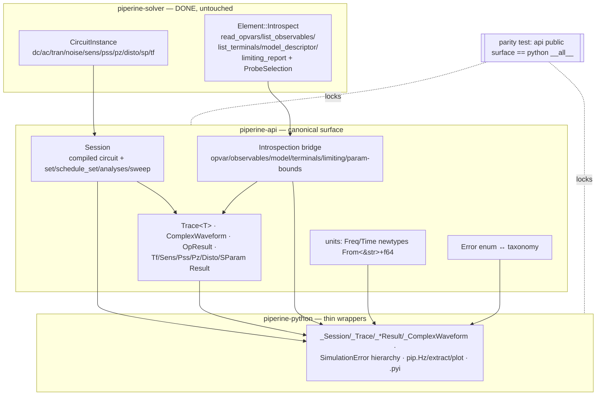

# Host Library Design

**Spec**: `.specs/features/host-library/spec.md`
**North star**: `ideal.md` · **Gap map**: `delta.md`
**Status**: Draft

---

## Architecture Overview

**One rule drives the whole layering: `piperine-api` (Rust) is canonical;
`piperine-python` wraps it thinly; a parity test locks them (MD-22).** The gap
is not merely "Python lags" — `piperine-api` itself is missing types
(`PzResult`, `DistoResult`, `SParamResult`, `TfResult`, `ComplexWaveform`, a
compiled `Session`) and `CircuitInstance` exposes no device-introspection
accessor. So most work lands in `piperine-api` first; Python binding is
mechanical after.



**Reshape-once discipline:** the `Trace<T>` consolidation (HOST-13) lands in
Phase 1 *with* the new result types — never build `AcTrace`/`NoiseTrace` then
remove them.

---

## Approach Decision

| Choice | Approach | Verdict |
|--------|----------|---------|
| Where capabilities land | **api-canonical, Python wraps (chosen)** | ✅ MD-22 by construction; one implementation; Python binding is mechanical; parity test enforceable. |
| — alt | Implement per host | ❌ guarantees drift (the exact bug today). |
| `Session` vs keep `SimSession` | **New `Session` owning the compiled circuit; `SimSession` staged surface folds into it** | ✅ single center (ideal §4); resolves appendix §4-R1. |
| — alt | Add compiled path onto `SimSession` | ❌ keeps two concepts; muddier than one `Session`. |
| Noise result | **`Trace` + noise methods (`psd`/`total`/`by_source`/`contributions`)** | ✅ nine-type taxonomy; `NoiseTrace` folded. |
| Units | **Typed newtypes `Freq`/`Time`/… with `From<&str>`+`From<f64>`; `impl Into<Freq>` on analysis args; Python SI helpers mirror** | ✅ ideal §3 + user's Rust `Into` idea; string ergonomics only where typed, no raw-float magic. |

---

## Code Reuse Analysis

| Component | Location | How to Use |
|-----------|----------|------------|
| `CircuitInstance` analysis drivers | `piperine-solver/core/circuit.rs` (`dc`/`ac`/`tran`/`noise`/`sens`/`pss`/`pz`/`disto`/`sp`/**`tf`**) | `Session` calls these; `tf` already exists solver-side — just bind it |
| `Element::Introspect` methods | `piperine-solver/core/element.rs` (shipped element-abi) | The introspection bridge reads these per device — no new solver work |
| `ProbeSelection` / `record_device_state` | `piperine-solver/analyses/transient.rs` (shipped) | `probe=` sets it; `Trace.opvar` reads recorded banks |
| `NoiseContribution` | `piperine-solver/analyses/noise.rs` (shipped) | `by_source`/`contributions` surface it |
| `ParamDescriptor` (`bounds`/`unit`/`scope`/`invalidation`) | `core/introspect.rs` (shipped) | `Param.bounds` reflection |
| `run_op_sweep` compile-once restamp | `piperine-api/session.rs` | The engine under `Session.sweep()` |
| existing `_LiveSession`/`_Trace`/`_OpResult` wrappers | `piperine-python/{live,results}.rs` | Rename/extend, don't rewrite |
| `Design::rfports` pattern | (referenced by the sibling introspection-attrs feature) | N/A here — mentioned for consistency only |

**Integration point that must be ADDED:** `CircuitInstance` needs public
accessors to reach per-device `Introspect` (opvars, observables, terminals,
model, limiting) keyed by instance label — none exists today. This is the
enabling seam for the whole P2 introspection door.

---

## Components

### piperine-api (canonical)

**C1 — `Session`** (`session.rs`/`session/`)
- Purpose: the compiled center of gravity — owns the built circuit; runs every
  analysis; `set`/`schedule_set`/`rebuilds`/`sweep`.
- Interfaces: `Module::compile() -> Session`; `session.op/dc/tran/ac/noise/tf/
  sens/pss/pz/disto/sp(...) -> typed`; `set(label, value)`; `schedule_set(t, …)`;
  `sweep(knob, points) -> Sweep`.
- Reuses: `CircuitInstance`, `run_op_sweep` restamp, `SimSession` staged logic.

**C2 — Result types** (`results.rs`/new modules)
- Add `TfResult`, `PzResult`, `DistoResult`, `SParamResult`, `ComplexWaveform`;
  keep `OpResult`/`SensResult`/`PssResult`/`FourierResult`.
- Purpose: one typed result per analysis; structured results stay distinct.

**C3 — `Trace<T>` generic** (`waveform.rs`)
- Purpose: one swept container; `Trace<Waveform>` (tran/dc), `Trace<Complex
  Waveform>` (ac), `Trace` + noise methods (noise). Removes `AcTrace`/
  `NoiseTrace`.
- Interfaces: `v`/`i`/`axis`/`stats`/`four`; noise adds `psd`/`total`/
  `by_source`/`contributions`.

**C4 — Waveform measurements + transforms** (`waveform.rs`)
- Real: `slew_rate`/`rise_time`/`fall_time`/`overshoot`/`settling_time`/`delay`;
  `fft`/`resample`/`derivative`/`integral`/`clip`. Complex: `bandwidth_3db`/
  `gain_margin`/`phase_margin`/`unity_gain_freq`.

**C5 — Introspection bridge** (`results.rs` + a new `introspect` accessor on
`CircuitInstance` in solver)
- Purpose: host door over `Element::Introspect`. `OpResult`/`Session` →
  `InstanceView` with `opvar`/`opvars`/`observables`/`model`/`terminals`;
  `op.stats.limiting`; `Param.bounds`. `Trace.opvar` via recorded `probe=`.
- Dependency: the new `CircuitInstance` introspection accessor (enabling seam).

**C6 — Sweeps** (`session.rs`)
- `Sweep`/`SweepPoint` (a `Session` view per point); nested/named; `map` →
  ndarray (Python) / `Vec<Vec<..>>` (Rust). Compile-once (MD-18).

**C7 — Configs + units** (`session.rs` + new `units.rs`)
- Typed config builders; canonical `Solver` knob set; `Freq`/`Time`/… newtypes
  with `From<&str>`/`From<f64>`; `NetRef: From<&str>`/tuples; `cross`/`dir`/
  `scale` enums.

**C8 — Error taxonomy** (`error.rs`)
- Ensure `Error` variants map 1:1 to the Python `SimulationError` hierarchy
  (`Convergence` carries node/iteration/analysis).

### piperine-python (thin wrappers)

**C9 — wrapper classes** (`live.rs`→`session.rs`, `results.rs`, `instance.rs`)
- `_Session` (rename `_LiveSession`), `_TfResult`/`_PzResult`/`_DistoResult`/
  `_SpResult`/`_ComplexWaveform`/`_Sweep`; extend `_InstanceView` (opvar/…),
  `_OpResult` (indexing), `_Trace` (generic v/i + noise methods).

**C10 — Python ergonomics** (`lib.rs` + new modules)
- `SimulationError` exception hierarchy from `Error`; SI helpers (`pip.Hz`…);
  kwargs-first signatures; typed `Config.__init__`; `pip.plot`/`bode`/`extract`;
  naming (`const`, `__getitem__`, `load_str`, properties, `__len__`); complete
  `.pyi` stubs.

### Tests + docs

**C11 — parity test** (`crates/piperine-python/tests/` or root `tests/`)
- Enumerate api public surface + Python `__all__`; assert same analyses + result
  types + config/enum/error names; fail loud on drift.

**C12 — docs** — `docs/spec/part_viii_host_api.md` rewrite + `appendix_c`
refresh.

---

## Data Models

```rust
// C3 — generic trace
pub struct Trace<T> { points: Vec<(f64, SignalSet<T>)>, stats: SolverStats, /*…*/ }
pub struct ComplexWaveform { /* axis + Vec<Complex64> */ }

// C5 — introspection view (host door)
pub struct InstanceView<'a> { /* label + &CircuitInstance + instance id */ }
impl InstanceView<'_> {
    pub fn opvar(&self, name: &str) -> Result<f64>;
    pub fn opvars(&self) -> Vec<(String, f64)>;
    pub fn observables(&self) -> Vec<ObservableDescriptor>;
    pub fn model(&self) -> ModelDescriptor;
    pub fn terminals(&self) -> Vec<TerminalDescriptor>; // carries TerminalKind
}

// C7 — typed units
pub struct Freq(pub f64);
impl From<f64> for Freq { /* … */ }
impl From<&str> for Freq { /* "10MHz" -> 1e7, fail loud on garbage */ }
```

```python
# C8/C10 — exception hierarchy
class SimulationError(Exception): ...
class ConvergenceError(SimulationError):  # .node .iteration .analysis
class ElaborationError(SimulationError): ...
class UnknownModule(SimulationError): ...
class UnknownNet(SimulationError): ...
```

---

## Error Handling Strategy

| Scenario | Handling | User impact |
|----------|----------|-------------|
| Analysis non-convergence | `Error::Solver` → `ConvergenceError(node, iteration, analysis)` | typed, catchable |
| `probe=`/`opvar` unknown target | fail loud (reuses ProbeSelection ABI-35 / new UnknownNet) | named error, never NaN |
| Analysis missing on one host | parity test fails at CI | drift caught pre-merge |
| `plot` without matplotlib | import-guarded, "install matplotlib" | clear, no hard dep |
| `Freq::from("garbage")` | fail loud parse error | named error |
| structural sweep param | rebuild + count; never silent wrong restamp | correct results |

---

## Risks & Concerns

| Concern | Location | Impact | Mitigation |
|---------|----------|--------|------------|
| `Trace<T>` reshape is breaking (removes `AcTrace`/`NoiseTrace`) | `piperine-api/waveform.rs` + all wrappers + tests | wide churn | Reshape-once in Phase 1; update the parity test + all call sites in the same phase; `cargo test --workspace` gate. |
| `CircuitInstance` has no introspection accessor | `piperine-solver/core/circuit.rs` | P2 blocked | First Phase-2 task adds the accessor (read-only, over shipped `Introspect`) — the enabling seam; low risk (no solver-math change). |
| `Trace.opvar` recompute from recorded banks | `piperine-api` transient path | opvar-over-time correctness | Reuse the shipped `record_device_state`/`ProbeSelection` + `eval_opvars`; validate against a DC opvar at a static point. |
| api missing `PzResult`/`DistoResult`/`SParamResult`/`TfResult` despite `run_*` existing | `piperine-api/session.rs` | untyped returns today | Add the api structs in Phase 1 (they may currently return solver types/tuples); wrap solver results. |
| Python `_ComplexWaveform` exists but api has no `ComplexWaveform` struct | api vs python | asymmetry | Add `ComplexWaveform` to api as the canonical; Python wraps it (part of C3). |
| matplotlib optional-dep ergonomics | `piperine-python` | import errors | Guard imports; `plot` raises a clear message; never a hard dependency. |

---

## Tech Decisions (non-obvious)

| Decision | Choice | Rationale |
|----------|--------|-----------|
| Canonical layer | `piperine-api` first, Python wraps | MD-22 by construction; kills drift |
| `Session` supersedes `SimSession` staged surface | one compiled center | ideal §4; resolves appendix §4-R1 |
| `Trace<T>` reshape timing | Phase 1, with the new result types | reshape once, not build-then-remove |
| Introspection enabling seam | new read-only `CircuitInstance` introspection accessor | the whole P2 door depends on it; no solver math changes |
| Units | typed newtypes `From<&str>`+`From<f64>` | user's Rust `Into` idea; string ergonomics only where typed |
| Parity enforcement | executable test over both public surfaces | MD-22 needs a guard, not just intent |

> **Project-level decision candidate (offer to user):** "host-library is
> ideal-first, host-pure scope, api-canonical, MD-22 enforced by a parity test"
> — worth an `MD-27`/`AD` in `.specs/STATE.md`. Recorded here as feature-local
> until the user confirms promotion.
