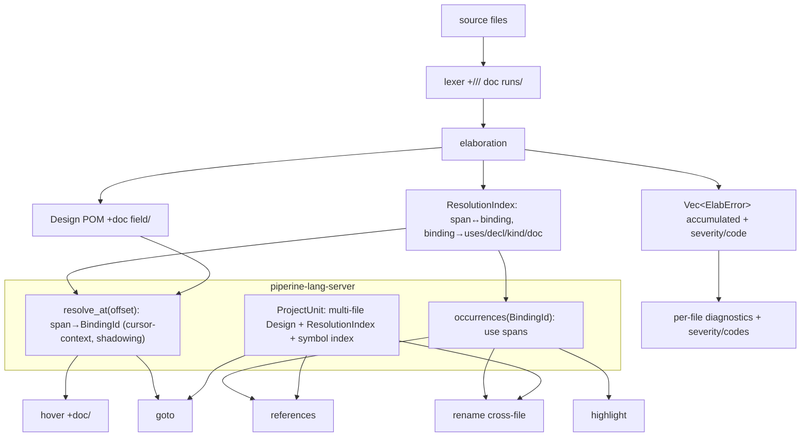

# Language Server (A+) Design

**Spec**: `.specs/features/language-server/spec.md`
**Status**: Draft

---

## Architecture Overview

The audit's root finding: the server has no semantic model to read — it
text-scans (`word_occurrences`) and word-matches (`symbol_index.rs:53`) because
**the elaborator does not retain its resolutions**. Scope resolution happens
transiently during elaboration and is thrown away; only the `Design` (POM)
survives. Every A+ feature (correct hover/goto, binding references/rename,
cross-file) needs one thing the server cannot compute from the POM alone: *which
binding each identifier occurrence refers to.*

**The keystone is a `ResolutionIndex`** — a side artifact the elaborator emits
(MD-25 spirit: additive, never mutates authored POM), mapping every identifier
**use span → binding**, and every **binding → { decl span, kind, doc, all use
spans, file }**. The server reads it; it re-implements no scoping.



**Reshape-once discipline:** `resolve_at` (`symbol_index.rs`) is rewritten onto
`ResolutionIndex` — the word-based global lookup is deleted, not layered over.

---

## Approach Decision

| Choice | Approach | Verdict |
|--------|----------|---------|
| Where scoping lives | **Elaborator emits `ResolutionIndex`; server reads it (chosen)** | ✅ The elaborator already resolves scopes correctly; capturing them is cheap and single-source. Server never duplicates scoping (spec LSP-05). Additive side artifact (MD-25). |
| — alt | Server re-implements scope resolution | ❌ Duplicates the elaborator, drifts, and re-does hard work (shadowing, imports). The current word-lookup is exactly this shortcut's failure. |
| Doc-comment carrier | **`doc: Option<String>` on POM decls, filled by elaboration from lexer-captured `///` runs** | ✅ One field feeds hover + P3 host reflection; additive (MD-25). |
| Project model | **`ProjectUnit` holds the multi-file elaborated `Design` + one `ResolutionIndex` spanning files** | ✅ Cross-file nav falls out of a project-wide index; single-file is the degenerate case. |
| Error model | **Elaboration returns `(Design, Vec<ElabError>)` where passes recover; unrecoverable passes still stop** | ✅ Accumulation where safe; honest about hard stops. |

---

## Code Reuse Analysis

| Component | Location | How to Use |
|-----------|----------|------------|
| `parse/lexer.rs` (hand-written) | `piperine-lang` | Extend to capture `///` runs — **edit with care** (files-not-to-edit-casually) |
| POM decl structs (`Module`/`Port`/`Param`/`Wire`/`Var`/`Instance`/`Behavior`) | `piperine-lang/pom/` | Add additive `doc` field (MD-25) |
| Elaboration passes | `piperine-lang/elab/` | Emit `ResolutionIndex` + accumulate errors; attach doc |
| `ElabContext` registries (`decl_span` for extern) | consumed at `symbol_index.rs:190` | Attribute-schema IDE (`ctx.schemas`, fields, decl_span) |
| `resolve_at` / `Resolution` | `symbol_index.rs` | Rewrite onto `ResolutionIndex` (keep the `Resolution` result shape, add `doc`) |
| `word_occurrences` | `state.rs:105` | **Replaced** by `occurrences(BindingId)`; kept only as a last-resort fallback for unresolved tokens |
| `ProjectContext` (`Piperine.toml` discovery + `SourceMap`) | `project.rs` | The seam for `ProjectUnit`; already builds the multi-file `SourceMap` |
| hover handler + `lookup_hover_info` | `handlers/hover.rs` | Prepend `doc` Markdown |
| `parse_str_tolerant` (multi parse error) | `parse/` | Model for elaboration error accumulation |
| `Connection::memory()` | `lsp-server` | Protocol-test harness |

**Must be ADDED (the keystone):** the `ResolutionIndex` type + the elaboration
pass that fills it. Nothing today records use→binding.

---

## Components

**C1 — Lexer `///` capture** (`piperine-lang/parse/lexer.rs`): recognize `///`
line runs; carry them as trivia attached to the following declaration token
(ordinary `//` discarded). [LSP-06]

**C2 — POM `doc` field** (`piperine-lang/pom/`): `doc: Option<String>` on
module/port/param/var/instance/net/behavior decls; additive, `#[serde]`. [LSP-07]

**C3 — Elaboration: doc attach + `ResolutionIndex` + error accumulation**
(`piperine-lang/elab/`):
- attach captured `///` runs → POM `doc`.
- emit `ResolutionIndex { uses: Vec<(Span, BindingId)>, bindings: Map<BindingId,
  BindingInfo{ decl_span, kind, doc, use_spans, file }> }` as an elaboration
  output (side artifact).
- return `(Design, ResolutionIndex, Vec<ElabError>)` — accumulate in recoverable
  passes. [LSP-05/07/18]

**C4 — `resolve_at` rewrite** (`piperine-lang-server/symbol_index.rs`): map
cursor byte-offset → the `Span` containing it in `ResolutionIndex.uses` →
`BindingId` → `Resolution { kind, name, decl_span, doc, type_info }`. Cursor
context + shadowing come for free (the index recorded the *resolved* binding).
Deletes the global word-loop. [LSP-01..04]

**C5 — Occurrence engine** (`piperine-lang-server`): `occurrences(BindingId) ->
[Span]` from `BindingInfo.use_spans`; references/rename/highlight consume it. No
text scan; comments/strings never appear (they are not uses). [LSP-10/11/13]

**C6 — `ProjectUnit`** (`piperine-lang-server/state.rs` + `project.rs`):
`ServerState.projects: Map<Root, ProjectUnit>`; a unit holds the multi-file
`Design` + one `ResolutionIndex` spanning files + a symbol index. `analyze`
builds/refreshes the unit; documents map to their unit. Single-file = a unit of
one. [LSP-14/17]

**C7 — Cross-file navigation** (`goto_def`/`references`/`rename`): `BindingInfo`
carries `file`; goto opens the decl's file; rename emits
`WorkspaceEdit.document_changes` across every file with uses. [LSP-12/15]

**C8 — Diagnostics fan-out + severity/codes** (`handlers/diagnostics.rs` +
`ElabError`): publish per file URI; map `ElabError` kind → `DiagnosticSeverity`
(WARNING vs ERROR) + structured `code` (e.g. `E2021`). [LSP-16/19]

**C9 — hover doc** (`handlers/hover.rs`): prepend `Resolution.doc` as Markdown
above the type/kind line. [LSP-08]

**C10 — Attribute-schema IDE** (`completion`/`diagnostics`/`hover`/`goto`/
`symbols`): `@`-position completion from `ctx.schemas`; argument validation
(unknown/typed/required field) as diagnostics; hover→fields; goto→`decl_span`;
outline entries. [LSP-20..24]

**C11 — Protocol-test harness** (`piperine-lang-server/tests/`): drive
`Connection::memory()` init→didOpen→request; fixtures for shadowing, doc
comments, cross-file. [LSP-25/26]

---

## Data Models

```rust
// C3 — the keystone side artifact
pub struct ResolutionIndex {
    uses: Vec<(Span, BindingId)>,                 // sorted by span for offset lookup
    bindings: HashMap<BindingId, BindingInfo>,
}
pub struct BindingInfo {
    decl_span: Span,
    kind: SymbolKind,          // reuse existing enum
    doc: Option<String>,
    use_spans: Vec<Span>,
    file: FileId,              // for cross-file
}
pub struct BindingId(u32);      // stable per elaboration
```

```rust
// C2 — additive POM field (MD-25)
pub struct Module { /* … */ pub doc: Option<String>, }
```

---

## Error Handling Strategy

| Scenario | Handling | User impact |
|----------|----------|-------------|
| Cursor on keyword/literal/comment | `resolve_at` → `None` | features decline, no false symbol |
| `///` run not before a decl | ignored at attach | no crash, no misattach (LSP edge) |
| Multiple elab errors, recoverable pass | accumulate → all published | all shown at once |
| Unrecoverable pass | stop (documented) + keep last valid design | navigation still serves (state.rs:87) |
| Cyclic project import | fail loud / degrade single-file | no hang (spec edge) |
| Rename collision in scope | prepare-rename best-effort warn | not a hard block |

---

## Risks & Concerns

| Concern | Location | Impact | Mitigation |
|---------|----------|--------|------------|
| Hand-written lexer edit ripples | `parse/lexer.rs` | parsing regressions | Trivia-only change (attach, don't restructure tokens); full `parse_elab` suite gates; `///` is a strict superset of `//`. |
| `ResolutionIndex` is new elaborator output — invasive | `piperine-lang/elab/` | correctness-critical path | Additive output (MD-25); existing `Design` unchanged; the index is *recorded*, not a new resolution algorithm (reuse the resolver already running). Guarded by `parse_elab`/`elab` suites. |
| Error accumulation changes elab signature | `elab/`, all callers incl. `state.rs:80` | wide call-site churn | Return `(Design, ResolutionIndex, Vec<ElabError>)`; adapt callers; hosts that want first-error keep `errors.first()`. |
| Cross-file spans need file identity | POM spans are byte offsets | wrong-file jumps | `BindingInfo.file: FileId`; the project `SourceMap` already keys files — thread the id through. |
| Perf: full project re-elaborate per keystroke | `state.rs:71` | latency on large projects | Out of scope (incremental is a follow-up); measure — full re-elab is fast today; cache the `ResolutionIndex` per version. |

---

## Tech Decisions (non-obvious)

| Decision | Choice | Rationale |
|----------|--------|-----------|
| Semantic source | Elaborator-emitted `ResolutionIndex` | server reads truth, never re-scopes (LSP-05) |
| Doc carrier | additive POM `doc` field | one source for hover + P3 host reflection (MD-25) |
| Occurrences | binding `use_spans`, not text | kills comment/string/scope false matches |
| Project model | `ProjectUnit` = multi-file Design + one index | cross-file nav falls out; single-file is degenerate |
| Errors | `(Design, Vec<ElabError>)` accumulate-where-safe | all-at-once without pretending every error recovers |

> **Project-level note:** the `ResolutionIndex` side-artifact pattern (additive,
> emitted by elaboration, never mutating authored POM) is a direct application
> of **MD-25**; no new MD needed. Worth referencing MD-25 in the design review.
