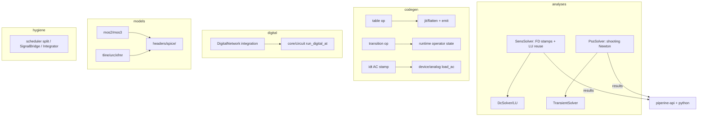

# p1-solver-complete Design

**Spec**: `.specs/features/p1-solver-complete/spec.md`
**Status**: Draft — approach recommendations locked as assumptions; user
reviews before Execute
**Constraints**: MD-13 (idiomatic ABI), MD-18 (no re-JIT during simulation),
MD-20 (host surfaces live in `piperine-api`), no-macros preference.

---

## Architecture Overview

Five independent work streams over the existing engine — no stream changes
another's contract:



## Approach choices (Large-feature exploration)

### `.sens`

| Approach | Trade-off | Verdict |
|---|---|---|
| **A. FD stamp perturbation + adjoint-free direct solve (recommended)** — perturb param, restamp (bypass-style cached stamps give ∂A/∂p, ∂b/∂p), solve `A·dx = −(∂A·x − ∂b)` reusing the run's LU | One cheap extra solve per param; no codegen change; accuracy limited by FD step (fine at 1e-3 rel target) | **Chosen** |
| B. Symbolic `∂R/∂p` emitted by codegen | Exact; new emit surface per param; big codegen churn | Later upgrade behind the same API |
| C. Adjoint (one solve per *output*) | Wins only when params ≫ outputs; more machinery | Not now |

### PSS

| Approach | Trade-off | Verdict |
|---|---|---|
| **A. Single shooting, FD Jacobian (recommended)** — `g(x₀)=x(T)−x₀`; Jacobian columns by perturbed re-integration OR Broyden rank-1 updates after the first full Jacobian | n+1 transients per Newton iter (FD) — fine for the target circuit sizes; trivially correct | **Chosen** |
| B. Harmonic balance | Frequency-domain, great for RF; a whole new solver | Post-V1 program |
| C. Extrapolation (accelerated settling) | No periodicity guarantee — violates fail-loud | Rejected |

`SolverDomain` gains a `Pss` variant. Options:
`PssAnalysisOptions { period, tstab, max_shoot_iter, shoot_tol }`.

## Code Reuse Analysis

| Component | Location | How to Use |
|---|---|---|
| LU + symbolic reuse | `math/faer.rs` | sens extra solves; PSS inner transients untouched |
| Bypass stamp cache | `solver/dc.rs` | sens ∂A/∂p via restamp diff (same cache shape) |
| Transient driver + breakpoint table | `solver/transient.rs` | PSS inner integrations; `transition` breakpoint declarations |
| Runtime-operator state bank (`delay`/`slew`) | `jit/flatten.rs`, `device/analog.rs` | `transition` state (start, target, t_change); tline PHDL model uses `delay` directly |
| `$limit` slot machinery + `emit_pnjlim` | `codegen/analog_emit.rs` | fetlim/limvds formulas drop into the same slots |
| `force_flux_stamps` mutual coupling | `device/analog.rs` | `xfmr` model — engine already couples branch currents |
| ngspice harness + goldens | root `tests/ngspice*` | MOS2/3, tline, urc golden cases; live-or-SKIP pattern |
| `NetworkComb`/`DigitalNetwork` | `jit/digital/{compile,network}.rs` | cone integration into `core/circuit.rs` |
| `T?` optional params | lang (done 2026-07-05) | sentinel migration |
| Host surface pattern (`run_op`/`run_tran`) | `piperine-api/src/session.rs` | `run_sens`/`run_pss` follow the same shape |

## Components (new/changed)

### `SensSolver`
- **Location**: `piperine-solver/src/solver/sens.rs` (+ `analysis/sens.rs`
  options/result)
- **Interfaces**: `CircuitInstance::sens(opts, ctx) -> SensSolver`;
  `SensAnalysisOptions { outputs: Vec<Net>, params: Vec<(String, String)>, dp_rel }`;
  result: `SensResult { d: Map<(out, label.param), f64>, stats }`.
- **Dependencies**: DC solve first (internally runs/reuses `dc().solve()`),
  `set_element_param` for perturbation, `ParamDescriptor::invalidation` gate.

### `PssSolver`
- **Location**: `piperine-solver/src/solver/pss.rs` (+ `analysis/pss.rs`)
- **Interfaces**: `CircuitInstance::pss(opts, ctx) -> PssSolver`; result: one
  period `TransientAnalysisResult` + `PssStats { iters, residual }`.
- **Dependencies**: transient driver re-entry from an arbitrary state — needs
  `TransientSolver` to accept a full initial state vector (extension of the
  existing IC seam), plus digital-state checkpoint/restore between shots.

### `table` / `transition` / `idt`-AC / multi-`ac_stim`
- **Location**: `codegen/src/lower/pom/analog_ops.rs` (register),
  `jit/flatten.rs` + `jit/analog.rs` + `codegen/analog_emit.rs` (emit),
  `device/analog.rs` (`load_ac` for idt/ac_stim; runtime state for
  transition).
- **Contract**: Jacobian of `table` = segment slope; `transition` declares
  breakpoints via `next_breakpoints`.

### `@initial` branch force + UIC hold
- **Location**: `jit/flatten.rs` (`FlatAnalog.initial_conditions` extended),
  `solver/transient.rs::compute_initial_conditions` + a t=0 clamp branch
  (`CKTsetIC` analog: large conductance G·(v−ic) released after first
  accepted step).

### Digital network integration
- **Location**: `core/circuit.rs` (`init_digital`/`run_digital_at`):
  detect pure-comb cones from `DigitalTopology`, build one `DigitalNetwork`
  element, keep per-device path for clocked/`SAMPLES_ANALOG` members.
- **Risk seam**: event ordering must stay identical — the fused network is a
  degenerate `Element` already; assertion tests are bit-equality vs the
  per-device path.

### Models
- **Location**: `piperine-lang/headers/spice/{mos.phdl, passives.phdl,
  tline.phdl(new)}`; ported from ngspice C (`mos2/mos3` load functions,
  `urc` expansion rules); tline in pure PHDL over `delay`.

### Hygiene
- `digital/{topology,state,scheduler}.rs` split; `SignalBridge` in
  `core/bridge.rs`; `Integrator` in `math/integration.rs` consumed by noise;
  `as_iv` re-signed; `init_global` moved to first solver build;
  `IntegrationMethod` deleted (TR-BDF2 hardwired).

## Data Models

```rust
pub struct SensAnalysisOptions { pub outputs: Vec<Net>, pub params: Vec<(String, String)>, pub dp_rel: f64 } // default 1e-6
pub struct PssAnalysisOptions { pub period: f64, pub tstab: f64, pub max_shoot_iter: usize, pub shoot_tol: f64 }
```

## Error Handling Strategy

| Error Scenario | Handling | User Impact |
|---|---|---|
| sens param needs Rebuild / unknown | `SolverDomain::Element` loud error naming param | clear message |
| PSS non-convergence | `SolverDomain::Pss` with iters + residual | never a fake periodic trace |
| table non-monotonic xs / length mismatch | codegen error at compile | loud at build |
| tline/urc bad params | model `assert`-style loud elaboration error | loud at elaborate |
| ngspice absent | golden cases SKIP with notice | existing pattern |

## Risks & Concerns

| Concern | Location | Impact | Mitigation |
|---|---|---|---|
| Transient re-entry from arbitrary state (PSS shots) may fight the `@initial`/IC seam | `solver/transient.rs` | wrong x(0) per shot | dedicated `with_initial_state(Vec<f64>)` entry, tested standalone before shooting uses it |
| FD Jacobian cost `n+1` transients per Newton iter | `solver/pss.rs` | slow on big circuits | Broyden updates after first Jacobian; document scaling; cap `max_shoot_iter` |
| Fused digital path diverging from per-device semantics | `core/circuit.rs` | silent logic corruption | bit-equality differential tests on every digital suite + examples 17–20 |
| MOS2/3 C sources are gnarly (weak-inversion, short-channel) | `headers/spice/mos.phdl` | subtle DC mismatch | golden per region (cutoff/linear/sat), live ngspice diff like MOS1 |
| `IntegrationMethod` removal touches 34 sites | solver-wide | churn risk | mechanical task, last in its phase, full gate |
| `transition` state under rejected timesteps | `device/analog.rs` | non-deterministic retry | state commit/rollback via existing accept path; test a rejected-step scenario |

## Tech Decisions

| Decision | Choice | Rationale |
|---|---|---|
| sens = FD direct | approach A | table above |
| PSS = single shooting, driven only | approach A | table above |
| tline in PHDL (not native element) | `delay`-based Branin model | zero solver surface; models stay PHDL (user direction: everything hand-ported PHDL) |
| New `SolverDomain::Pss` | enum variant | typed domains rule |
| Host surface in `piperine-api` + python | `run_sens`/`run_pss` mirror `run_op` | MD-20 |
