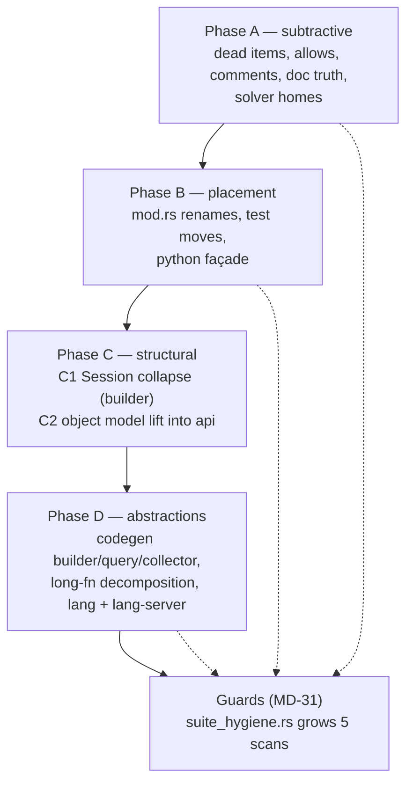

# P6 Cleanup — Architecture & Readability · Design

**Spec:** `.specs/features/p6-cleanup-architecture/spec.md`
**Source findings:** `CLEANUP_PLAN.md` (`CL-01..CL-13`)
**Status:** Approved (user, 2026-07-26 — D1 revised, D3 shape chosen, sub-agent execution chosen)

---

## Architecture Overview

Four phases, ordered by *mental-picture value per unit of risk*. Every phase is
behavior-preserving; the oracle is the workspace suite plus the ngspice
cross-checks. Phases A/B are subtractive and mechanical, C is the two structural
merges, D is the abstraction grind.

**Invariants every task upholds**

1. `cargo test --workspace` → 0 failures, count ≥ the T1 baseline, at **every**
   commit (D9).
2. `cargo check --workspace --all-targets` → 0 warnings.
3. No behavior change: items may move file or crate, never change meaning.
   Python-facing names never change (D6).
4. One atomic commit per task; guards land in the same commit as the rule they
   enforce, with the failure proof noted in the task report (MD-31).

---

## Code Reuse Analysis

### Existing components to leverage

| Component | Location | How to use |
|---|---|---|
| `tests/suite_hygiene.rs` | root `tests/` | The single home for all five new source-tree scans — it already walks the tree and asserts hygiene rules |
| `capabilities_contract.rs` registry+exhaustiveness pattern | `crates/piperine-solver/tests/` | The shape every new guard copies: enumerate the real surface, look each item up in a table that must account for it, fail naming the unaccounted |
| `tests/host_parity.rs` | root `tests/` | The safety net for C1/C2 — it enumerates both host surfaces and fails on divergence |
| `piperine-api/src/results.rs` delegation style | `crates/piperine-api/src/results.rs` | The reference for what Python's `design.rs`/`module.rs`/`instance.rs` must become (one-line `self.inner.…` forwards) |
| `analyses/transient.rs` phase-method decomposition | `crates/piperine-solver/src/analyses/transient.rs` | The proven pattern for CLA-23/24 (`predict_step`/`attempt_step`/`assess_step`/…) |
| `lang-server/tests/common/` | `crates/piperine-lang-server/tests/` | The fixture-sharing pattern Python's extracted tests copy (CLA-11) |
| `Design::fork` / `with_overrides_applied` / `set_param` | `piperine-lang` POM | Reused verbatim by the collapsed `Session` and the lifted `Module` — the staging semantics are already there |
| `piperine-solver`'s crate shape | whole crate | The target state for `codegen`/`lang`/`lang-server`: 5 free fns at 13.6k LOC |

### Integration points

| System | Integration |
|---|---|
| `piperine-python` | Retargeted twice: to the collapsed `Session` (C1) and onto the lifted api model (C2). Python-facing names frozen (D6) |
| `piperine-cli` | Uses the api through `piperine-python`; no change expected — verified by `piperine-cli`'s own suite |
| `piperine-plugin` | Holds a `SimSession` reference in `host.rs`; retargeted in C1 |
| ngspice cross-check | `tests/ngspice_validation.rs` (30 tests) is the numeric oracle for C1 — it drives the staged path end to end |

---

## Components

### C1 — `Session` + `SessionBuilder` (CLA-14/15/16, finding CL-01)

- **Purpose**: one host entry object; the staged workflow becomes "compile a
  `Session` per analysis" (which is what `SimSession::run_*` already does
  internally — every one of them calls `build_circuit`).
- **Location**: `crates/piperine-api/src/session/` (new dir):
  `mod.rs` (declarations only), `session.rs` (`Session` + `SessionBuilder`),
  `sweep.rs` (`Sweep`/`SweepPoint`/`Grid`/`Nested`), `config.rs`
  (`SolverConfig`/`Scale`).
- **Interfaces**:
  - `Session::builder(&Design, &str) -> SessionBuilder`
  - `SessionBuilder::provider(Rc<dyn DeviceProvider>) -> Self`
  - `SessionBuilder::hooks(Rc<dyn SimHooks>) -> Self`
  - `SessionBuilder::disto(bool) -> Self` — gates the `.disto` kernel compile
    (today's `compile_disto` flag; default `false`, `disto()` sets it)
  - `SessionBuilder::compile(self) -> Result<Session, Error>`
  - `Session::compile(&Design, &str) -> Result<Session, Error>` — kept as the
    no-options shorthand
  - unchanged: `set`, `schedule_set`, `rebuilds`, `module`, `op`, `tran`, `ac`,
    `noise`, `sens`, `pss`, `pz`, `disto`, `sp`, `tf`, `dc`, `sweep`, `grid`
  - ported from `SimSession` (D5): `design() -> &Design`,
    `snapshot_digital`, `snapshot_opvars`, `snapshot_introspect`
  - `stage` does **not** move onto `Session`: staging happens *before* compile,
    so it is `Design::set_param` (already public) or
    `SessionBuilder::stage(label, param, value)` for call-site parity
- **Dependencies**: `piperine-codegen` (`CircuitCompiler`, `DeviceProvider`),
  `piperine-solver` (`CircuitInstance`), `piperine-lang` (`Design`)
- **Reuses**: `SimSession::build_circuit` becomes `SessionBuilder::compile`'s
  body verbatim (hooks order preserved: `transform_design` → overrides →
  `before_lower` → lower → compile); `Session`'s existing analysis bodies are
  untouched.

**Mandatory first step (task C1a, no deletion yet): the equivalence matrix.**
Before `SimSession` loses a single method, produce a table in this design doc's
appendix mapping every `SimSession` method to its `Session` counterpart, with one
of three verdicts: *identical*, *differs (how)*, *missing (port it)*. Any `differs`
row is resolved by porting the `SimSession` behavior onto `Session` — the
staged path is what `ngspice_validation.rs` exercises, so a silent semantic
drift there is a numeric regression, not a compile error. `SimSession` is deleted
only in the task after every row reads *identical*.

### C2 — `piperine-api::model` (CLA-17/18/19, finding CL-02)

- **Purpose**: the navigable object model becomes api-canonical (MD-27 §1);
  Python's three model files become delegation.
- **Location**: `crates/piperine-api/src/model/` — `design.rs`, `module.rs`,
  `instance.rs`, `descriptors.rs`, `mod.rs` (declarations only).
- **Shape**: 1:1 mirror of the Python types (D3), method for method:

| api type | Methods (mirroring today's Python) | Python type it backs |
|---|---|---|
| `Design` | `load`, `load_str`, `top`, `module`, `modules`, `const_`, `select` | `_Design` |
| `Selection`, `Node` | `len`, `is_empty`, `nodes`; `kind`, `name` | `_Selection`, `_Node` |
| `Module` | `name`, `ports`, `nets`, `instances`, `params`, `behaviors`, `op`, `sens`, `pss`, `pz`, `disto`, `sp`, `tran`, `ac`, `noise`, `set`, `compile` | `_Module` |
| `Port`, `Net`, `Instance`, `Param` | `name`, `direction`/`ty`/`module` accessors | `_Port`, `_Net`, `_Instance`, `_Param` |
| `InstanceView` | `label`, `terminal_connections`, `v`, `i`, `opvar`, `opvars`, `model`, `terminals`, `observables`, `param`, `params` | `_InstanceView` |
| `ModelDescriptor`, `TerminalDescriptor`, `ObservableDescriptor`, `ParamDescriptor` | field accessors | same-named `_`-prefixed |

- **Interfaces of note**:
  - `Module` owns `Rc<Design>` + the isolated staged-override map, exactly as
    `_Module` does today (parent design untouched), and builds a `Session` per
    analysis through C1's builder.
  - `Module::set(label, param, value)` stages; `Module::compile()` returns a
    `Session` (the live path) — the two workflows stay visible at the model
    level, which is where they belong.
  - `Design` keeps `Rc` (not `Arc`): `piperine_lang::Design`'s interior is not
    `Sync`, which is why Python marks its wrappers `unsendable`. Documented in
    the module `//!`; making the POM `Send` is out of scope.
- **Dependencies**: `piperine-lang` (POM), C1's `Session`.
- **Reuses**: `InstanceView` already exists in `piperine-api/src/results.rs` —
  extend it rather than adding a second one; `Module::analysis_err`'s
  error-mapping stays in Python (it maps to `PyErr`, a binding concern), while
  the api side returns `Error` as it already does.
- **MD-25 guard**: the model exposes `Design::modules` only. Any lifted method
  that would need `flat_modules` fails loud instead (spec Edge Case).

### C3 — Guards (`tests/suite_hygiene.rs`, CLA-05/08/13/25/28)

One home, five scans, each following the registry+exhaustiveness shape:

| Scan | Rule | Failure message names |
|---|---|---|
| `no_file_scope_lint_suppression` | no `#![allow(` under `crates/*/src`, `src` | file + line |
| `no_dead_architecture_identifiers` | `IrProgram\|IrModule\|IrExpr\|IrInstance\|piperine[-_]ir` appear at most in the one allowed note | file + identifier |
| `mod_rs_declares_only` | every `mod.rs` ≤ 60 lines, or carries `// hygiene-exempt: <reason>` | file + line count |
| `no_function_over_200_lines` | brace-balance scan over `crates/*/src` | file:line + fn name + length |
| `module_level_fns_have_owners` | every module-level `fn` in `codegen`/`lang`/`lang-server` is listed in the scan's justified-exemption table **or** absent | file:line + fn name |

**Exemption convention** (D8): a module-level `fn` or an oversized `mod.rs` may
carry a preceding line `// hygiene-exempt: <reason>`. The scan counts exemptions
and reports them, so the debt stays visible instead of dissolving. Entry points
(`main`, `#[pymodule]` init, CLI command fns) are the expected users.

**Each guard must be proven able to fail**: inject the violation, observe the
named failure, revert. The proof goes in the task report and `validation.md`.

### C4 — Phase-D abstractions in `piperine-codegen` (CLA-20/21/22)

| New owner | Absorbs | Location |
|---|---|---|
| `ExprBuilder` (or inherent ctors on the resolved `Expr`) | `select`, `binary`, `lit`, `not_expr`, `and_guards`, `subst_expr`, `subst_block`, `subst_scope`, `substitute_marker` | `crates/piperine-codegen/src/flatten/` + `emit/builder.rs` callers |
| expression **query** surface (inherent methods on `Expr`/`Stmt`, or one `ExprQuery` trait) | `has_branch_current`, `has_branch_access`, `has_marker`, `expr_eq`, `expr_structural_eq`, `blocks_eq`, `stmts_eq`, `isolate_branch_coeff`, `collect_branch_current_pairs`, `zero_branch_currents` | `crates/piperine-codegen/src/resolve/` (owner of the types) |
| `LimitCollector` | `collect_limits`, `limit_branch`, `limit_branches_into`, `ident_of` | `crates/piperine-codegen/src/kernel/analog/limits.rs` (already exists, 58 lines — the natural home) |

The three structural-equality functions (`expr_eq`, `expr_structural_eq`,
`blocks_eq`, `stmts_eq`) are **one algorithm split four ways** — unify into a
single method with the CSE call site as the only consumer that needs the
"structural" variant.

### C5 — Long-function decomposition (CLA-23/24)

| Target | Length | Approach |
|---|---|---|
| `resolve/pom/mod.rs:315 lower_bodies` | 253 | Phase methods on the lowering type; take this one **first** (codegen entry point, not on the frozen list) |
| `lang-server/handlers/symbols.rs:46 extract_symbols` | 207 | One method per symbol kind, owned by the handler/`SymbolIndex` |
| `parse/parser/expr.rs:96 parse_primary` | 316 | Dispatch: one match arm per token kind, each arm a single call to a named `Parser` method (D7) |
| `parse/parser/stmt.rs:22 parse_mod_stmt` | 212 | Same dispatch shape |

Plus the 100–200 band brought under the 200 ceiling where it costs nothing
(`pss::solve` 158, `digital/compile.rs` 141/123, `introspection_meta` 136,
`flatten/analog.rs::walk` 134, `lex_number` 133, `resolve_expr` 132,
`server.rs::new` 129, `tokenize_all` 124, `resolve_call` 114, `eval_call` 107,
`prelude_items` 104, `parse_behavior_stmt` 101). The 200-line guard is the
enforced line; going below 60 everywhere is not a requirement.

**Parser safety rule**: the frozen corpora (`headers/`, `tests/fixtures*`) are
the contract. A parser task that changes any parse result is reverted, not
patched (spec Edge Case).

---

## Error Handling Strategy

| Scenario | Handling | Impact |
|---|---|---|
| `SimSession` method has no `Session` equivalent | C1a matrix catches it; port first, delete later (never drop) | none — capability preserved |
| Structural `set` on a compiled `Session` | unchanged: fails loud with today's message | none — existing documented deviation carries over |
| Lifted model would need `flat_modules` | fail loud in the api method | MD-25 preserved |
| A parser decomposition alters a parse result | task reverted; corpora win | none |
| A moved test duplicates one in its new home | delete the weaker, name it in the commit (MD-28.3) | test count drops by exactly the named duplicates |
| Workspace test count would drop unexplained | task stops, accounts for each missing test | prevents silent coverage loss |

---

## Risks & Concerns

| Concern | Location | Impact | Mitigation |
|---|---|---|---|
| `SimSession`/`Session` are two **lifecycles**, not duplicates — the in-code `SPEC_DEVIATION` argues for keeping both | `crates/piperine-api/src/session.rs:600-625` | A naive collapse changes when re-elaboration happens, silently altering staged-path numerics | C1a equivalence matrix before any deletion; staged workflow becomes explicit per-analysis `compile()`; `ngspice_validation.rs` (30 tests) is the numeric oracle |
| `Session::set` fails loud on structural writes while Python's `_LiveSession` auto-rebuilds (~150 lines of dirty-ledger machinery) | `session.rs:615-623` | The collapse could be read as "now Rust must auto-rebuild too" — scope explosion | Explicitly out of scope; `rebuilds()` stays on the surface for a future task, as the existing note already plans |
| `run_sens`/`run_op_sweep` mirror param writes into `info.instances` by hand | `session.rs` (`run_op_sweep`, `Session::set`) | Duplicated mirror logic; a collapse that keeps one copy could drop the other | The matrix task treats the mirror as behavior to preserve; unify into one private helper on `Session` |
| `parse/` is on CLAUDE.md's "not to edit casually" list, and CLA-24 edits it | `crates/piperine-lang/src/parse/parser/{expr,stmt}.rs` | A grammar regression would ripple through everything | Dispatch-only decomposition (D7), frozen-corpus suites as oracle, its own atomic commit, last in the order |
| `resolve/pom/mod.rs` carries `#![allow(dead_code)]` **and** the 253-line `lower_bodies` **and** 615 lines in a `mod.rs` | `crates/piperine-codegen/src/resolve/pom/mod.rs` | Three findings on one file; uncoordinated tasks would collide | Sequence them in one batch: delete-dead → rename out of `mod.rs` → decompose |
| Blanket `#![allow(dead_code)]` on 9 solver analysis files may hide items that *become* dead as Phase D moves code | `crates/piperine-solver/src/analyses/*.rs` | New dead code could slip in mid-feature | The allow removal lands in Phase A, so every later phase compiles under a strict dead-code check |
| `piperine-python`'s 1436-LOC model migration is one mechanical diff with 166 test targets downstream | `crates/piperine-python/src/{design,module,instance}.rs` | Large diff, high churn | Split per file (three tasks), `host_parity.rs` + the Python suite gate each |
| Object-model lift keeps `Rc` (not `Arc`), so the api model is single-threaded | new `piperine-api/src/model/` | A Rust host wanting `Send` sessions is blocked | Documented in the module `//!`; POM `Send`ness is a separate, larger decision |
| No test currently asserts the workspace test **count** | — | A silent coverage drop during a refactor of this size is invisible | T1 captures the baseline; every task report states the count |

---

## Tech Decisions

| Decision | Choice | Rationale |
|---|---|---|
| Staged workflow after the collapse | "compile a `Session` per analysis" | It is literally what `SimSession::run_*` does today (each calls `build_circuit`); no new concept, one type |
| Options on compile (`provider`/`hooks`/`disto`) | `SessionBuilder` | `Session::compile(&Design, &str)` cannot grow three optional params without a config struct or a builder; builder keeps the common path one call |
| `stage()` after the collapse | `Design::set_param` (already public) + `SessionBuilder::stage` for parity | Staging precedes compilation; putting it on the compiled object was the confusing part |
| Object-model shape | 1:1 mirror of the Python types | Parity by construction (D3); the diff is mechanical and `host_parity.rs` can enumerate both sides |
| Guard home | all five scans in root `tests/suite_hygiene.rs` | One place to look for "what does this project enforce"; it already owns tree-walking hygiene |
| Exemption mechanism | `// hygiene-exempt: <reason>` comment, counted and reported | Keeps legitimate entry points legal while keeping the debt countable — an allow-list file would drift |
| Function-length ceiling | 200 lines guarded, 60 aspirational | A hard 60 would force artificial splits in dispatch tables; 200 is where comprehension actually breaks |
| `math/constant.rs`, `core/port.rs` | deleted whole | Zero consumers, measured; re-adding a constant when needed costs one line |
| MD-03 | superseded, structs deleted | D2 — wiring per-analysis contexts is runtime architecture, not cleanup |

> **Project-level decisions:** this design proposes **MD-33** (no file-scope
> lint suppression), **MD-34** (`mod.rs` declares, never implements), **MD-35**
> (comments describe the present), plus amendments to **MD-03** (superseded),
> **MD-20** (`Session` is the single host entry), and **MD-22/MD-27** (object
> model is api-canonical). They land in `.specs/STATE.md` in the final phase
> (CLA-29/30), after the code they describe is real.

---

## Appendix — C1a equivalence matrix (filled by T24)

Full matrix with `file:line` evidence on both sides, the five dangerous
same-role/different-behavior rows, and the porting hand-off:
**`.specs/features/p6-cleanup-architecture/session-equivalence.md`**. Line
references below are `crates/piperine-api/src/session.rs` at `e3c233b`.

| `SimSession` method | `Session` counterpart | Verdict | Action |
|---|---|---|---|
| `new` `:113` | `Session::compile` `:644` / `builder` | **differs** — unforked ownership + infallible vs double `fork` + `Result` | T25: `builder`; `Session`'s fork-and-isolate wins, staging re-expressed as `SessionBuilder::stage` |
| `set_device_provider` `:118` | — | **missing** | T25: `SessionBuilder::provider` |
| `set_hooks` `:126` | — | **missing** | T25: `SessionBuilder::hooks`; `Session` holds the `Rc` for solve-time firing |
| `stage` `:148` | — | **differs by construction** (staging precedes compilation) | T25: `SessionBuilder::stage(label, param, Value)` |
| `design` `:137` | — | **missing** | T25: `Session::design(&self) -> &Design`, same signature |
| `module` `:141` | `Session::module` `:663` | **identical** | none |
| `run_op` `:361` | `Session::op` `:706` | **differs** — re-elaborates + fires `after_solve("op", node_voltages)`; bodies otherwise line-for-line equal | T25 (builder) + T26 (hook firing) |
| `run_op_sweep` `:390` | `Session::sweep` `:1050` + `op` (**not** `dc` `:1010`) | **differs (3×)** — return shape, per-point `info` clone `:428`, and ignored `Invalidation` `:401` | Retarget to `sweep` + `point.op()` (one build, one `OpResult`/point, `info` cloned per point `:725`). `dc`'s trace shape stays; the ignored-`Invalidation` difference is resolved in `Session`'s favour and recorded |
| `run_tran` `:506` | `Session::tran` `:735` | **differs** — `tspan: (stop, start)` tuple vs positional; hooks; `tran` also drains `pending_sets` (`Session`-only) | T25 + T26; argument order is a call-site rewrite, same values |
| `run_ac` `:540` | `Session::ac` `:796` | **differs (widening only)** — `impl Into<Freq>`/`impl Into<bool>` accept every `f64`/`bool` caller | T25 + T26 |
| `run_noise` `:565` | `Session::noise` `:817` | **differs** — hooks + re-elaboration only | T25 + T26 |
| `run_sens` `:185` | `Session::sens` `:847` | **differs** — hooks + re-elaboration; same two `Error::Measurement` messages | T25 + T26 |
| `run_pss` `:235` | `Session::pss` `:887` | **differs** — hooks + re-elaboration only | T25 + T26 |
| `run_pz` `:262` | `Session::pz` `:904` | **differs** — hooks + re-elaboration only | T25 + T26 |
| `run_sp` `:293` | `Session::sp` `:952` | **differs** — hooks + re-elaboration only | T25 + T26 |
| `run_disto` `:334` | `Session::disto` `:926` | **differs (cost, not result)** — the only `SimSession` path passing `compile_disto = true`; `Session` gets the kernels unconditionally (`CircuitCompiler::new` defaults the flag `true`) | T25: `SessionBuilder::disto(bool)` defaulting **`true`** — §C1's proposed `false` default would break `tests/session_analyses.rs:156` and `tests/host_parity.rs:61`; deviation recorded in `session-equivalence.md` §3.2 |
| `snapshot_digital` `:438` | — | **missing** | T25: same associated fn on `Session`, body verbatim (`piperine-python/src/live.rs:417` calls it) |
| `snapshot_opvars` `:461` | — | **missing** | as above (`live.rs:418`) |
| `snapshot_introspect` `:477` | — | **missing** | as above (`live.rs:419`) |
| `build_circuit` `:157` (private) | `Session::compile` body `:644` | **differs** — hooks + provider + `compile_disto` vs fork | T25: `SessionBuilder::compile` = this body **plus** the fork, hook order verbatim (`transform_design` → overrides → `before_lower` → lower → compile) |

`Session`-only, nothing to reconcile: `rebuilds`, `set`, `schedule_set`, `tf`,
`dc`, `sweep`, `sweep_grid`. `SimSession` has no `.tf`, so the collapse adds
reach rather than removing it.
