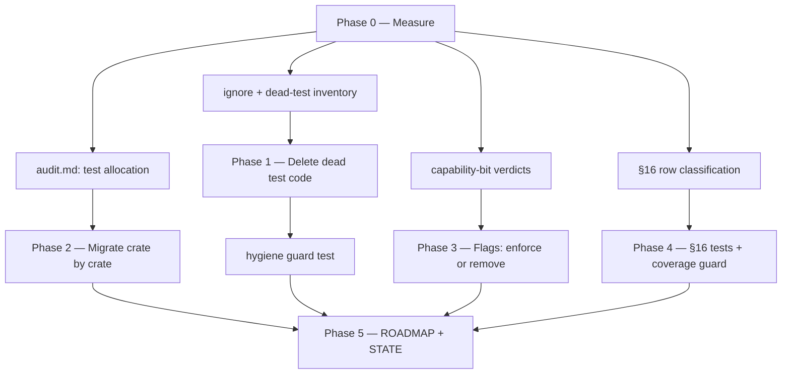

# P6 — Cleanup & Completeness Design

**Spec**: `.specs/features/p6-cleanup-completeness/spec.md`
**Status**: Approved (agent-decided per the user's "run the full flow" grant;
every non-obvious call is recorded in Tech Decisions with its evidence)

---

## Architecture Overview

Three independent workstreams, each with the same shape: **measure → decide →
act → guard**. The measurement is checked in as a report so the decisions are
auditable; the guard is a Rust test so the invariant cannot silently rot again
(the exact failure mode P6 exists to end).



Ordering rationale: dead code goes first (Phase 1) so the migration in
Phase 2 never relocates a test that should not exist; the guards land with
their workstream so every later commit is protected by them.

---

## Code Reuse Analysis

### Existing components to leverage

| Component | Location | How to use |
|---|---|---|
| Capability registry test (`documented_consumer` table + exhaustiveness assert) | `crates/piperine-solver/tests/capabilities_contract.rs:21-85` | **The pattern for both new guards.** The §16 guard is the same shape: a `documented_enforcement(row) -> Option<&'static str>` table checked for exhaustiveness against rows parsed from the spec file. |
| Source-walking guard | `crates/piperine-lang/tests/extern_coverage_guard.rs` | The precedent for a test that reads repository sources and fails on drift — the ignore/hygiene guard follows it (walk `CARGO_MANIFEST_DIR/..`, no hardcoded name list, per CLN-08.3). |
| Facade hygiene guard | `crates/piperine-python/tests/facade_hygiene.rs` | Second precedent for "policy as a test"; also the source of lesson L-002 (assert an object's *own* attribute, never an inherited view) — applies to the doc-header check. |
| DC bypass cache | `crates/piperine-solver/src/analyses/dc.rs:97-145` (`cache_valid`, `any_limiting_report`, `invalidate_bypass`) | The place `BYPASS_OK` gets wired; the existing limiter suppression and `invalidate_bypass` seams stay exactly as they are. |
| `CompiledModule`/`AnalogKernel` capability sub-structs behind `Option` | `crates/piperine-codegen/src/kernel/analog/` | How codegen already answers "does this device have operators / events / limiters" — the same `Option::is_none()` checks decide whether a compiled device may declare `BYPASS_OK`. |
| `PiperineDevice::capabilities` | `crates/piperine-codegen/src/device/mod.rs` | Single place a codegen device's bitflags are assembled — one edit point for the new bit. |
| Existing per-crate test layout | `crates/piperine-solver/tests/*` (19 files, already functionality-named) | The target shape for the crates that are not there yet; no new convention is invented. |

### Integration points

| System | Integration method |
|---|---|
| `cargo test --workspace` | Remains the only gate. New guards are ordinary `#[test]`s; no new tooling in CI. |
| `docs/spec/part_vii_solver.md` §16 | Read at test time by the §16 guard (`include_str!` on the spec file, same trick `PluginHost::seed_schemas` uses for `device_port.phdl`) — the doc becomes the single source of truth for the row list. |
| `.specs/features/p6-cleanup-completeness/audit.md` | The checked-in measurement; referenced by tasks and by `validation.md`. Not read by any test (a report is evidence, not an invariant). |

---

## Components

### Test-allocation audit tool

- **Purpose**: extract mechanical facts per test so the unit/integration
  classification is decided from evidence, not memory.
- **Location**: `.specs/features/p6-cleanup-completeness/tools/audit_tests.py`
  (one-shot analysis tool; deliberately **not** in a crate — it is not part of
  the build and must not become a dependency).
- **Interfaces**:
  - `python3 audit_tests.py --root <repo>` → TSV on stdout: `crate, file,
    test_name, kind_hint, evidence` where `kind_hint ∈ {unit, integration,
    unclear}` and `evidence` lists the pipeline entry points the test calls
    (`parse_and_elaborate`, `CircuitCompiler`, `SimSession`, `Command::new`,
    `PluginHost`, …), the crate-external imports it uses, and whether it
    touches process-global state (`env::set_var`, `set_current_dir`,
    `facade_lock`).
  - `--check <crate>` → exit non-zero if any test in that crate is classified
    `unit` while living in `tests/`, or `integration` while living inline.
- **Dependencies**: Python 3 stdlib only (regex-level parsing — the repo has
  no Rust-parsing dependency and this feature will not add one).
- **Reuses**: nothing; new, throwaway-by-design.
- **Why a hint, not a verdict**: `kind_hint` is advisory. The task author
  makes the call per test using the spec's definition, and records it in
  `audit.md`. A regex tool must never silently move a test.

### Suite hygiene guard

- **Purpose**: make dead/ignored/ungrouped test code a *test failure* instead
  of a doc claim (CLN-05, CLN-08, and the durable half of CLN-04).
- **Location**: `tests/suite_hygiene.rs` (root package — the only target that
  legitimately sees the whole workspace; mirrors how root `tests/` already
  holds the cross-crate parity suites).
- **Interfaces** (three `#[test]`s, each walking `**/*.rs` under `crates/` and
  `tests/`, skipping `target/`):
  - `no_disabled_test_code` — fails on `#![cfg(any())]`, `#[cfg(FALSE)]`,
    `#[cfg(any())]` on a `mod tests`, or a `// #[test]` commented-out test.
  - `every_ignore_states_a_reason` — fails on `#[ignore]` without
    `= "reason"`, and on **any** `#[ignore]` attached to a `#[test]`
    (doc-example `ignore` fences are the only legal ignores).
  - `every_integration_target_declares_its_scope` — every
    `crates/*/tests/*.rs` and `tests/*.rs` starts with a `//!` header (the
    mechanical half of "grouped by functionality": a file that cannot state
    what it covers is not grouped).
- **Dependencies**: `std::fs` walk only.
- **Reuses**: `extern_coverage_guard.rs`'s walk-and-assert shape.
- **Failure text**: every assert names `file:line` so the fix is one jump.

### §16 enforcement registry

- **Purpose**: bind each Part VII §16 failure row to the test that trips it
  (CLN-16/17/19).
- **Location**: `crates/piperine-solver/tests/failure_rules.rs`.
- **Interfaces**:
  - `fn rows() -> Vec<Row>` — parses the §16 markdown table out of
    `include_str!("../../../docs/spec/part_vii_solver.md")`, yielding
    `(section, rule, failure)`.
  - `fn enforcement(rule: &str) -> Option<&'static str>` — the registry:
    either `"enforced: <crate>/tests/<file>::<test>"` or
    `"unenforceable: <why no public surface reaches it>"`.
  - `#[test] every_failure_rule_is_accounted_for` — exhaustive over `rows()`;
    an unmatched row fails naming it.
  - `#[test] every_named_enforcement_test_exists` — for each
    `enforced: path::test` entry, assert the file exists and contains
    `fn <test>` (kills the copy-paste-a-dead-name failure mode; lesson L-008's
    "a Done-when that names a case must have the test" made mechanical).
- **Dependencies**: the spec file's table format (pipe-delimited, `| §n |`).
- **Reuses**: `capabilities_contract.rs` registry pattern verbatim.

### `ElementCapabilities` dispositions

- **Purpose**: end the reserved-bit status quo (CLN-11..CLN-14).
- **Location**: `crates/piperine-solver/src/core/element.rs` (flags),
  `crates/piperine-solver/src/analyses/dc.rs` (bypass gate),
  `crates/piperine-codegen/src/device/mod.rs` (declaration).
- **Verdicts** (evidence in Tech Decisions):
  - `SUPPORTS_QUERIES` → **remove**. Zero declarers, zero consumers; the
    `list_queries`/`query` defaults are always available, so no host needs a
    hint to call them.
  - `BYPASS_OK` → **enforce**. The DC bypass exists but is *global*: it never
    consults the bit, so it currently bypasses devices that never opted in —
    the bit's own doc says opt-in. Gate the cache on "every element in the
    circuit declares `BYPASS_OK`" and have codegen declare it only for
    devices whose stamps are a pure function of terminal voltages.
  - `bound_step_hint` → **enforced already**; ROADMAP corrected, no code
    change (CLN-15).

### Codegen `BYPASS_OK` predicate

- **Purpose**: decide, per compiled device, whether its DC stamps are a pure
  function of terminal voltages.
- **Location**: `crates/piperine-codegen/src/device/mod.rs` (assembling
  `capabilities()`), reading the kernel's existing capability `Option`s.
- **Rule** (all must hold): no runtime operators (`delay`/`slew`/`idt`/
  `transition`), no analog events, no `$limit` limiters, no digital dependency
  (`DEPENDS_ON_DIGITAL`/`SAMPLES_ANALOG`), no `simparam`-style ambient reads,
  no internal unknowns whose update is history-dependent.
- **Dependencies**: `AnalogKernel`'s capability sub-structs.
- **Reuses**: the same `Option::is_none()` checks the device already makes to
  build its other flags.

---

## Data Models

### `audit.md` row (the checked-in measurement)

```
| crate | file::test | current | verdict | target | evidence |
|-------|-----------|---------|---------|--------|----------|
| piperine-solver | tests/lifecycle.rs::resets_between_runs | integration | unit | src/core/circuit.rs | touches no pipeline entry point; asserts one method's branches |
```

`verdict ∈ {keep, move-inline, regroup, delete}`; a `delete` row **must**
carry `survivor: <file::test>` in evidence (CLN-04). This table is the
feature's audit trail and the input to Phase 2's per-crate tasks.

### §16 registry entry

```rust
enum Enforcement {
    Enforced { test: &'static str },       // "crates/piperine-solver/tests/dc.rs::gmin_then_source_then_fail"
    Unenforceable { reason: &'static str } // why no public surface reaches it
}
```

---

## Error Handling Strategy

| Error scenario | Handling | Impact |
|---|---|---|
| A migration cannot keep its crate green | Revert that task's diff, record the blocker in `audit.md`, move on to the next crate — never commit red (CLN-09) | The crate stays as-is with a named reason; no half-migrated state lands |
| A `ppr_ir.rs` behavior has no current equivalent and cannot be expressed through today's `resolve` API | Fail loud in `audit.md` as a tracked gap and keep the test as a live `#[test]` if it can compile, else record it as a coverage gap requirement for a follow-up feature — never a silent delete (CLN-07) | Visible gap instead of invisible loss |
| Gating the DC bypass on `BYPASS_OK` measurably slows a validation circuit | Keep the gate (correctness first — the current behavior bypasses devices that never opted in) and record the measurement; broaden the codegen predicate only where provably safe | Possible extra Newton evaluations on circuits with stateful devices |
| Removing `SUPPORTS_QUERIES` breaks an external plugin that sets it | Accept: `piperine-plugin`'s ABI version guards the boundary, and no in-tree device sets the bit | Out-of-tree device rebuilds — the ABI-version check makes it loud, not silent |
| The §16 table's markdown shape changes | The guard's parser fails loud (zero rows parsed → explicit assert), never silently passes on an empty row set | Doc format change is caught by the suite |

---

## Risks & Concerns

| Concern | Location (file:line) | Impact | Mitigation |
|---|---|---|---|
| **`BYPASS_OK` is write-only *and* the implemented bypass ignores its opt-in contract** — the global check bypasses any device whose solution barely moved, including devices whose stamps are not a pure function of terminal voltages | `crates/piperine-solver/src/analyses/dc.rs:114-145` (gate), `core/element.rs:85` (contract) | A stateful device can be stamped stale during DC and satisfy the convergence test with a wrong operating point — the same class of bug the per-variable-threshold comment already records having been found via ngspice `diode_series` | Phase 3 wires the bit (per-circuit gate) + a test proving a non-declaring device is never bypassed; the existing limiter suppression and `invalidate_bypass` seams are kept |
| **602 lines of `ppr_ir.rs` read as coverage but are never compiled** | `crates/piperine-codegen/tests/ppr_ir.rs:1` | Anyone auditing codegen coverage over-counts by 27 tests, incl. unique-looking ones (`flicker_noise_source_registered`, `match_desugars_to_if_chain`, `string_param_preserved`, two lowering-error cases) | Phase 1 triages each against live suites; the hygiene guard makes recurrence impossible |
| **Test-count-as-coverage temptation** — a large deletion pass can look like progress while removing real assertions | this feature's own Phase 2 | Silent coverage loss, the worst possible P6 outcome | CLN-04's named-survivor rule, the `audit.md` trail, and the Verifier's discrimination sensor at the end |
| Relocating tests inline puts previously-isolated tests in one process | e.g. `crates/piperine-python/tests/*` (facade lock), CLI tests using cwd/env | New flakiness that looks like a real regression | CLN-10: a moved test keeps/gains its serialization guard; the audit's `evidence` column flags global-state touches up front |
| Root `tests/` and crate `tests/` share three file stems (`opvar_host.rs`, `run_examples.rs`, `session_analyses.rs`) | `tests/` vs `crates/*/tests/` | Same-name suites invite drift and double maintenance | Phase 2 reviews the three pairs explicitly: keep the layer-distinct halves (per the spec's layer-duplication edge case), delete only same-layer duplicates with a named survivor |
| The audit tool is regex-level | `tools/audit_tests.py` | Misclassification if used as a verdict | It emits `kind_hint` + evidence only; the human/agent verdict is recorded per row, and `--check` is run only *after* migration as a regression check on the same heuristic |
| Spec-file-reading tests couple the suite to doc formatting | `failure_rules.rs` | A doc reflow breaks a test | Parser asserts a non-empty row set and matches on `| §` prefix only; the coupling is intentional (the doc is the contract) |

---

## Approach exploration (Large ⇒ required)

**Chosen: A — measure-then-migrate, crate by crate, guards per workstream.**
An audit report is produced first, verdicts are recorded per test, and each
crate migrates in one commit with its own gate. Guards land with their
workstream. Slowest to start, but it is the only option that makes "no
coverage lost" checkable after the fact, and per-crate commits keep every
step revertible.

**B — guard-first, migrate opportunistically.** Land the hygiene guards, then
fix violations as later features touch each crate. Cheaper now; leaves P6's
actual complaint (allocation) unresolved and unbounded in time. Rejected:
the ROADMAP explicitly wants this done as a prerequisite for later refactors,
not spread across them.

**C — mechanical mass-move.** Have the audit tool rewrite files automatically
(move every `kind_hint: unit` test inline). Fastest, and the worst: a
regex-level tool would relocate tests it misjudges and silently break fixture
visibility, with a 1123-test blast radius. Rejected — the tool stays advisory.

---

## Tech Decisions (non-obvious only)

| Decision | Choice | Rationale |
|---|---|---|
| Audit tool language/placement | Python 3 stdlib, under the feature's `tools/`, not a crate | It is a one-shot measurement, not a product artifact; adding a Rust-parsing dependency to the workspace for a cleanup pass would be net-negative, and MD-13's "no macros / no clever machinery" spirit applies |
| Guards are Rust tests, not scripts | `tests/suite_hygiene.rs`, `crates/piperine-solver/tests/failure_rules.rs` | The gate is `cargo test --workspace`; a policy that lives outside the gate is a policy nobody runs (`capabilities_contract.rs` is the existing precedent) |
| Hygiene guard lives in the **root** package | `tests/suite_hygiene.rs` | Only the root target legitimately walks the whole workspace; root `tests/` already hosts cross-crate suites (`host_parity.rs`, `plugin_parity.rs`) |
| `SUPPORTS_QUERIES` → remove, not wire | Delete the bit | Evidence: zero declarers in the whole tree, zero readers; `list_queries`/`query` have working defaults (`core/element.rs:380-397`), so a "host hint" bit adds nothing a host cannot ask directly |
| `BYPASS_OK` → wire, not remove | Gate the DC bypass on it | Evidence: `analyses/dc.rs:114` bypasses on a global solution-moved test with no per-element consent, while `core/element.rs:78-85` documents it as opt-in for devices whose stamps are a pure function of terminal voltages. Removing the bit would bless the current over-broad bypass; wiring it makes the implementation match its contract |
| Bit numbering after removal | Leave all other bit positions unchanged (a hole at `1 << 10`) | `capabilities_contract.rs:104-110` asserts `HAS_DISTO2/3`/`NUMERIC_JACOBIAN` at `1 << 12/13/14`; renumbering would churn the ABI for cosmetics |
| Unreachable §16 rows | Remove the row from the spec, with a note | A normative rule no surface can trigger is drift; the spec is the contract, so it must only contain enforceable rules (CLN-18) |
| Inline tests in a sibling `tests.rs` | Allowed (`#[cfg(test)] mod tests;`) when the implementation file would become unreadable | MD-28 says "same `.rs`" to forbid *distant* files; a sibling module in the same module tree keeps the co-location property that matters, and the spec's edge case records this reading |
| Test-name preservation | Names are preserved across moves unless the name no longer fits | Keeps `git log -S` and the lessons store searchable (lesson evidence references `file::test` strings) |
| Migration order | Small crates first (`piperine-api`, `piperine-project`, `piperine-cli`, `piperine-plugin*`), then `piperine-python`, `piperine-codegen`, `piperine-lang`, `piperine-lang-server`, `piperine-solver`, root `tests/` last | Builds the migration idiom on low-risk crates before the 6000-line suites; the root suite is last because it is the cross-crate net that catches everything moved beneath it |

> **Project-level decisions:** two candidates for `.specs/STATE.md` on close —
> (1) the hygiene-guard-as-a-test convention (policy invariants live in the
> gate, extending MD-28 with its enforcement), and (2) the `BYPASS_OK`
> per-circuit consent rule (an ABI-semantics decision future devices must
> honor). Recorded in Phase 5 as MD entries, not here.

---

## Phase Plan

| Phase | Tasks | Requirements | Gate |
|---|---|---|---|
| 0 — Measure | T1 audit tool, T2 `audit.md` allocation report, T3 §16 classification, T4 flag-verdict evidence note | CLN-01, CLN-16 (analysis half), CLN-11/12 (evidence half) | build + report review |
| 1 — Dead test code | T5 `ppr_ir.rs` triage, T6 hygiene guard (3 tests), T7 prove the guard fails on a deliberate violation | CLN-05, CLN-06, CLN-07, CLN-08 | `cargo test -p piperine-codegen`, `cargo test -p piperine` |
| 2 — Allocation migration | T8 `piperine-api`+`piperine-project`, T9 `piperine-cli`, T10 `piperine-plugin`+`-macros`, T11 `piperine-python`, T12 `piperine-codegen`, T13 `piperine-lang`, T14 `piperine-lang-server`, T15 `piperine-solver`, T16 root `tests/` (incl. the 3 shared stems), T17 re-audit clean | CLN-02, CLN-03, CLN-04, CLN-09, CLN-10 | per-crate gate per task; workspace at phase end |
| 3 — Capability flags | T18 remove `SUPPORTS_QUERIES`, T19 wire `BYPASS_OK` + codegen predicate + tests, T20 contract-test exhaustiveness | CLN-11..CLN-14 | `cargo test -p piperine-solver -p piperine-codegen` |
| 4 — §16 | T21 add missing enforcement tests, T22 remove unreachable rows from the spec, T23 registry guard | CLN-17, CLN-18, CLN-19 | `cargo test -p piperine-solver` + full |
| 5 — Docs | T24 ROADMAP P6 restated + rows checked, T25 `.specs/STATE.md` handoff + MD entries | CLN-15, CLN-20, CLN-21 | build + review |

25 tasks. Executed inline, sequentially, one atomic commit per task (no
sub-agents — this session's tooling policy forbids spawning them without an
explicit user request; the closing Verifier therefore runs as the standalone
fresh-eyes pass from `validate.md`).
