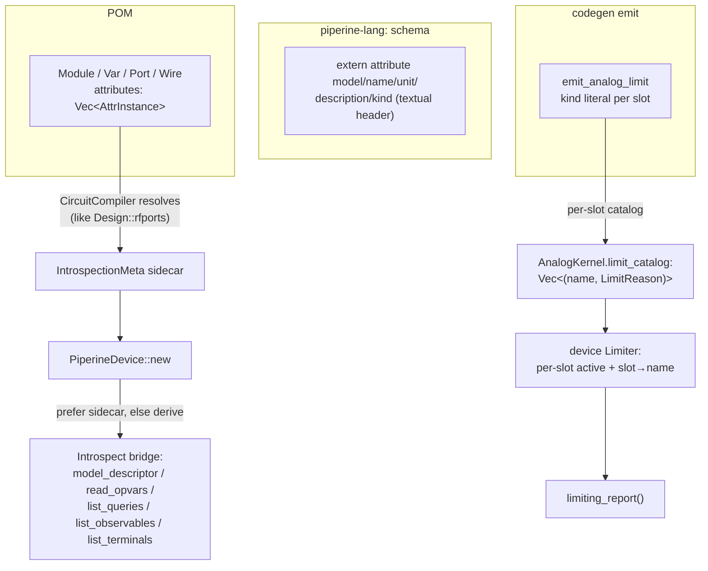

# PHDL Introspection Attributes Design

**Spec**: `.specs/features/phdl-introspection-attributes/spec.md`
**Status**: Draft

---

## Architecture Overview

Two independent plumbing patterns, one per concern:

- **Declarative metadata (P1/P2 — `@model`/`@name`/`@unit`/`@description`/
  `@kind`):** the attributes live on POM `Module`/`Var`/`Port`/`Wire` nodes
  (`attributes: Vec<AttrInstance>`, already parsed + schema-validated by
  elaboration). They are resolved into an `IntrospectionMeta` sidecar at the
  `CircuitCompiler` level — which holds `&Design` (full POM with attributes),
  the exact level `Design::rfports()` already resolves `@rfport` at — and handed
  to `PiperineDevice::new`. The `Introspect` bridge methods prefer the sidecar
  and fall back to today's kernel-derived defaults when a field is absent. **The
  kernel and `LoweredBody` are untouched** — `AnalogKernel::compile` takes a
  `LoweredBody`, which carries no attributes, so metadata never routes through
  lowering.

- **Limiter naming (P3 — `$limit` kind/reason):** the limiter `kind`
  (`"pnjlim"`/`"fetlim"`/`"limvds"`) is a compile-time string literal known at
  emit (`emit_analog_limit`, `analog_expr.rs:301`). Emit already switches on it
  per slot. We collect a per-slot `(name, reason)` catalog on the kernel, and
  the device-side `Limiter` tracks *which slot* clamped so `limiting_report()`
  reads the catalog instead of the hardcoded `"pnjlim"`/`VoltageStep`.



---

## Approach Decision (key architectural choice)

**Where does declared metadata reach the device?**

| Approach | How | Verdict |
|----------|-----|---------|
| **A — Sidecar resolved at CircuitCompiler (chosen)** | Resolve POM attributes into `IntrospectionMeta` in `CircuitCompiler` (`&Design` in hand), pass to `PiperineDevice::new`; bridge reads sidecar, falls back to kernel-derived | ✅ Non-invasive: `LoweredBody`, `resolve/`, `AnalogKernel::compile` all unchanged. Mirrors the proven `Design::rfports()` precedent. Metadata is a pure introspection concern, correctly kept out of the JIT residual path. |
| B — Carry attributes through lowering into `LoweredBody`→kernel | Thread attributes through `resolve/pom/lower_bodies` → `LoweredBody` → `AnalogKernel` catalog fields | ❌ Touches the correctness-critical resolve/kernel path (CLAUDE.md "files not to edit casually") for data the JIT never needs. Higher risk, no benefit. |

Approach A for all metadata (P1/P2). P3 (limiter naming) is *not* metadata — the
`kind` is intrinsic to the `$limit` call and already flows through emit, so its
catalog rides the kernel (the only place that sees the emit-time literal).

---

## Code Reuse Analysis

### Existing Components to Leverage

| Component | Location | How to Use |
|-----------|----------|------------|
| `Design::rfports()` | `pom/design.rs:327` | Template for the new POM→sidecar resolver: iterate `module.wires`/`.ports`/`.vars` attributes, match by `attr.schema()`, read `attr.field(...)`, fail loud via `AttrSchemaField` |
| `SchemaRegistry::register_declared` | `elab/registry/mod.rs:56` (the `@rfport` registration) | Register the new schemas — but from a **textual** `extern attribute` header (MD-24), parsed via the existing `register.rs:142` path, not code-registered like `@rfport` |
| `AttrInstance` (`schema()`, `field()`) | `pom/` (used at `design.rs:349-365`) | Read attribute schema name + field values off POM nodes |
| `ElabErrorKind::AttrSchemaField` | used at `design.rs:334` | Fail-loud on bad/unknown attribute field values |
| `TerminalDescriptor.kind` / `TerminalKind` | `core/introspect.rs` (shipped `element-abi-maturity` T14) | Sidecar overrides `desc.kind` in `list_terminals` (`device/mod.rs:452`) |
| `ModelDescriptor { type_id, version }` | `core/introspect.rs` (shipped) | `@model` fills both fields; `model_descriptor` (`device/mod.rs:488`) reads sidecar first |
| `ObservableDescriptor`/`ObservableKind`, `QueryDescriptor` | `core/introspect.rs` (shipped) | `@name`/`@kind`/`@unit`/`@description` fill these in `list_observables`/`list_queries` |
| `emit_analog_limit` kind switch | `emit/analog_expr.rs:322` | Already has the per-slot kind literal — collect it into the kernel catalog at the same site |
| `Limiter` (`active`, `seeds`) | `device/analog/limits.rs:13` | Extend to per-slot active tracking so the report names the slot that clamped |

### Integration Points

| System | Integration Method |
|--------|--------------------|
| Elaboration schema registry | New textual `extern attribute` header, prelude-level (unconditional, like `@rfport` — but textual) |
| `CircuitCompiler::new(design, bodies)` | Resolve `IntrospectionMeta` per module from `design.module(name)` attributes; store on the compiler, pass to each `PiperineDevice::new` |
| `PiperineDevice` | New `Option<IntrospectionMeta>` field; `Introspect` methods consult it first |

---

## Components

### 1. Introspection attribute schemas (textual header)

- **Purpose**: Declare `@model`/`@name`/`@unit`/`@description`/`@kind` as textual
  `extern attribute` schemas so name lookup + LSP go-to-def resolve (MD-24).
- **Location**: new `crates/piperine-lang/headers/introspection.phdl`; registered
  unconditionally into `SchemaRegistry` at prelude seed time.
- **Interfaces** (PHDL surface):
  - `extern attribute model { type: String, version: String }`
  - `extern attribute name { value: String }` (single positional-ish field)
  - `extern attribute unit { value: String }`
  - `extern attribute description { value: String }`
  - `extern attribute kind { value: String }`
- **Dependencies**: the `extern attribute` parse + `register_declared` path
  (already exists, `register.rs:142`).
- **Reuses**: `@rfport` registration pattern (but textual, not code-registered).
- **Open (Design)**: single-field attributes — confirm the field name
  convention (`value`) vs a bare-string attribute form. If the grammar supports
  `@name("i_d")` positionally, prefer that; else `@name(value = "i_d")`. Resolve
  against the parser's attribute-argument grammar during T-execution.

### 2. `IntrospectionMeta` sidecar + resolver

- **Purpose**: A per-module resolved bundle of declared introspection metadata,
  built from POM attributes, consumed by the device bridge.
- **Location**: resolver as `Design::introspection_meta(module_name)` in
  `pom/design.rs` (next to `rfports`); the struct in `pom/` or surfaced to
  codegen (codegen already reads `Design`).
- **Data model**:
  ```rust
  struct IntrospectionMeta {
      model: Option<ModelId>,                 // @model(type, version) on the module
      vars: HashMap<VarName, VarMeta>,         // @name/@unit/@description/@kind on vars
      terminals: HashMap<NodeName, TermMeta>,  // @name/@kind/@description on ports+wires
  }
  struct ModelId { type_id: String, version: String }
  struct VarMeta { name: Option<String>, unit: Option<String>, description: Option<String>, kind: Option<String> }
  struct TermMeta { name: Option<String>, kind: Option<String>, description: Option<String> }
  ```
- **Interfaces**:
  - `Design::introspection_meta(&self, module: &str) -> Result<IntrospectionMeta, ElabError>`
    — resolves + validates (`@kind` string ∈ target enum; duplicate `@name`;
    wrong-placement; unknown field), fails loud like `rfports`.
- **Dependencies**: POM attributes on `Module`/`Var`/`Port`/`Wire`.
- **Reuses**: `rfports()` iteration + `AttrSchemaField` error shape.

### 3. `CircuitCompiler` wiring

- **Purpose**: Resolve `IntrospectionMeta` at build and hand it to each device.
- **Location**: `device/circuit.rs` / `device/builder.rs` (`PiperineDevice::new`
  call sites, `builder.rs:257,354`).
- **Interfaces**: `PiperineDevice::new(..., meta: Option<IntrospectionMeta>)`.
- **Dependencies**: component 2.
- **Reuses**: existing `CircuitCompiler` `&Design` access.

### 4. `Introspect` bridge — prefer declared over derived

- **Purpose**: Each bridge method reads the sidecar first, falls back to the
  current kernel-derived default.
- **Location**: `device/mod.rs` (`model_descriptor:488`, `read_opvars:353`,
  `list_queries:365`, `list_observables:535`, `list_terminals:439`).
- **Behavior**:
  - `model_descriptor`: `meta.model` → `ModelDescriptor`; else module-name echo.
  - `list_queries`/`read_opvars`: opvar name = `meta.vars[v].name` else kernel
    name; attach `unit`/`description` to `QueryDescriptor`.
  - `list_observables`: observable name = `meta.vars[v].name` (else positional),
    kind = `meta.vars[v].kind` (else derived); **the same `@name` used here and
    in `list_queries` — one source, both catalogs (PIA-07)**.
  - `list_terminals`: `desc.kind`/name from `meta.terminals[node]` else
    position-inferred.
- **Reuses**: all shipped descriptor types; only the value source changes.

### 5. Limiter catalog (P3)

- **Purpose**: Name the limiter that actually fired in `LimitingReport`.
- **Location**: emit collects catalog in `emit/analog_expr.rs:322`; stored on
  `AnalogKernel` (`kernel/analog/limits.rs`); consumed in
  `device/analog/mod.rs` (`limiting_report`) + `device/analog/limits.rs`
  (`Limiter`).
- **Data model**: `AnalogKernel.limit_catalog: Vec<(&'static str /*name*/, LimitReason)>`
  indexed by limit slot; `LimitReason` inferred from kind
  (`pnjlim`/`fetlim` → `VoltageStep`, `limvds` → `VdsStep`) unless an optional
  `$limit` reason arg overrides.
- **Interfaces**:
  - emit: extend `emit_analog_limit` to record `(kind, reason)` per slot.
  - `Limiter`: track per-slot `active` (not just a single bool) so the report
    names the clamping slot.
  - `limiting_report()`: read `kernel.limit_catalog[slot]` for
    `limiter_name`/`reason`.
- **Dependencies**: `$limit` optional reason arg (grammar-additive, trailing).
- **Reuses**: existing per-slot vold machinery (`Limiter::update`).
- **Open (Design)**: `$limit` optional reason arg vs pure inference. MVP:
  infer from kind (zero signature change, satisfies PIA-15). Add the optional
  reason arg only if a model needs a non-default reason (PIA-16) — decide at
  T-execution whether any stdlib model needs it; else ship inference + leave the
  arg as a documented additive follow-up.

---

## Error Handling Strategy

| Error Scenario | Handling | User Impact |
|----------------|----------|-------------|
| `@kind` value outside target enum | `ElabError::AttrSchemaField` at resolve | Compile error naming the bad kind (PIA-09/13) |
| Attribute on wrong declaration kind | Fail loud at resolve/schema-placement check | Compile error naming the misplacement (PIA-03/19) |
| Duplicate `@name` across vars | Fail loud at resolve (name is a key) | Compile error naming the collision (PIA-20) |
| `@unit`/`@description` on non-opvar var | Fail loud at resolve | Compile error (spec Edge) |
| Unknown `$limit` kind at emit | Existing `CodegenError::unsupported` (`analog_expr.rs:326`) | Unchanged |
| Attribute absent | Fall back to derived default | No error — backward compatible |

---

## Risks & Concerns

| Concern | Location | Impact | Mitigation |
|---------|----------|--------|------------|
| Single-field attribute grammar (`@name("x")` positional vs `@name(value="x")`) may not exist | parser attribute-arg grammar | P1/P2 syntax undecided | Component 1 open item — verify the grammar at T-start; pick the supported form; if only keyed args exist, use `value =` and note it. No fabrication — confirm in code first. |
| `@kind` placement-resolution ambiguity if a node is both var-like and terminal-like | resolver | Wrong enum chosen | Placement is unambiguous in POM (a `Var` vs a `Port`/`Wire` are distinct node types); resolve enum by node type, fail loud if neither applies (spec Edge). |
| Per-slot limiter active tracking changes `Limiter` semantics | `device/analog/limits.rs:133` (`self.active` single bool) | Could perturb the Newton convergence veto | Keep the aggregate `active()` (OR of per-slot) for the existing veto gate; add per-slot only for *naming*. Parity: existing MOS/diode goldens must stay green (PIA-18). |
| `@rfport` remains code-registered while new schemas are textual | `registry/mod.rs:56` | Minor MD-24 inconsistency | Out of scope (spec); new schemas set the textual precedent; `@rfport` migration is a separate follow-up. |

---

## Tech Decisions (non-obvious)

| Decision | Choice | Rationale |
|----------|--------|-----------|
| Metadata plumbing | Sidecar at CircuitCompiler, not through lowering | Keeps resolve/kernel (correctness-critical) untouched; mirrors `rfports` (Approach A) |
| One `@name`, both catalogs | `list_queries` + `list_observables` read the same `meta.vars[v].name` | Structurally dissolves the inconsistency (PIA-07); no unification code |
| `@kind` enum by placement | Node type (Var→ObservableKind, Port/Wire→TerminalKind) selects the enum | Atomic attribute reused across kinds; POM node types disambiguate (MD-26) |
| Limiter reason default | Infer from kind (`pnjlim`/`fetlim`→VoltageStep, `limvds`→VdsStep); optional arg overrides | Zero-change for existing `$limit` sites (PIA-18); optional arg only if needed |
| New schemas textual | `extern attribute` header, not `register_declared` code call | MD-24 — LSP go-to-def; the `@rfport` code path is the exception to avoid |

> **Project-level decision** MD-26 (atomic attributes) already recorded in
> `.specs/STATE.md`. No new AD needed — this design conforms to it.
