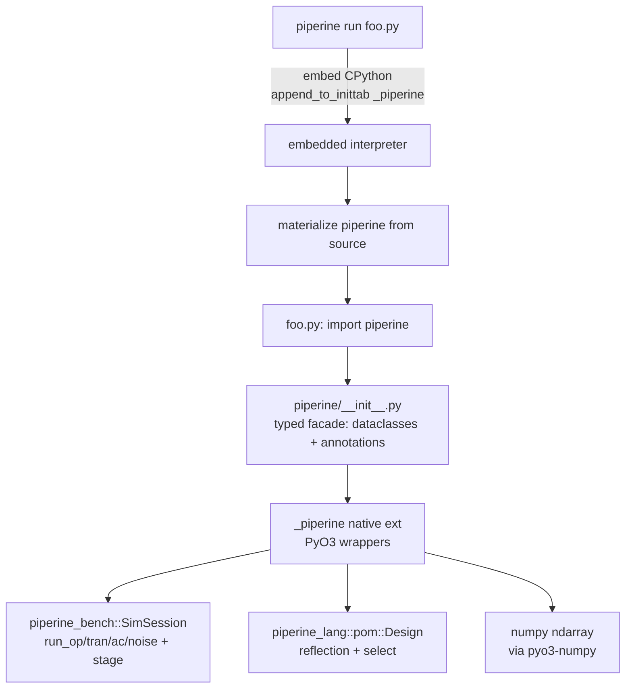

# Piperine Python Bindings Design

**Spec**: `.specs/features/python-bindings/spec.md`
**Status**: Draft

---

## Architecture Overview

Two layers, one public surface. A **typed pure-Python facade** (`piperine/`)
is the public API (IDE autocomplete, dataclasses, docstrings); it forwards to
a **native PyO3 extension** (`_piperine`) that wraps `SimSession`, the POM,
and the result objects. The CLI's `piperine run script.py` embeds CPython,
registers `_piperine` as a built-in, materializes the facade from source, and
runs the script — no `pip install` required.



### Crate: `piperine-python` (new)

A PyO3 crate, built two ways via one Cargo feature:
- **`cdylib` + `extension-module` feature** → the importable `_piperine.so`
  (for the `pip install` wheel via maturin — a follow-up, but the crate is
  ready for it).
- **`rlib` (no `extension-module`)** → linked into the CLI binary, which
  registers the module as a built-in via `pyo3::append_to_inittab` for the
  embedded-interpreter path.

`#[pymodule] fn _piperine(_py, m) -> PyResult<()>` registers the `#[pyclass]`/
`#[pyfunction]` wrappers. The `#[pymodule]` symbol is only exported when
`extension-module` is on (cdylib); the rlib build still compiles the wrappers
and exposes a registration entry the CLI calls.

### The facade: `python/piperine/__init__.py` (lives in the crate)

Pure-Python, fully typed (`from __future__ import annotations`), the single
source of the public surface. It:
- defines the config dataclasses (`Solver`, `OpConfig`, `TranConfig`,
  `AcConfig`, `NoiseConfig`) with field defaults mirroring the PHDL bundles;
- re-exports the native classes (`Design`, `Module`, `OpResult`, `Trace`,
  `Waveform`, …) under typed aliases with docstrings;
- adds the pythonic sugar: `__getitem__` on results, instance sub-views, and
  any pure-Python convenience (e.g. `Waveform.__iter__`).

For the wheel, maturin packages `python/piperine/` + `_piperine.so`. For the
embedded CLI, `include_str!` + `PyModule::from_code` materializes `piperine`
in the embedded interpreter after `_piperine` is registered as a built-in.

---

## Code Reuse Analysis

| Component | Location | How to use |
|-----------|----------|------------|
| `parse_and_elaborate` | `piperine-lang/src/lib.rs:66` | `_piperine.load(path)` reads the file + calls this |
| `Design` reflection | `pom/design.rs:155-292` | `_Design` pyclass holds a `Design`, exposes `top/module/modules/select/const_` |
| `Module` reflection | `pom/module.rs:210-264` | `_Module` exposes ports/nets/instances/params/behaviors + lookups |
| `SimSession` | `piperine-bench/src/session.rs:64` | `_Module.op/tran/...` builds a `SimSession::new(design.fork(), name)` per analysis (or cached) and calls `run_*` |
| `SimSession::stage` | `session.rs:123` | `_Module.stage(label, param, value)` → param override |
| Result objects | `objects.rs`, `waveform.rs` | `_OpResult/_Trace/_Waveform` pyclasses wrap them; thin typed methods call the existing (private) `fn v(&self, args)` etc. |
| `NetRef { name }` | `objects.rs:17` | the net handle result methods accept — built from a Python `str` |
| CLI dispatch | `piperine-cli/src/lib.rs` | add a `Run` path for `.py` scripts (or a `--python` flag) → embed + run |

### Integration points

| System | Integration method |
|--------|-------------------|
| numpy | `pyo3` + the `numpy` crate (pyo3-numpy); `Waveform.points` → two `PyReadonlyArray1` (axis, values) |
| CPython embed | `pyo3` `auto-initialize` feature on the CLI; `append_to_inittab(_piperine)` + `prepare_freethreaded_python` + `PyModule::from_code` for the facade |
| Config bundles | facade dataclasses unpack to native positional args mirroring `SimSession::run_*` signatures |

---

## Components

### `_piperine.load(path) -> _Design` (PY-01)

- **Purpose**: load + elaborate a `.phdl`/`.ppr` file.
- **Interfaces**: `#[pyfunction] fn load(path: &str) -> PyResult<_Design>`.
  Reads the file, builds a `SourceMap` (project-aware via `piperine-project`
  if a project root is found, else `SourceMap::dummy`), calls
  `parse_and_elaborate`, wraps in `_Design`. Errors → `PyValueError` with the
  miette report.

### `_Design` / `_Module` / `_Port` / `_Net` / `_Instance` / `_Param` (PY-02/03/14)

- **Purpose**: read-only POM reflection.
- **Interfaces**: `#[pyclass]` wrappers holding the POM (the `_Design` owns a
  `Design`; `_Module` borrows — modeled as (Rc<Design>, module-name) to avoid
  lifetime fights across the FFI boundary). Methods return lists of the child
  pyclasses. `_Module.op/tran/ac/noise` construct a `SimSession` and run.

### `_Module.op/tran/ac/noise` (PY-04/05)

- **Purpose**: run an analysis; mirror `SimSession::run_*`.
- **Interfaces**: native takes positional args matching `run_*`; the facade's
  dataclass unpacks them. Return `_OpResult`/`_Trace`/`_AcTrace`/`_NoiseTrace`.

### `_OpResult` / `_Trace` / `_Waveform` / `_ComplexWaveform` / `_AcTrace` / `_NoiseTrace` (PY-06-11)

- **Purpose**: typed result access + numpy.
- **Interfaces**: `#[pyclass]` wrapping the bench result; `.v(net)/.i(net)`
  build a `NetRef` from `&str` and call the existing (made `pub(crate)`-visible)
  readout; `_Waveform.axis`/`.values` build numpy arrays from `points`.
  `__getitem__` for `["net"]` and `["instance.path"]`.

### `piperine run script.py` (PY-15)

- **Purpose**: embedded-interpreter execution.
- **Interfaces**: a new CLI path detects a `.py` arg (or a `--python` flag on
  `run`); calls a `piperine_python::run_script(path)` helper that: (1)
  `append_to_inittab(_piperine)`, (2) `prepare_freethreaded_python`, (3)
  `PyModule::from_code(facade_src, …)` → register as `piperine` in
  `sys.modules`, (4) `py.run(user_script)`. Python exceptions propagate to
  stderr + non-zero exit.

### Facade `piperine/__init__.py` (PY-16)

- **Purpose**: typed public surface (autocomplete).
- **Interfaces**: dataclasses + typed re-exports + `__getitem__` sugar. The
  IDE sees this; runtime imports `_piperine`.

---

## Data Models

### Native → numpy

`Waveform.points: Vec<(f64, T)>` splits into two arrays:
```python
class Waveform:
    @property
    def axis(self) -> np.ndarray: ...      # the (t) or (freq) array
    @property
    def values(self) -> np.ndarray: ...    # real; complex for ComplexWaveform
```
Built in Rust via `numpy::PyReadonlyArray1` / `PyArray1::from_vec`.

### Config dataclasses (facade)

```python
@dataclass
class Solver:
    temperature: float = 300.15
    reltol: float = 1e-3
    abstol: float = 1e-12
    gmin: float = 1e-12
    max_iter: int = 100

@dataclass
class TranConfig:
    stop: float
    step: float = 0.0          # 0 → adaptive (initial dt = stop/1000)
    start: float = 0.0
    ic: dict[str, float] = field(default_factory=dict)
    solver: Solver = field(default_factory=Solver)
```
(`OpConfig`, `AcConfig`, `NoiseConfig` analogous — mirror `headers/prelude.phdl`.)

---

## Error Handling Strategy

| Scenario | Handling | User impact |
|----------|----------|-------------|
| `load()` parse/elab error | `PyValueError(report)` | Python traceback with the miette diagnostic |
| Unknown net in `.v(net)` | `PyKeyError(name)` | Loud — never silent NaN |
| Unknown instance path | `PyKeyError(path)` | Loud |
| Analysis non-convergence | `PyRuntimeError(domain + msg)` | Carries the solver error |
| numpy not installed | `PyImportError` at `import piperine` | Clear message (numpy is a hard dep) |
| `piperine run` script error | propagate Python traceback to stderr, exit 1 | No silent swallow |

---

## Risks & Concerns

| Concern | Location | Impact | Mitigation |
|---------|----------|--------|------------|
| **PyO3 dual-build** (extension-module vs embed) feature unification | `piperine-python/Cargo.toml` | CLI build could pull the wrong feature | A Cargo feature `extension-module` (off by default); the CLI depends without it, the wheel build (maturin) enables it; verify both build |
| **POM borrow lifetimes across FFI** | `_Design`/`_Module` pyclasses | GIL-bound lifetimes don't mix with `&'a Module` | `_Module` stores `(Rc<Design>, String name)` and re-looks-up by name on each call (the POM is cheap to index) |
| **Result-object methods are `impl Object` dispatch, not `pub fn`** | `objects.rs`, `waveform.rs` | Can't call `op.v(net)` directly from the binding | Add thin `pub(crate) fn v(&self, net: &NetRef) -> f64` wrappers (or make the dispatch helpers `pub`) — minimal, surgical |
| **Embedded interpreter needs numpy** | `piperine run` | If the system Python lacks numpy, array access fails | Document the numpy requirement; the facade's `import numpy` at top gives a clear error; long-term, vendor numpy |
| **`append_to_inittab` must run before `prepare_freethreaded_python`** | CLI `run` | Ordering bug → import fails | Centralize in one `run_script()` helper with the documented order; test |
| **Workspace build adds Python dev deps** | every `cargo build` | Python headers must be present | PyO3 resolves via `pyo3-build-config`; gate the `piperine-python` crate so the rest of the workspace builds without Python (it only builds when built) |

---

## Tech Decisions

| Decision | Choice | Rationale |
|----------|--------|-----------|
| PyO3 version | latest stable `pyo3` + `numpy` (pyo3-numpy) crate | Standard, maintained |
| Public surface | typed pure-Python facade over native `_piperine` | Autocomplete (user requirement) + docstrings; no stub drift |
| Embedding | `append_to_inittab` + `prepare_freethreaded_python` + `PyModule::from_code` | Self-contained `piperine run` |
| Result→numpy | `PyArray1::from_vec` for axis/values | Zero-copy-ish, idiomatic |
| `_Module`→analysis | build a fresh `SimSession::new(design.fork(), name)` per analysis call | Mirrors the bench's fresh-per-call purity (spec §11); a cache is a later optimization |

> **Project-level decisions:** none new. This implements spec §10 (the uniform
> host-neutral API) — no `AD-NNN` additions to STATE.md.
