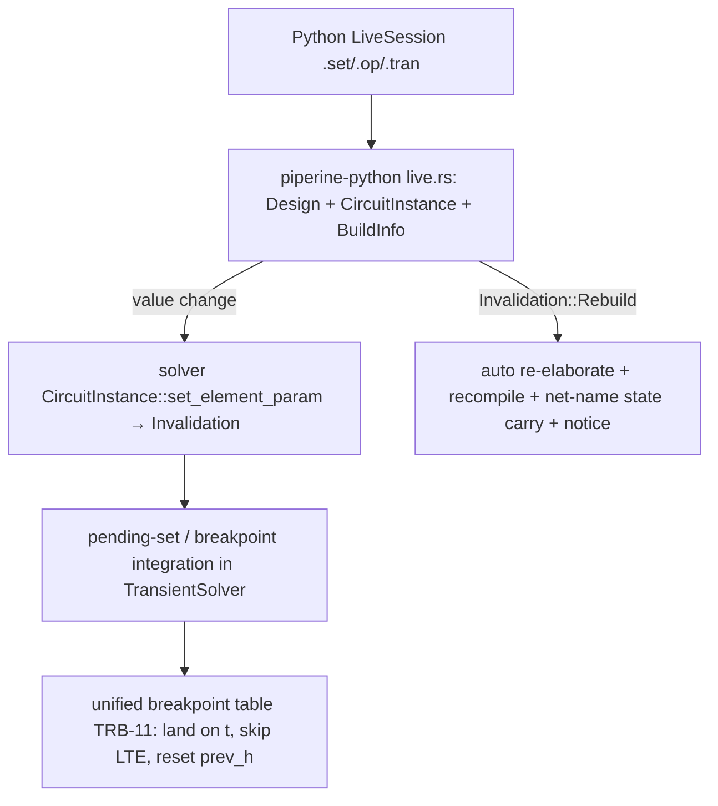

# solver-live-params Design

**Spec**: `.specs/features/solver-live-params/spec.md`
**Status**: Approved (user 2026-07-16)

## Architecture Overview

Three layers, one addressing scheme:

- **Solver layer** (`piperine-solver`): `set_element_param` hardened — PHDL
  path parity, loud errors listing params, bypass-cache invalidation,
  `Invalidation` honored by DC and transient drivers. A **scheduled-set
  queue** on the transient driver: host pushes `(t, label, param, value)`;
  the driver feeds `t` into the unified breakpoint table, applies the set
  when landing on `t`, re-solves consistently when invalidation ≥
  `OperatingPoint`. Immediate set while idle = apply now, effective next run.
- **Host layer** (`piperine-python/src/live.rs`, new): `LiveSession` owns the
  elaborated `Design`, the compiled `CircuitInstance`, and `CircuitBuildInfo`.
  Compile once; `set` routes to solver; `Rebuild` triggers auto re-elab
  (rebuild via `CircuitCompiler`, carry node voltages by net name as next
  guess, set `rebuilt` notice flag). **No new bench surface** (bench in-lang
  is being discontinued); bench result objects may be reused as types.
- **Python layer**: `design.compile()` → `_LiveSession` with
  `set(path, param, value)`, `schedule_set(t, ...)`, `op/tran/ac/noise`
  (same result shapes as `_Module` — PY-17), `rebuilds` counter/notice.

## Code Reuse Analysis

| Component | Location | How |
|---|---|---|
| `set_element_param` | `piperine-solver/src/core/circuit.rs:112` | Extend: loud errors w/ param list; parity with POM paths |
| `Element::set_param` + `Invalidation` | `core/element.rs:199`, `introspect.rs:69` | Already typed; drivers start honoring it |
| `AnalogInstance::set_param` | `codegen/device/analog.rs:683` | Params already runtime buffer — no JIT change for values |
| Unified breakpoint table | `solver/transient.rs:288-311` (TRB-11) | Scheduled sets feed the same table; reuse skip-LTE/reset-prev_h edge rules |
| Device bypass cache | solver bypass (CP-11) | Invalidate on set — same hooks as gmin/src_scale invalidation |
| POM addressing | `piperine-lang/src/pom/design.rs:298 set_param` | Parity oracle for path grammar tests |
| Compile-count proof | `piperine-bench/tests/compile_once_sweep.rs` pattern + `AnalogKernel::compile_count` | LIVE-02/LIVE-10 tests |
| Python analysis plumbing | `piperine-python/src/module.rs` (`solver_config`, `net_map`, results) | LiveSession reuses config/result mapping; does NOT fork per analysis |
| ParamDescriptor bounds | `core/introspect.rs` | Out-of-bounds set → loud (edge case) |

## Components

### 1. Solver: hardened live set + scheduled sets
- `CircuitInstance::set_element_param` — unknown param error includes
  `list_params()` names; success invalidates that element's bypass cache and
  marks OP dirty.
- `TransientSolver`: `pending_sets: Vec<ScheduledSet>` (or a
  `SetQueue` struct owned by the driver — MD-13 no loose fns). Each entry's
  `t` enters the breakpoint table; on landing: apply, map invalidation
  (`Restamp` → restamp next step; `Temperature` → recompute + restamp;
  `OperatingPoint`+ → consistent re-solve at t). Last-write-wins per param;
  one breakpoint per set call.
- DC driver: set between runs already works (T12); add OP-dirty handling.

### 2. Host: `LiveSession` (piperine-python, Rust side)
- Fields: `design: Design`, `circuit: CircuitInstance`, `info: CircuitBuildInfo`,
  `rebuilds: usize`.
- `set(path, param, value)`: try solver; on `Rebuild` → POM
  `Design::set_param` + re-elaborate + `CircuitCompiler` rebuild + carry node
  voltages by net-name into next-solve guess + `rebuilds += 1`. Re-elab
  failure → error surfaced, old circuit kept (LIVE-17).
- Analyses run on the held `circuit` (no fork, no rebuild).

### 3. Python face
- `_LiveSession` pyclass + facade class in the pure-Python layer
  (autocomplete parity with existing facade). Same result objects.
- Example script: resistor bisection to target voltage (LIVE-12 test rides it).

## Error Handling Strategy

| Scenario | Handling | User sees |
|---|---|---|
| unknown path | typed solver error | path echoed |
| unknown param | typed error + available params | param list |
| out-of-bounds value | `ParamError::Bounds`-style, no partial apply | bounds in message |
| re-elab failure on auto rebuild | session keeps old compiled circuit | elab error + "previous circuit still active" |
| set during tran with `Rebuild` | auto re-elab, tran restarts at t with carried ICs | rebuild notice |

## Risks & Concerns

| Concern | Location | Impact | Mitigation |
|---|---|---|---|
| Bypass cache stale after set | solver bypass (CP-11 trap) | silently wrong point | LIVE-05 dedicated test; reuse existing invalidation hooks |
| Element label ≠ POM path in some hierarchy corner (arrays/bundles) | codegen flatten labels | naming parity breaks | LIVE-01 parity test over hierarchical design incl. bundle instance |
| Reactive discontinuity on set (C/L value jump) | transient charge history | NaN / LTE storm | reuse breakpoint edge rules; LIVE-07 waveform-match test |
| Python `LiveSession` holding `CircuitInstance` across calls vs pyo3 borrow rules | piperine-python | runtime borrow panics | `RefCell`/`Py<...>` pattern already used by `_Module`; keep single-threaded contract explicit |
| Result-shape drift vs `_Module` | results.rs | PY-17 violation | LIVE-13 shape test reuses existing smoke-test comparisons |
| Bench harness still on SimSession | tests | none now | untouched; bench deprecation is a future feature |

## Tech Decisions

| Decision | Choice | Rationale |
|---|---|---|
| Where LiveSession lives | `piperine-python` (Rust side), not bench | Bench in-lang discontinued (user 2026-07-16); Python is the host surface |
| Mid-tran mechanism | Scheduled-set queue feeding the unified breakpoint table | One deterministic path serves tests now and real-time later |
| Auto re-elab owner | Host/LiveSession, never solver core | Solver has no POM; MD-18 boundary stays clean |
| Multiple sets same param | Last-write-wins; breakpoint per set call | Spec edge-case rule |

No new MD entries needed — conforms to MD-05/MD-13/MD-18.
