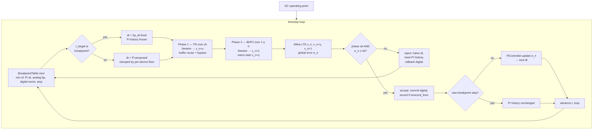

# TR-BDF2 Engine Design

**Spec**: `.specs/features/solver-trbdf2-engine/spec.md`
**Status**: Draft

---

## Baseline Evidence (TRB-20) — recorded before implementation

The discrimination circuit: a **periodic narrow-pulse charge pump** — a pure-PHDL
`Pulse` source (`if/else` on `$abstime`, true discontinuity at each edge) driving
an RC (R=1 kΩ, C=1 nF, τ=1 µs). Period 1 µs, pulse width swept 1 ns → 500 ns.
Simulated 100 µs (100 periods) under the **target 500-step budget** (`dt_max =
stop/500`), current `main` (Gear-2 + `LteStepper`, no breakpoints):

| Pulse width | Steps taken | V(out) after 100 µs | Verdict |
|-------------|-------------|---------------------|---------|
| 1 ns        | 568         | 0.5409              | indistinguishable from 10 ns |
| 10 ns       | 568         | 0.5409              | **identical to 1 ns — wrong** |
| 100 ns      | 2721        | 0.4365              | **budget blown 5.4× + non-monotonic** (lower than 10 ns!) |
| 500 ns      | 3385        | 2.0381              | **budget blown 6.8×** |

**Three failures, all fixed by this epic:**

1. **Missed pulses (no breakpoints).** 1 ns ≡ 10 ns — the stepper grows `dt`
   during the low phase and steps *over* the narrow pulse, so the charge it
   delivers is never resolved. TRB-10/11/12 force a landing on every edge.
2. **Non-monotonic / wrong value.** A wider pulse yields a *lower* voltage —
   physically impossible (more charge ⇒ higher V). The reactive LTE stepper
   partially trips on the wider pulses and lands on garbage. TRB-20 demands
   the correct, monotonic value within `reltol` of ngspice.
3. **Budget blown.** When the stepper *does* detect a pulse it thrashes
   `dt` reactively, taking 5–7× the 500-step budget. The PI controller
   (TRB-07) smooths growth; breakpoints remove the reactive shrinking.

**Target (new engine):** V(out) rises monotonically with `pw`, every width
distinguished, within ~500 accepted steps, matching ngspice within `reltol`.

---

## Design Discovery (T5 implementation attempt, 2026-07-14) — CRITICAL

The first two-phase driver implementation revealed a **kernel limitation**
that reshapes the plan. The reactive companion in `device/analog.rs::load_transient`
is `i_C = c0·Q(V) + c1·Q(V_prev) + c2·Q(V_prev2)` — a **pure-derivative**
form (BDF/Gear style). This is correct for BDF but **wrong for trapezoidal**:
the trapezoidal companion is

```
i_{C,n+1} = (2C/s)·(V_{n+1} − V_n) − i_{C,n}
```

which needs the **previous capacitor current** `i_{C,n}` as extra state. The
kernel does not track per-port previous current, so feeding the trapezoidal
coeffs `(2/(γh), −2/(γh), 0)` through the existing companion silently degrades
the TR stage to backward-Euler-over-half-step (`τ_eff ≈ 1.55τ` instead of `τ`
— measured on the RC discharge: `V(τ) = 0.524` vs `e⁻¹ = 0.368`). The BDF2
stage (phase 2) is fine — its pure-derivative companion is correct.

**Consequence:** TR-BDF2's TR stage requires a **kernel enhancement** — a
previous-current state bank per reactive port, applied only during the TR
phase — before the two-phase driver can produce correct results. This is a
new prerequisite task (T5a below). The BDF2 phase uses the existing
companion unchanged. (Pre-existing note: the opt-in `Trapezoidal` method
suffered the same silent 1st-order degradation; removing it in T13 retires
that latent bug.)

This is exactly the kind of finding the discrimination baseline was meant to
surface — and it did, on the very first integrated circuit.

---

## Architecture Overview

The transient engine becomes a single driver loop that consults a **unified
breakpoint table**, runs a **two-phase TR-BDF2 step**, estimates a **global
Milne LTE**, and feeds a **stateful PI controller**. TR-BDF2 is the sole
integration scheme — `IntegrationMethod`, the Gear order-ramp, and the
Trapezoidal codegen branch are deleted.



The two Newton solves (phase 1 + phase 2) share the **symbolic** LU (already
reused) and the **buffer** (new `reset()`); the numeric LU refactors per solve
because `c0` differs between phases. Device bypass (TRB-17) skips re-evaluation
when an element's terminals are unchanged, and when *no* element changed its
stamps the numeric LU is reused (TRB-18).

---

## Code Reuse Analysis

### Existing components to leverage

| Component | Location | How to use |
|-----------|----------|------------|
| `StepperStrategy` trait | `solver/convergence.rs:151` | New `PiController` impl; `LteStepper` removed as primary (per-device LTE kept as floor) |
| `NewtonRaphsonSolver::solve_with_strategy` | `math/newton_raphson.rs:218` | Called twice per timestep (TR phase, BDF2 phase); unchanged signature |
| `FaerSparseLinearSystem` + `SymbolicLu` | `math/faer.rs` | Add `reset()` for buffer reuse; symbolic LU already reused |
| `TransientAnalysisContext` | `analysis/transient.rs:138` | Carries the phase (TR/BDF2) and sub-step sizes to the kernel |
| `ElementCapabilities` bitflags | `core/element.rs:30` | Add `BYPASS_OK`; existing flags unchanged |
| `DigitalState::{checkpoint,rollback,commit}` | `digital/scheduler.rs:164-182` | Already wired in transient; breakpoints are absolute → survive rollback |
| `BreakpointProvider` trait | `math/integration.rs:170` | **Removed**; folded into `Element::next_breakpoints` (MD-13 rule 2) |
| `bdf2_coeffs` non-uniform formula | `math/integration.rs:121` | The BDF2 phase reuses it directly with `dt0=(1−γ)h, dt1=γh` |
| Pure-PHDL `Pulse` source | (this epic, test fixture) | 100% PHDL via `if/else` on `$abstime` + `floor`; no Rust primitive |

### Integration points

| System | Integration method |
|--------|-------------------|
| Transient driver | `TransientSolver::solve` rewritten to the two-phase loop above |
| Kernel (`device/analog.rs::load_transient`) | Calls `TrBdf2::phase_coeffs(phase, h)` instead of `bdf_coeffs(method,…)`; `method` param dropped |
| Digital scheduler | Future event times poured into `BreakpointTable`; `peek_next_event_time` removed from the transient driver (table-driven) |
| `Tolerances` | `.integration` field removed; PI gains (`kp`,`ki`) and `bp_dt` added |
| `TransientAnalysisOptions` | `dt_max` default → `stop/500` (500-step budget); `bp_dt` added |

---

## Components

### `TrBdf2` (the sole integration scheme)

- **Purpose**: Owns γ = 2 − √2, the per-phase companion coefficients, and the
  Milne LTE formula. Replaces the `IntegrationMethod` enum.
- **Location**: `crates/piperine-solver/src/math/integration.rs`
- **Interfaces**:
  - `TrBdf2::GAMMA: f64 = 2.0 - 2.0_f64.sqrt()` — the single constant.
  - `fn phase_coeffs(phase: TrBdf2Phase, h: f64) -> (f64, f64, f64)` — TR phase
    returns `(2/(γh), −2/(γh), 0)`; BDF2 phase returns the non-uniform BDF2
    coefficients for sub-step `(1−γ)h` with previous sub-step `γh` (delegates to
    the existing `bdf2_coeffs`).
  - `fn milne_lte(x_n, x_nγ, x_n1) -> f64` — the global LTE from the predictor
    differenced against the BDF2 solution.
- **Dependencies**: none (pure math).
- **Reuses**: `bdf2_coeffs` for the BDF2 phase.

### `TrBdf2Phase`

- **Purpose**: Tags which sub-step the kernel is stamping.
- **Location**: `crates/piperine-solver/src/math/integration.rs`
- **Interfaces**: `enum TrBdf2Phase { Trapezoidal, Bdf2 }`, carried on
  `TransientAnalysisContext.phase`.

### `PiController` (the timestep policy)

- **Purpose**: Replaces the reactive `LteStepper`. Smooth `dt` growth from the
  global Milne error; per-device LTE stays as a floor.
- **Location**: `crates/piperine-solver/src/solver/convergence.rs`
- **Interfaces**: `impl StepperStrategy for PiController` with state
  `{ prev_error: Option<f64>, kp, ki }`. `propose_dt` consumes the global LTE
  (the `StepperStrategy` trait gains an optional LTE argument). `reject_dt`
  halves `dt` and resets `prev_error = None`.
- **Dependencies**: `TrBdf2::milne_lte`, per-device `suggest_transient_step`
  (floor).
- **Reuses**: the `StepperStrategy` trait seam; `DampedNewton` unchanged.

### `BreakpointTable`

- **Purpose**: Sorted absolute times the integrator must land on. Fed by
  `Element::next_breakpoints` and the digital scheduler's future event times.
- **Location**: `crates/piperine-solver/src/solver/transient.rs` (or a new
  `solver/breakpoints.rs` module).
- **Interfaces**:
  - `fn rebuild(&mut self, elements, digital_state, from, horizon)` — collect
    breakpoints in `(from, from+horizon]`.
  - `fn next(&self, from) -> Option<Second>` — the next landing point.
  - Survives rollback (absolute times; not part of checkpointed state).
- **Dependencies**: `Element::next_breakpoints`, `DigitalState` event times.
- **Reuses**: `digital_time_epsilon` for equality.

### `Element::next_breakpoints` (ABI extension)

- **Purpose**: Per-element landing-point declaration. Default empty.
- **Location**: `crates/piperine-solver/src/core/element.rs`
- **Interfaces**: `fn next_breakpoints(&self, _from: Second, _horizon: Second)
  -> &[Second] { &[] }` (owned slice; elements with static schedules return a
  cached slice).
- **Reuses**: replaces the orphan `BreakpointProvider` trait (MD-13 rule 2).

### `ElementCapabilities::BYPASS_OK` (ABI extension)

- **Purpose**: An element opts into stamp reuse when its terminals barely move.
- **Location**: `crates/piperine-solver/src/core/element.rs`
- **Interfaces**: one new bitflag. The transient driver tracks per-element
  "terminals changed since last eval" (`reltol·|v| + vntol`); when unchanged +
  `BYPASS_OK`, it reuses the previous stamps. Suppressed while any element has
  `limiting_active()`.

### `FaerSparseLinearSystem::reset` (buffer reuse)

- **Purpose**: Clear `triplets`/`b_vec` without reallocating each Newton
  iteration.
- **Location**: `crates/piperine-solver/src/math/faer.rs`
- **Interfaces**: `fn reset(&mut self)` — `self.triplets.clear();
  self.b_vec.fill(E::zero())`. `NewtonRaphsonSolver` calls `reset()` instead of
  `L::new(...)`.

### `TransientSolver::solve` (rewritten driver)

- **Purpose**: The two-phase loop. Owns the `BreakpointTable`, the
  `PiController`, and the phase orchestration.
- **Location**: `crates/piperine-solver/src/solver/transient.rs`
- **Reuses**: `DampedNewton`, `NewtonRaphsonSolver::solve_with_strategy` (×2 per
  step), `DigitalState` checkpoint/rollback/commit.

### Codegen: kernel breakpoint schedule + phase coeffs

- **Purpose**: (a) JIT-compiled source models expose their edge times through
  `next_breakpoints`; (b) `load_transient` calls `TrBdf2::phase_coeffs` instead
  of `bdf_coeffs`.
- **Location**: `crates/piperine-codegen/src/device/analog.rs` (+ the kernel
  interface for breakpoint schedules).
- **Reuses**: the existing `eval_charge` plumbing as the model for
  `eval_breakpoints`.

---

## Data Models

### `TrBdf2Phase` (carried on `TransientAnalysisContext`)

```rust
pub enum TrBdf2Phase { Trapezoidal, Bdf2 }
```

`TransientAnalysisContext` drops `integration`/`order`/`dt_prev` (no method
selection, no order ramp) and gains `phase: TrBdf2Phase` + the sub-step `h`.
The kernel calls one function: `TrBdf2::phase_coeffs(ctx.phase, ctx.h)`.

### `BreakpointTable`

```rust
pub struct BreakpointTable {
    times: Vec<Second>,   // sorted, deduplicated, absolute
}
```

Rebuilt each step from elements + digital queue within `(t_now, t_now +
2·dt_max]`. Immutable across rollback.

### PI controller state

```rust
pub struct PiController {
    kp: f64,              // default 0.7
    ki: f64,              // default 0.4
    prev_error: Option<f64>,
}
```

Lives on `Tolerances` (config: `kp`/`ki`) and the driver (mutable
`prev_error`).

---

## Error Handling Strategy

| Scenario | Handling | User impact |
|----------|----------|-------------|
| Phase 1 (TR) or phase 2 (BDF2) Newton fails | Reject whole step, halve `dt`, reset PI history, retry from `x_n` (TRB-05) | Invisible — just slower |
| `dt` reduced to `dt_min` and step still fails | Return the underlying `SolverDomain::Newton` error (MD-09, no silent stall) | Loud error: "Newton: Failed to converge" |
| Milne LTE > tol after accept | Treat as reject (TRB-05): halve `dt`, redo both phases | Invisible — just slower |
| No breakpoints + empty digital queue | Pure PI path (table returns `None`) | Normal adaptive sim |
| Breakpoint coincides with digital event | Single landing at `t_next` (min already dedups) | Correct |

---

## Risks & Concerns

| Concern | Location | Impact | Mitigation |
|---------|----------|--------|------------|
| **`IntegrationMethod` removal is invasive** — deletes tested paths | `math/integration.rs`, `solver/transient.rs:40-50`, `device/analog.rs:710` | ~6 unit tests + the order-ramp logic gone; risk of missing a call site | A dedicated migration task greps every `IntegrationMethod`/`Trapezoidal`/`Gear` reference; the compiler enforces completeness (enum gone → every match arm errors) |
| **Two-phase doubles Newton cost** — 2 solves/step | `TransientSolver::solve` | Runtime regression vs single-solve Gear-2 | Buffer reuse (TRB-16) + device bypass (TRB-17/18) recover the cost; the 500-step budget (vs current 2721–3385) is the net win |
| **PI controller stability** — wrong `kp`/`ki` can oscillate | `PiController` | `dt` oscillates, budget blown | Defaults `0.7`/`0.4` (ngspice lineage); TRB-23 reports ±50% sensitivity; `reject_dt` resets history to kill bias |
| **Bypass × limiting interaction** — bypassing a limiting device breaks convergence | `core/element.rs`, driver | Silent wrong answer while `limiting_active` | TRB-19: bypass suppressed globally while ANY element limits (driver-level gate, not per-element) |
| **`StepperStrategy::propose_dt` signature change** — needs the global LTE | `solver/convergence.rs:155` | All impls change | Only two impls exist (`LteStepper` removed, `PiController` added); trait evolution is contained |
| **Digital queue → breakpoint table routing** — the "apply until" flip | `digital/scheduler.rs:160`, driver | Could double-count or miss events | `BreakpointTable` dedups with `digital_time_epsilon`; scheduler still drains at `t_next` unchanged |
| **Pure-PHDL `Pulse` is the test fixture, not a library module** | test file | Reused across test sites | Define once in a shared test constant (mirroring `VSOURCE`/`CAPACITOR`); a library `Pulse` is a follow-up |

---

## Tech Decisions

| Decision | Choice | Rationale |
|----------|--------|-----------|
| γ value | 2 − √2 (Hosea & Shampine) | Standard TR-BDF2; equal-weight stages |
| BDF2 phase coefficients | Reuse the existing `bdf2_coeffs(dt0=(1−γ)h, dt1=γh)` | The non-uniform formula already exists; no new math |
| Method selection | Removed entirely | User mandate: TR-BDF2 is the sole scheme; MD-13 (no vestigial surface) |
| Default `dt_max` | `stop/500` (500-step budget) | User target; the baseline shows the current `stop/50`–`stop/100` defaults miss pulses and blow the budget |
| `bp_dt` (post-breakpoint step) | `dt_min · 100`, on `TransientAnalysisOptions` | Resolves the edge without stalling; MD-03 placement |
| Bypass tolerance | `reltol·|v| + vntol` | Same vocabulary as convergence; no new knob |
| PI error history at breakpoints | Frozen (not updated) | Breakpoint steps are artificially short; updating would pollute the PI |
| Discrimination circuit | Narrow-pulse charge pump (pure-PHDL `Pulse` → RC) | Physically valid; the baseline proves 3 distinct failures; breakpoints + PI are the direct fix |

> **Project-level decisions:** none new — this feature implements MD-05, MD-07,
> MD-08, MD-12 (partial), MD-13. No `AD-NNN` additions to STATE.md.
