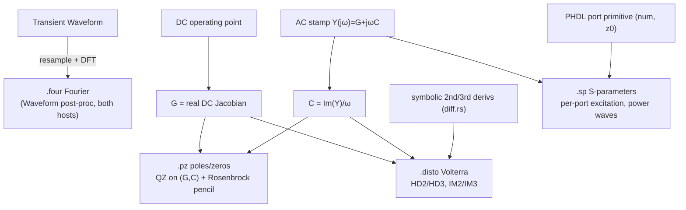

# Spectral & Small-Signal Analyses Design

**Spec**: `.specs/features/spectral-analyses/spec.md`
**Status**: Draft

Four analyses, each an *assembly* of primitives the solver already owns. This
doc documents the **algorithm** of each (the user's explicit ask) precisely
enough to implement and to validate against closed forms.

---

## Architecture Overview



**Placement (MD-17, MD-22):** three new solver analyses live in
`crates/piperine-solver/src/analyses/` (`pz.rs`, `sp.rs`, `disto.rs`),
siblings of `ac.rs`/`tf.rs`/`noise.rs`, each exporting an options struct + a
`…Solver` driver, wired through `analyses/mod.rs` and surfaced on
`prelude`/`result`. `.four` is **not** a solver analysis — it is a method on
`Waveform` (root `piperine-api`) + a Python `Waveform` method, no solver
entry. Every solver analysis is mirrored on both hosts in this feature
(MD-22): the Rust object-model call and the Python facade land together.

**Coordination:** all four add *new* files; none edits a file the in-flight
`solver-simplification` refactor touched. The only shared edits are additive
lines in `analyses/mod.rs`, `prelude.rs`, `result.rs` (new re-exports / result
structs) — append-only, low collision risk.

---

## Code Reuse Analysis

### Existing Components to Leverage

| Component | Location | How to Use |
| --------- | -------- | ---------- |
| `DcSolver` | `analyses/dc.rs` | Operating point for `.pz`/`.disto`/`.sp` — same `DcSolver::new(circuit).solve()` prologue as `ac.rs`/`tf.rs`. |
| `AcSystem` / `load_ac` complex stamps | `analyses/ac.rs`, `Element::load_ac` | `.sp` reuses the AC assemble+solve per frequency; `.pz` reuses one AC stamp to extract `C`. |
| `assemble_dc_stamps` pattern | `analyses/tf.rs:214` | `.pz`/`.disto` build the linearized `G` the same way (update devices at DC point, collect `load_dc` stamps, drop `Rhs`). |
| `FaerSparseLinearSystem` / `FaerSymbolicMatrix` | `math/faer.rs` | `.sp`/`.disto` per-frequency complex solves; reuse symbolic LU pattern across frequencies (MD-18 restamp discipline). |
| `Mat::generalized_eigen` (QZ) | `faer 0.23.2` | `.pz` poles/zeros — returns `S_a()`/`S_b()`; λ = α/β, β≈0 ⇒ pole at ∞. |
| `diff::d_dv` / `d_dnode` | `codegen/src/lower/diff.rs` | `.disto` 2nd/3rd derivatives by *reapplying* `d_dv` to an already-differentiated `Expr`. |
| Waveform interpolation | `piperine-api/src/waveform.rs` `Waveform::at` | `.four` resamples the non-uniform TR-BDF2 grid onto a uniform one. |
| `SolverDomain` typed errors | `solver/error.rs` | new domains `Pz`, `Sp`, `Disto`; `.four` uses an api-level error. |

### Integration Points

| System | Integration Method |
| ------ | ------------------ |
| Host object model (MD-22) | Rust `Module::pz/sp/disto` + `Waveform::fourier`; Python `module.pz/sp/disto` + `waveform.fourier` — same names/shape. |
| ngspice cross-check | `tests/ngspice/` gains `.four`/`.pz`/`.disto`/`.sp` decks where ngspice supports them. |

---

## Algorithm 1 — `.four` (Fourier)  [FOUR-01…05]

**Input:** a `Waveform` (time, value samples for one output), fundamental
`f0 > 0`, harmonic count `N` (default 10).

**Steps:**

1. **Window.** Take the last full period `[t_end − T, t_end]`, `T = 1/f0`.
   If `t_end − t_start < T` → fail loud (FOUR-04).
2. **Resample.** Build a uniform grid of `M` points over the window
   (`M = max(2·N, 256)`, power-of-two not required — direct DFT, not FFT, on
   the Rust side for exactness; Python may use `numpy.fft`). Sample the
   waveform at each grid point via `Waveform::at` (linear interp) — this
   defuses the non-uniform TR-BDF2 grid (FOUR-03).
3. **DFT at harmonics.** For `k = 0..N-1`:
   `X_k = (1/M)·Σ_{m=0}^{M-1} x_m · exp(−j·2π·k·m/M)`.
   DC term `k=0` uses the real mean. Magnitude `|X_k|` doubled for `k≥1`
   (single-sided spectrum), phase `arg(X_k)`.
4. **Normalize + THD.** `norm_mag_k = |X_k| / |X_1|`,
   `norm_phase_k = phase_k − phase_1`,
   `THD = sqrt(Σ_{k≥2} |X_k|²) / |X_1|` (FOUR-02).

**Result type** `FourierResult { fundamental: f64, harmonics: Vec<FourierComponent>, thd: f64 }`,
`FourierComponent { frequency, magnitude, phase, norm_magnitude, norm_phase }`.

**Validation:** synthesize `sin(2πf0 t)+0.1·sin(2π·3f0 t)` → HD3=0.1, THD=0.1,
DC=0; cross-check numpy FFT (FOUR-02).

**Why direct DFT (not FFT) on the Rust side:** exactness at exactly `k·f0`
without bin-leakage worries, and `N` is tiny (≤ ~20). Python wraps numpy for
ergonomics but returns the *same* fields (MD-22); a parity test pins Rust==Py.

---

## Algorithm 2 — `.pz` (Pole-Zero)  [PZ-01…07]

The circuit linearized at the DC point is a descriptor (MNA) system

```
C·(dx/dt) = −G·x + b·u ,     y = lᵀ·x
```

with **G** the real DC Jacobian and **C** the reactive (charge/flux) matrix.
Transfer function `H(s) = lᵀ (sC + G)⁻¹ b`.

### Matrix extraction

- **G** — assemble exactly as `tf.rs::assemble_dc_stamps`: update devices at
  the DC point, collect `load_dc` stamps, drop `Rhs` → dense `G` (n×n).
- **C** — take **one** `load_ac` stamp at a probe `ω0` (e.g. `ω0 = 1`).
  Every Piperine stamp is affine in `jω`: `Y(jω) = G + jω·C`. Hence
  `C = Im(Y(jω0)) / ω0`. This holds because reactive contributions are `jωC`
  (charge companions) and inductor branch rows are `−jωL` on the branch
  unknown — both linear in `jω` (branch-current MNA keeps them linear).
  **Guard (PZ-06):** verify linearity by sampling a second `ω1`:
  `Im(Y(jω1))/ω1 ≈ Im(Y(jω0))/ω0` and `Re(Y(jω1)) ≈ Re(Y(jω0))`; if a device
  breaks it → fail loud (a frequency-nonlinear stamp cannot be a `(G,C)`
  pencil).

### Poles  [PZ-01]

Poles are the `s` with `det(sC + G) = 0` ⇔ generalized eigenvalues of the
pencil. Solve `A x = λ B x` with `A = −G`, `B = C`:

```
qz = (-G).generalized_eigen(C)          // faer QZ
for (α, β) in zip(qz.S_a(), qz.S_b()):
    if |β| > tol_inf * (|α|+|β|):  poles.push(α / β)   // finite
    else:                          skip                // pole at ∞ (algebraic)
```

`s = α/β` is the pole in rad/s. `|β|≈0` ⇒ "pole at infinity" (algebraic
constraint row) — dropped. If **no** finite pole survives *and* the circuit
has no reactive stamp → fail loud (PZ-05).

### Zeros  [PZ-02]

Transmission zeros of `H` are where the **Rosenbrock system pencil** drops
rank:

```
        [ sC + G   −b ]
P(s) =  [  lᵀ       0 ]
```

i.e. the finite generalized eigenvalues of the bordered `(n+1)×(n+1)` pencil

```
A' = [ −G   b ]      B' = [ C   0 ]
     [  lᵀ  0 ]           [ 0   0 ]
```

`b` = the input excitation column (unit into the input source's branch/node),
`l` = the output selector row (V(out) or V(out)−V(ref), or a branch current).
Same QZ + infinite-filter as poles. This is the textbook Rosenbrock definition
of transfer-function zeros — exact, no root-search heuristic (contrast
ngspice's Müller iteration).

### Post-processing  [PZ-03]

Sort by |Re|; pair complex conjugates; snap `|Im| < tol_real·|s|` to the real
axis. Result `PoleZeroResult { poles: Vec<Complex<f64>>, zeros: Vec<Complex<f64>> }`
(rad/s). Host may present in Hz (`/2π`).

**Validation (PZ-04):** RC → `s = −1/(RC)`; series RLC →
`−R/2L ± j·sqrt(1/LC − (R/2L)²)`; RC-with-zero (bridged-T) → known zero.

---

## Algorithm 3 — `.sp` (S-Parameters)  [SP-01…06]

N-port scattering matrix over a frequency sweep, on the AC-linearized circuit.

### Ports (frontend — see "Port primitive" below)

Each port `i`: an ordered index `num`, two nodes `(p, n)` (n may be gnd), a
real reference impedance `z0_i` (default 50 Ω). A port is physically a `z0`
resistor between its nodes plus a switchable AC excitation.

### Per-frequency algorithm

For each frequency `f`:

1. Assemble the AC system `Y(jω)` once (reuse `AcSystem`); the `.sp` driver
   adds each port's `z0` termination conductance to the stamp set at setup
   (ports are analysis-time, not baked into the authored netlist).
2. For each **driven** port `j` (others left matched by their own `z0`
   resistor, no source): inject a unit AC current `I_j = 1 A` at port `j`'s
   node pair, solve `Y·V = I` (reuse the AC complex solve).
3. Measure at every port `i`: node voltage `V_i = V(p_i) − V(n_i)` and the
   current `I_i` **into** the network at port `i`
   (`I_i = (V_i)/z0_i` contributed by the termination minus the injected
   source; bookkeeping below).
4. **Power waves** (real `z0`, Kurokawa normalization):
   `a_i = (V_i + z0_i·I_i) / (2·sqrt(z0_i))`,
   `b_i = (V_i − z0_i·I_i) / (2·sqrt(z0_i))`.
   With only port `j` driven and all ports terminated in their own `z0`,
   `a_i = 0` for `i ≠ j`, so `S_ij = b_i / a_j` (SP-02).
5. Fill column `j` of `S`. Repeat for all `j`.

**Practical stamping:** the cleanest equivalent is the *Thévenin port* — a
voltage source `E_j` behind `z0_j`. Driving port `j` with `E_j = 1 V` and all
others with `E=0` (but their `z0` still in place) makes `a_j = 1/(2√z0_j)`
constant and `a_i=0` for `i≠j`. Then `b_i = (V_i − z0_i I_i)/(2√z0_i)` and
`S_ij = b_i/a_j`. This avoids fragile current bookkeeping (measure only node
voltages + the source-branch current, both already solver unknowns).

**Result** `SpResult { frequencies: Vec<f64>, s: Vec<Array2<Complex<f64>>>, z0: Vec<f64>, n_ports }`.

**Validation:** matched series-R attenuator (analytic `S11`,`S21`); shunt-C
low-pass `S21` roll-off; reciprocity `S12==S21`, passivity `|S_ii|≤1`
(SP-03, SP-04).

### Port primitive — `@rfport` attribute (LOCKED, user 2026-07-19)

Ports are declared with an **`@rfport` attribute** on a node/wire, reusing the
existing attribute-schema machinery (Part VI: `@schema`/`@attribute`,
`piperine-plugin` attr schemas) — **no** new device kind, **no** stamped port
element, **no** `IS_PORT` capability flag:

```phdl
@rfport(num = 1, z0 = 50)  wire rf_in;
@rfport(num = 2, z0 = 50)  wire rf_out;
```

- The attribute carries `num` (1-based port index) and `z0` (reference
  impedance, default 50). The reference terminal is `gnd` for a single node;
  a differential form (`@rfport(num=1, z0=50, ref=n)`) is the follow-up shape.
- The `.sp` driver reads the attribute schema at setup, enumerates the ports,
  and **adds the `z0` termination + Thévenin excitation itself** for the
  duration of `.sp` (the network as authored has no port impedance baked in —
  ports are an analysis-time concept, matching Spectre where `port`
  terminations belong to the S-parameter setup).
- Extraction path: attributes live on the POM node; the host resolves
  `@rfport` schema instances → `(num, z0, node_ref)` and passes them into the
  solver's `.sp` options. No solver-ABI change.

Fail loud (SP-05): `num` collisions, `z0 ≤ 0`, unknown node, zero ports.

---

## Algorithm 4 — `.disto` (Volterra Distortion)  [DISTO-01…06]

Small-signal weakly-nonlinear distortion by the **method of nonlinear
currents** (Volterra, first three kernels). All solves are on the AC-
linearized system `Y(jω) = G + jωC` reusing one symbolic LU per frequency.

### Device derivatives (the enabler — DISTO-03/04)

Each nonlinear contribution `f(v)` (resistive `i(v)` and charge `q(v)`) needs
its 2nd and 3rd derivatives w.r.t. every controlling branch voltage. Produced
**symbolically** by reapplying `diff::d_dv`:

- 1st: `f' = d_dv(f)` (already emitted for the Jacobian).
- 2nd: `f'' = d_dv(f')`; cross terms `∂²f/∂vⱼ∂vₖ = d_dv_k(d_dv_j(f))`.
- 3rd: `f''' = d_dv(f'')` and the mixed 3rd partials.

These become **new JIT kernels** (`disto2`, `disto3`) emitted alongside the
residual/Jacobian in `jit/analog.rs`. A nonlinearity whose higher derivative
cannot be lowered → `CodegenError::Unsupported` naming the device (DISTO-04).
No numeric perturbation (fail-loud convention).

### Single-tone (F1) → HD2, HD3  [DISTO-01]

1. **First order.** Solve `Y(jω1)·X1 = b` (unit input at F1). `X1` = the
   linear node responses (complex phasors).
2. **Second order (2·F1).** Each nonlinear device contributes a *nonlinear
   current* `I2 = ½ · f''(V_dc) · X1⊙X1` (Hadamard over its controlling
   voltages, per the device's derivative kernel). Assemble `I2` as an RHS,
   solve `Y(j·2ω1)·X2 = −I2`. `X2` = the 2·F1 response phasors.
   `HD2 = |X2(out)| / |X1(out)|`.
3. **Third order (3·F1).** Nonlinear current from 3rd derivative *and* the
   2nd-order mixing of `X1` with `X2`:
   `I3 = (1/6)·f'''·X1³ + ½·f''·(2·X1⊙X2)`. Solve
   `Y(j·3ω1)·X3 = −I3`. `HD3 = |X3(out)| / |X1(out)|`.

### Two-tone (F1, F2) → IM2, IM3  [DISTO-02]

Inputs at F1 and F2 (amplitudes per ngspice `skw2`/`refpow` convention).
First order gives `X1@F1`, `X1@F2`. Second-order nonlinear currents produce
responses at `F1±F2` (IM2); third-order at `2F1±F2`, `2F2±F1` (IM3) via the
same kernels evaluated with the appropriate phasor products. Solve `Y` at each
mix frequency; report IM2, IM3 ratios.

**Result** `DistoResult { hd2, hd3, im2, im3, per_freq: Vec<…> }` (fields
populated per mode).

**Validation (DISTO-05):** a polynomial VCCS `i = g1 v + g2 v² + g3 v³` at
bias, amplitude `A`: closed-form `HD2 = ½·(g2/g1)·A`,
`HD3 = ¼·(g3/g1)·A²` (matched ≤ 1e-3 rel).

**Phasing:** this is the heaviest task — it introduces codegen kernels
(`disto2`/`disto3`) and a new complex multi-frequency driver. Tasks phase it:
(a) 2nd-derivative kernel + HD2 single-tone; (b) 3rd-derivative + HD3;
(c) two-tone IM2/IM3. Each phase independently validatable.

---

## Data Models

```rust
// piperine-api (both hosts, MD-22)
pub struct FourierComponent { pub frequency: f64, pub magnitude: f64,
    pub phase: f64, pub norm_magnitude: f64, pub norm_phase: f64 }
pub struct FourierResult { pub fundamental: f64,
    pub harmonics: Vec<FourierComponent>, pub thd: f64 }

// piperine-solver::result
pub struct PoleZeroResult { pub poles: Vec<Complex<f64>>, pub zeros: Vec<Complex<f64>> }
pub struct SpResult { pub frequencies: Vec<f64>,
    pub s: Vec<ndarray::Array2<Complex<f64>>>, pub z0: Vec<f64>, pub n_ports: usize }
pub struct DistoResult { pub hd2: Option<f64>, pub hd3: Option<f64>,
    pub im2: Option<f64>, pub im3: Option<f64>, /* + per-freq detail */ }
```

---

## Error Handling Strategy

| Error Scenario | Handling | User sees |
| -------------- | -------- | --------- |
| `.four` span < 1 period, `f0≤0`, `N<2` | `SolverDomain::Fourier` (api err) | typed error, no partial spectrum |
| `.pz` no reactive elements | fail loud after empty finite-pole set | "circuit has no reactive elements; no finite poles" |
| `.pz` freq-nonlinear stamp | two-ω linearity guard fails | "device X reports non-(G+jωC) AC stamp" |
| `.sp` bad port (`z0≤0`, dup `num`, unknown node, 0 ports) | validation in setup | typed `SolverDomain::Sp` |
| `.disto` unlowerable higher derivative | `CodegenError::Unsupported` | names the device |
| any analysis, no analog unknowns | fail loud at setup | "no analog network" |

---

## Risks & Concerns

| Concern | Location | Impact | Mitigation |
| ------- | -------- | ------ | ---------- |
| `.disto` codegen kernels (2nd/3rd deriv) are the largest new surface; the temp-tape flattener ([[flattener-temp-tape]]) may explode on repeated `d_dv` | `codegen/src/lower/diff.rs`, `jit/analog.rs` | tree blow-up / perf | Reuse the shared value-tape (derivatives reference tape entries, not inlined); phase `.disto` last; validate on the polynomial VCCS before wiring real devices. |
| Dense QZ is O(n³) | `.pz` | slow on large circuits | `.pz` is a characterization analysis (not inner loop); acceptable. Document the dense-only limit; sparse Arnoldi is a post-V1 upgrade. |
| `C` extraction assumes affine-in-jω stamps | `.pz`/`.disto` | wrong `C` if violated | two-ω linearity guard fails loud (PZ-06). |
| `.sp` `@rfport` attribute plumbing | attr-schema → POM node → host → `.sp` options | frontend/host touch, no solver-ABI change | Reuses Part VI attribute machinery; `.sp` adds terminations at setup; `.sp` is P2, lands after `.four`/`.pz`. |
| Additive edits to `analyses/mod.rs`/`prelude.rs` collide with `solver-simplification` | shared files | merge friction | Append-only re-export lines; other AI is done (user); rebase if needed. |

---

## Tech Decisions

| Decision | Choice | Rationale |
| -------- | ------ | --------- |
| PZ eigensolver | faer `generalized_eigen` (QZ), dense | Native, singular-`C` safe via α/β; no Müller root-search |
| PZ zeros | Rosenbrock bordered pencil | Exact textbook transmission zeros; one more QZ, no heuristic |
| `C` extraction | `Im(Y(jω0))/ω0` + two-ω guard | Reuses `load_ac`, no new device ABI method |
| `.four` engine | direct DFT (Rust), numpy (Python), parity-tested | Exact at `k·f0`; `N` tiny |
| `.sp` port model | `@rfport` attribute (LOCKED); `.sp` adds Thévenin source behind `z0` at setup | Idiomatic (Part VI attributes); `a_j` constant, `a_{i≠j}=0`; no port element stamped |
| `.disto` derivatives | symbolic (repeated `d_dv`) | Fail-loud faithfulness; no numeric perturbation |
| **PORT-FMT** (LOCKED, user 2026-07-19) | `@rfport(num, z0)` attribute on a node/wire, read at `.sp` setup via the attribute-schema machinery; the `.sp` driver adds the `z0` termination itself | User: most Piperine-idiomatic; reuses the existing `@schema`/attribute path (Part VI), no new device kind, no `IS_PORT` capability flag, no stamped port element |

> **Project-level:** PORT-FMT (`@rfport` attribute) touches the frontend/host
> attribute path, **not** the solver Element ABI — no MD amendment needed. The
> `@rfport` schema name becomes a stdlib-reserved attribute; note it in the
> attribute-schema docs when the `.sp` task lands.
</content>
