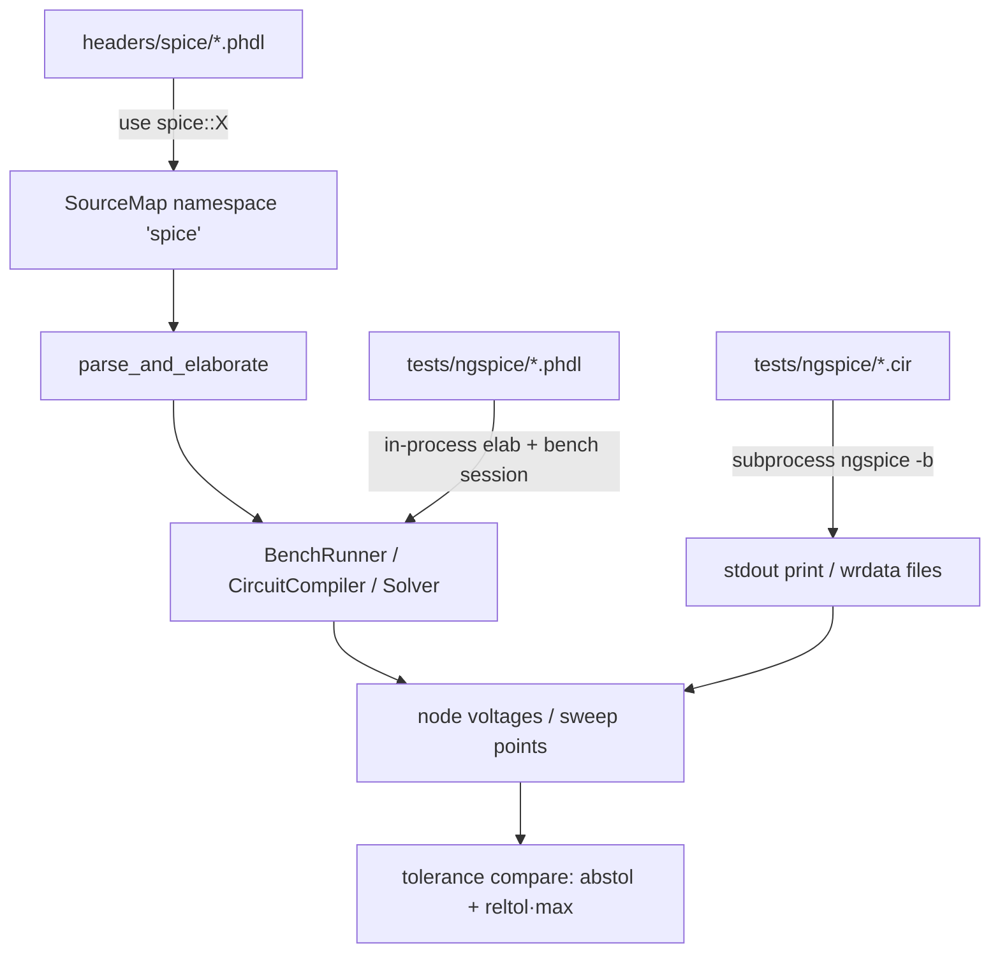

# spice-stdlib Design

**Spec**: `.specs/features/spice-stdlib/spec.md`
**Status**: Draft

## Architecture Overview

Three components, sequential: (1) migration of the PHDL models into builtin
headers + namespace registration, (2) an ngspice cross-validation harness as a
`piperine-bench` integration test, (3) transistor correctness fixes verified
through that harness.

### Approach choices (explored)

1. **Harness runtime** — (a) keep python `run.py` as script; (b) **Rust
   integration test in `piperine-bench/tests/`, piperine side in-process,
   ngspice side subprocess** (chosen — approved with spec); (c) shell script in CI.
   (b) wins: runs under `cargo test --workspace`, reuses bench elab helpers, no
   stdout parsing on the piperine side (reads result objects directly).
2. **Sweep comparison** — (a) one `.op` per point in both simulators; (b)
   **ngspice `.dc` + `wrdata` export, piperine bench-loop staging the swept
   source + `$op`/in-process DC per point** (chosen). Same points, CSV-style
   artifact per user rule 2, no native `.dc` needed.
3. **Namespace precedence** — (a) builtin always wins; (b) **project wins:
   builtin `spice` inserted only if no project package claimed the name**
   (chosen; matches user expectation that local deps override stdlib).

## Code Reuse Analysis

| Component | Location | How to Use |
|---|---|---|
| Namespace registration | `crates/piperine-project/src/source_map.rs:57` (`add_namespace("piperine", headers_dir)`) | Add `spice` → `headers_dir/spice` beside it, guarded by "not already claimed" |
| Dummy map for lang tests | `crates/piperine-lang/src/source_map.rs::dummy` | Add `spice` → `headers/spice` |
| Bench e2e infra | `crates/piperine-bench/tests/bench.rs` (`elab` helper) | Same pattern for validation test: elaborate `.phdl` string/file, run bench, read results |
| Bench session / results | `piperine-bench/src/{session,objects}.rs` | Read node voltages programmatically (no `$display` parsing) |
| Existing circuits + harness contract | `~/Git/plugins/piperine-spice/validation/` | Port 8 circuit pairs + tolerance formula `|Δ| ≤ abstol + reltol·max(|a|,|b|)` |
| ngspice golden C sources | `~/Git/ngspice/src/spicelib/devices/{mos1,jfet,bjt}` | Line-by-line diff target for the correctness fixes |
| Homotopy | `piperine-solver/src/solver/convergence.rs` + `dc.rs::solve_gmin_stepping` / source stepping (PARTIAL) | BJT fixes extend `HomotopyStrategy` composition (MD-05) |

## Components

### 1. `headers/spice/` (migration)

- **Purpose**: builtin stdlib home of the models.
- **Location**: `crates/piperine-lang/headers/spice/{lib,constants,passives,sources,controlled,switches,diode,bjt,mos,jfet}.phdl`
- **Source**: `~/Git/plugins/piperine-spice/src/` verbatim (newer copy; `Real?`
  optionals, `pub` items). `.bak`/`.experiment` files are **not** migrated.
- **Interfaces**: `use spice::<file>;` from any project; `use spice::constants;`
  self-reference must resolve through the same namespace.
- **Registration**: `piperine-project/src/source_map.rs` — insert `spice` before
  project/dependency names, or via entry-if-absent, so a project package named
  `spice` shadows the builtin (SPICE-04). Same addition in `SourceMap::dummy`.
  Check `piperine-lang-server` `ProjectContext::discover` picks it up (it builds
  through piperine-project — verify, don't duplicate).

### 2. `ngspice_validation` test (harness)

- **Purpose**: golden-reference compare, part of `cargo test`.
- **Location**: `crates/piperine-bench/tests/ngspice_validation.rs` + circuit
  pairs in `crates/piperine-bench/tests/ngspice/` (`<name>.cir`,`<name>.phdl`,
  sweeps add `<name>.sweep.toml`-free convention: sweep config encoded in the
  `.cir` `.dc` line and mirrored in the test table).
- **Interfaces** (all owned by a `NgspiceHarness` struct — MD-13 rule 2, no
  loose functions):
  - `NgspiceHarness::detect() -> Option<Self>` — `ngspice` on PATH? else skip.
  - `op_case(name) -> CaseResult` — run `.cir` via `ngspice -b`, parse
    `v(node) = …`; run `.phdl` in-process; compare shared nodes.
  - `sweep_case(name, …) -> CaseResult` — ngspice `wrdata` file vs piperine
    staged-source loop; point-by-point compare.
  - Tolerances: `reltol 1e-3`, `abstol 1e-6` (V) / `1e-9` (A), constants on the
    struct.
- **Error handling**: 0 shared nodes → test failure ("contract violation");
  unparseable ngspice output → failure with raw output excerpt; piperine
  non-convergence → failure naming circuit + solver error.
- **Skip path**: no binary → `eprintln!("SKIP: ngspice not on PATH")`, pass.

### 3. Correctness fixes (diagnosis-driven)

- **MOS1 (~1.5× Id)** — suspect list from model scan: `von`/body-effect path,
  `tTransconductance` temperature preprocessing, `vds_eff`/`mode` handling,
  geometry defaults (`w`,`l` defaults vs ngspice `1e-4`). Method: Id–Vgs and
  Id–Vds sweeps vs ngspice `.dc`, bisect region where curves diverge, then
  line-diff `headers/spice/mos.phdl` against `mos1load.c`/`mos1temp.c`.
  Fix lands in the PHDL model (equations), not the solver.
- **JFET (~15 mV)** — same sweep-bisect method against `jfetload.c`.
- **BJT saturation + mirror (convergence)** — solver-side: complete source
  stepping (`HomotopyStrategy` impl, MD-05-conformant) so deep-saturation and
  coupled-BJT circuits converge; models stay untouched unless sweeps expose an
  equation gap. ngspice reference: `NIiter`/`dynamic gmin` + `srcSteps` in
  `ni/niiter.c`, `cktop.c`.

## Error Handling Strategy

| Error Scenario | Handling | User Impact |
|---|---|---|
| ngspice absent | skip with notice | test passes, message visible with `--nocapture` |
| ngspice output unparseable | test fails, raw excerpt printed | loud, no silent pass |
| piperine solve diverges | test fails with solver error + circuit name | distinguishes model bug from harness bug |
| node mismatch | fail: circuit, node, both values, Δ | actionable diff |
| builtin/project `spice` clash | project wins | documented in spec.md assumption |

## Risks & Concerns

| Concern | Location | Impact | Mitigation |
|---|---|---|---|
| Namespace insert order decides shadowing silently | `piperine-project/src/source_map.rs:27,57` | user package clobbered by builtin (or vice versa) | explicit if-absent guard + dedicated test (SPICE-04) |
| BJT mirror may need more than source stepping (coupled positive feedback) | `solver/dc.rs` | scope balloon into solver | bound: gmin+source composition first; if still failing, escalate to user with diagnosis before inventing new homotopy |
| mos1 body size near Cranelift limits (temp-tape mitigated) | `codegen/jit/flatten.rs` | sweep tests slow or compile failure | compile once per circuit, stage source value per point (no recompile) |
| `run_examples.rs` + 391-test baseline must stay green | workspace | regression | full-suite gate per task |
| Stale fork `~/Git/piperine-spice` confuses future greps | external | drift returns | SPICE-14 deprecation READMEs in both repos |
| `fetlim`/`limvds` are identity in piperine | codegen/solver | sweep points near region boundaries may oscillate instead of converge | acceptable unless sweeps fail; then implement per ngspice `devsup.c` under existing ConvergenceHint mechanism |

## Tech Decisions

| Decision | Choice | Rationale |
|---|---|---|
| Harness language | Rust test, piperine in-process | cargo-test integration; no stdout parsing on piperine side |
| Sweep export | ngspice `wrdata` (ASCII columns) | user rule 2 (CSV-style artifact); trivially parseable |
| Builtin vs project namespace | project wins | least surprise; stdlib never breaks an existing project |
| Model fixes location | PHDL equations for MOS1/JFET; solver homotopy for BJT | matches 2026-07-12 diagnosis; keeps models ngspice-line-faithful |
| python `validation/run.py` | not ported | superseded by Rust harness; circuits carry over |

No new project-level AD entries — everything conforms to MD-05/MD-13.
