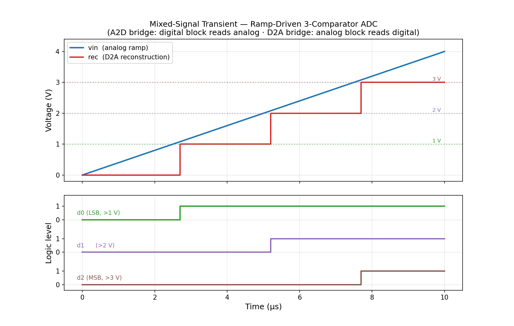
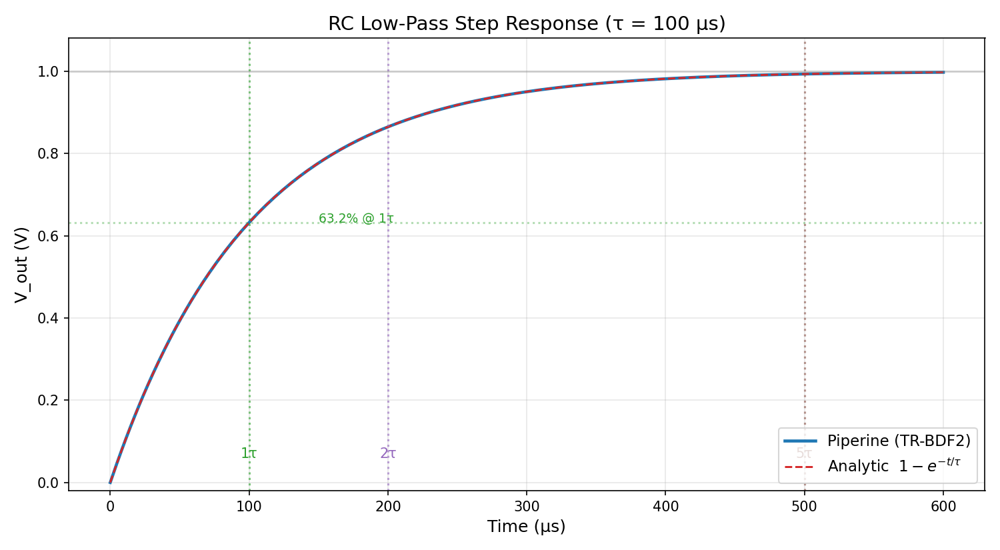
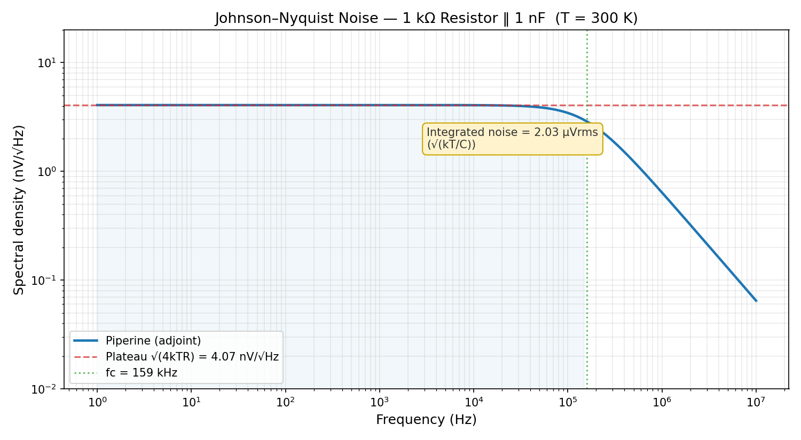

<div align="center">


**A modern hardware-description language and a native analog / mixed-signal simulator — in one toolchain.**

Design a circuit in **PHDL**, simulate it on a **pure-Rust in-house solver** (no SPICE underneath), and verify it with **real Python** — not a `.measure` mini-language.

</div>

> ⚠️ **Work in progress — not production ready.** APIs, syntax, and behavior
> change without notice. Use it to explore and contribute, not for anything you
> depend on. PHDL is an **experimental** language.

---

## What is Piperine?

Piperine is a complete, HDL-centric design toolchain for the **low/medium-level
designer** — hobbyists, independent professionals, and small teams building real
products without Cadence-class tooling. One language and one host cover the whole
loop: design entry, SPICE-class simulation, mixed-signal, and interactive
verification.

- **PHDL** (`.phdl`) is a real language — generics with const parameters,
  capabilities (traits), bundles, enums, SI-suffixed literals (`2.2u`, `10k`),
  typed attributes — resolved at elaboration by a pure evaluator, **never a macro
  stage**.
- It compiles **straight into a native in-house solver**: analog devices are
  JIT-compiled to machine code via **Cranelift**, digital behavior runs on an
  **event-driven interpreter**. No external SPICE, no Verilog-AMS — PHDL is the
  frontend.
- The device Jacobian is **symbolically differentiated** and JIT-compiled next to
  its residual — your model's derivative is exact, not finite-difference.
- Verification is **code**: `import piperine` gives you the elaborated design,
  the analyses, and numpy waveforms. No TCL, no hidden state.

```
PHDL (.phdl) ──► elaborated design ──► Cranelift-JIT analog devices ──► native solver
                                            + event-driven digital interpreter
                                            + optional OSDI (.osdi) Verilog-A models
   hosts: Python (import piperine) · Rust (piperine-api) — drive analyses & measurement
```

---

## See it in 60 seconds

Describe a resistive divider in PHDL:

```phdl
discipline Electrical { potential v : Real; flow i : Real; }

mod VoltageSource(inout p : Electrical, inout n : Electrical) { param voltage : Real = 5.0; }
analog VoltageSource { V(p, n) <- voltage; }

mod Resistor(inout p : Electrical, inout n : Electrical) { param r : Real = 1e3; }
analog Resistor { I(p, n) <+ V(p, n) / r; }

mod DividerBoard() {
    wire gnd : Electrical;  wire vin : Electrical;  wire mid : Electrical;
    source : VoltageSource(.p = vin, .n = gnd) { .voltage = 5.0 };
    r_top  : Resistor(.p = vin, .n = mid)      { .r = 3e3 };
    r_bot  : Resistor(.p = mid, .n = gnd)      { .r = 2e3 };
}
```

Verify it in Python — the sweep is a `for` loop, the assertion is an `assert`:

```python
import piperine

m = piperine.load("divider.phdl").module("DividerBoard")

r = m.op()
assert abs(r.v("mid", "gnd") - 2.0) < 1e-6          # 5·R2/(R1+R2)
assert abs(r["r_top"].i("p", "n") - 1e-3) < 1e-9    # string current

for rl in [2e3, 1e3, 500.0, 250.0]:                 # a sweep, not a task
    m.set("r_bot", "r", rl)
    v = m.op().v("mid", "gnd")
    assert abs(v - 5.0 * rl / (3e3 + rl)) < 1e-6
```

Run it: `piperine run divider_tb.py` (or `piperine test` to discover every
`*_tb.py`). That's the whole loop.

---

## What you can do

### True mixed-signal — one model, both domains

`analog` and `digital` blocks share the same module. The boundary is explicit and
type-checked: a digital register read *inside* an analog contribution is a
feature, not a hack. Here a first-order delta-sigma modulator crosses it twice:

```phdl
mod DeltaSigma ( input vin : Electrical, inout gnd : Ground, input clk : Bit, output dout : Bit ) {
    param c : Real = 1.0e-12;  param r : Real = 1.0e3;  param vref : Real = 1.0;
    wire intg : Electrical;            // integrator output
    var  q : Bit = 0;                  // quantizer register, held across clocks
}
analog DeltaSigma {
    var vfb : Real = if (q == 1) { vref } else { -vref };   // digital state read in analog
    I(intg, gnd) <+ c * ddt(V(intg, gnd));                  // integrating capacitor
    I(intg, gnd) <+ (vfb - V(vin)) / r;                     // (feedback − input) drives the node
}
digital DeltaSigma {
    dout <- q;
    @ posedge(clk) { q = (V(intg) > 0.0); }                 // clocked 1-bit quantizer
}
```

A ramp-driven 3-comparator ADC — the analog block reads digital (D2A), the digital
block reads analog (A2D), in one transient run:

<div align="center"></div>

### The full analysis suite — native, ngspice-cross-validated

Everything a working SPICE user expects, on the native solver — no external
engine:

| | |
|---|---|
| **DC** operating point + `.dc` source/param sweeps | **Transient** — adaptive **TR-BDF2**, LTE step control, exact breakpoint landing |
| **AC** small-signal (incl. `ac_stim` stimuli) | **Noise** — white + flicker device PSDs, per-source contributions |
| **`.tf`** transfer function (gain, Zin, Zout) | **PSS** — periodic steady state (shooting) |
| **`.sens`** DC sensitivity | **`.four`** Fourier / THD |
| **`.pz`** pole-zero | **`.disto`** distortion (HD2/HD3/IM2/IM3, Volterra) |
| **`.sp`** S-parameters (`@rfport`) | all over MNA with **symbolic** Jacobians |

Passives, sources, controlled sources, switches, diode, BJT, JFET, MOS levels
1/2/3, transmission lines, transformers, and lumped RC lines are present and
**cross-checked against ngspice** to numerical agreement.

### Verification is code — with real plots

A Python testbench drives the analyses; matplotlib does the rest. RC step
response vs. the analytic `1 − e^(−t/τ)`, straight from a transient:

```python
t = piperine.load("rc.phdl").module("RcStep").tran(
        piperine.TranConfig(stop=6e-4, step=2e-6, ic={"out": 0.0}))
v = t.v("out", "gnd")                 # a Waveform: .values / .axis (numpy), .at, .cross, .rms
plt.plot(v.axis, v.values)            # your own matplotlib, no wrapper in the way
```

<div align="center"></div>

Johnson–Nyquist noise of a resistor, integrated over a bandwidth:

<div align="center"></div>

### Compile-once live sessions — for optimization loops

`design.compile()` gives a `Session` that owns the compiled circuit. Every
`set` is a **solver-level restamp — no re-JIT, no re-elaboration** — so a fit
loop runs one compilation for the whole sweep. `session.sweep(label, param,
values)` is the fluent form of the same loop, and `sweep_grid({...})` +
`.map(fn)` cover nested/named sweeps into a shaped array:

```python
session = design.compile()
lo, hi = 1e2, 1e6
for _ in range(60):                       # bisection on a nonlinear diode circuit
    mid = 0.5 * (lo + hi)
    session.set("r1", "r", mid)
    if session.op().v("out") > 0.62: lo = mid
    else:                            hi = mid
assert session.rebuilds == 0              # pure value sets never re-elaborate
```

Measured **≥ 10× faster** than re-elaborating per point, bit-for-bit equal to
fresh builds — the foundation the design-centering optimizer builds on.

### Parametric generation, resolved at compile time

Structural and behavioral scaling is native `for`-loop data generation with const
parameters `[N]` — no external netlist generators:

```phdl
mod Ladder[N] ( inout bus : Electrical, inout gnd : Ground ) {
    param r : Real = 1.0e3;  param cpar : Real = 5.0e-15;
    wire tap : Electrical[N];
    for i in 0..N {
        rseg[i] : Resistor ( bus, tap[i] ) { .r = r };
        rgnd[i] : Resistor ( tap[i], gnd ) { .r = r };
    }
}
analog Ladder {
    for i in 0..N { I(rseg[i].n, gnd) <+ cpar * ddt(V(rseg[i].n, gnd)); }
}
```

### A real type system — model cards, capabilities, bounded polymorphism

PHDL has generics, **capabilities** (traits), **bundles**, enums, `fn`
functions, and `Map`/`Vec`/`Option` value types. A SPICE model card is just a
value bundle with a capability on top — and the *same* method runs both inside
the JIT-compiled analog contribution and in const evaluation:

```phdl
bundle DiodeModel { isat : Real = 1e-14, vt : Real = 0.02585 }

capability Junction {
    fn current(self, v : Real) -> Real;
    fn forward_drop(self, i : Real) -> Real;
}
impl Junction for DiodeModel {
    fn current(self, v : Real) -> Real      { return self.isat * (exp(v / self.vt) - 1.0); }
    fn forward_drop(self, i : Real) -> Real { return self.vt * ln(i / self.isat); }
}

mod Diode(inout a : Electrical, inout c : Electrical) {
    param model : Junction = DiodeModel { };   // typed by the *capability*, not the bundle
}
analog Diode {
    I(a, c) <+ model.current(V(a, c));         // capability method, inlined into the contribution
}
```

Disciplines are user-defined too (`potential`/`flow`), so the same solver runs
**electro-thermal** and other multi-physics couplings — not just `Electrical`.

### Rich behavioral operators

Analog bodies speak the operators a real device model needs — all with symbolic
derivatives: `ddt` (charge/flux), `idt` (integration), `delay`, `slew`,
`transition`, `table` (1-D interpolation), `ac_stim` (AC stimulus), and `$limit`
(pnjlim / fetlim / limvds junction limiting). Convergence uses gmin- and
source-stepping homotopy — the hard nonlinear cases converge.

### Live & interactive — mid-run parameter changes

Beyond compile-once sweeps, a `Session` can **schedule parameter changes
mid-transient**, landing exactly on the breakpoint:

```python
session = design.compile()
session.schedule_set(t=5e-6, label="v1", param="dc", value=1.8)   # step the supply at 5 µs
trace = session.tran(piperine.TranConfig(stop=1e-5, step=1e-8))
```

### Read the device, not just the terminals — introspection

Every instance exposes its computed operating-point variables, model
descriptor, terminal/observable catalog, and param bounds — not just `v`/`i`
at the pins. Useful for efficiency tuning, convergence debugging, and feeding
an optimizer's knob bounds:

```python
op = m.op()
q1 = op["q1"]
print(q1.opvar("gm"), q1.opvar("power"))     # any opvar the device computes
print(q1.model().name, q1.terminals())       # model descriptor + terminal catalog
print(q1.param("r").bounds)                  # (min, max) the optimizer can trust
print(op.stats.limiting)                     # $limit diagnostics, empty when nothing limited

trace = m.tran(piperine.TranConfig(stop=1e-3, probe=["q1.power"]))  # record it over time

nz = m.noise(piperine.NoiseConfig(...))
nz.by_source()                                # {"r1/thermal": Waveform, ...}
```

### Typed errors, SI helpers, and a uniform surface

Python and Rust are **one API** — same names, same call shape, same typed
results, locked by a parity test (MD-22). Failures raise a typed
`SimulationError` hierarchy (`ConvergenceError`, `ElaborationError`,
`UnknownModule`, `UnknownNet`), not bare `ValueError`s. Frequencies and times
take an optional SI-suffixed string:

```python
try:
    m.ac(piperine.AcConfig(fstart=piperine.Hz("1k"), fstop=piperine.Hz("10M"), points=200))
except piperine.ConvergenceError as e:
    print(e.node, e.iteration, e.analysis)

piperine.extract(trace, {"peak": lambda t: t.v("out").max(), "rms": lambda t: t.v("out").rms()})
```

### Batteries included

- **Builtin SPICE model library** — a complete ngspice-faithful device set in
  any project with **no dependency** (see [The SPICE standard library](#the-spice-standard-library-use-spice) below), plus the disciplines,
  math, constants, and collections preludes.
- **Extensible via plugins** — write a device (`@device(plugin = …)`), an
  attribute schema, a lifecycle hook, or a script as a **native (dlopen)** or
  **Python** plugin. TOFU-trusted, with published `extern.phdl` stubs so a
  plugin's names resolve in the editor like any other.
- **OSDI support** — load `.osdi` v0.4 compiled Verilog-A device models alongside
  JIT-compiled PHDL devices — the standard Verilog-A compilation target, as an
  interop path for external models.
- **Typed attributes** — layout/routing/floorplan intent attaches as
  schema-validated attributes, not unstructured `PRAGMA` comments:
  ```phdl
  @layout(min_width = 2.0e-6, layer = "m3")
  wire clk : Electrical;
  ```
- **Rich `Waveform`** — measurements (`slew_rate`/`rise_time`/`fall_time`/
  `overshoot`/`settling_time`/`delay`), transforms (`fft`/`resample`/
  `derivative`/`integral`/`clip`), and `ComplexWaveform` margins
  (`bandwidth_3db`/`gain_margin`/`phase_margin`/`unity_gain_freq`) on the Rust
  host today; `wf.plot()`/`pip.plot(...)`/`pip.bode(...)` render on Python
  when matplotlib is installed (no hard dependency).
- **No-Magic philosophy** — type conversions and domain crossings are explicit;
  anything the toolchain cannot compile faithfully is a **named error**, never a
  silent zero.

---

## The SPICE standard library — `use spice::…`

Piperine ships a **complete, ngspice-faithful device library** as PHDL stdlib
headers — available in any project with **zero dependency**, and translated
**line-by-line from the ngspice C sources** (each model header cites the exact
`.c` files and line numbers it came from). Every model is
**cross-validated against ngspice** to numerical agreement.

| Namespace | Devices |
|-----------|---------|
| `spice::passives` | `res`, `cap`, `ind`, `mut` (mutual `K`), `xfmr` (combined transformer) |
| `spice::sources` | `vsrc`, `isrc` — waveforms **DC · AC · SIN · PULSE · EXP · SFFM · AM** |
| `spice::diode` | `dio` (junction diode with `$limit` convergence) |
| `spice::bjt` | `bjt` (Gummel-Poon) |
| `spice::mos` | `mos1`, `mos2`, `mos3` (MOSFET levels 1/2/3) |
| `spice::jfet` | `jfet` |
| `spice::switches` | `sw` (voltage), `csw` (current) |
| `spice::controlled` | `vcvs`, `vccs`, `ccvs`, `cccs` |
| `spice::tline` | lossless transmission line (Branin) |
| `spice::urc` | lumped RC line (`urc2` / `urc5` / `urc10`) |

These aren't toy models. The resistor carries the **full SPICE model card** —
sheet-resistance geometry (`rsh`, `w`, `l`, `narrow`), temperature coefficients
(`tc1`/`tc2`, `tnom`), thermal *and* flicker noise (`kf`/`af`), SOA limits
(`bv_max`) — and ngspice's `XXXGiven` flags map cleanly onto PHDL optionals
(`T?` + `.get_or(default)`), so "was this param set?" is a language feature, not a
sentinel. A half-wave rectifier, fully from the stdlib:

```phdl
use spice::sources;
use spice::passives;
use spice::diode;

mod HalfWave() {
    wire vin : Electrical;  wire out : Electrical;  wire gnd : Electrical;
    v1 : vsrc(.p = vin, .n = gnd) { .wave = 1, .sin_va = 5.0, .sin_freq = 60.0 };  // 5 V, 60 Hz sine
    d1 : dio (.p = vin, .n = out) { };                                            // rectifier
    rl : res (.p = out, .n = gnd) { .r = 1e3 };
    cl : cap (.p = out, .n = gnd) { .c = 10e-6 };                                  // smoothing cap
}
```

The **model card travels with the instance** — a `BjtModel`/`Mos1Model` bundle
sets the device physics right where it's used. A BJT common-emitter stage:

```phdl
use spice::sources;  use spice::passives;  use spice::bjt;

mod CommonEmitter() {
    wire gnd : Electrical;  wire vcc : Electrical;  wire vb : Electrical;
    wire base : Electrical;  wire col : Electrical;
    vc  : vsrc(.p = vcc, .n = gnd)  { .dc = 5.0 };
    vbb : vsrc(.p = vb,  .n = gnd)  { .dc = 2.0 };
    rb  : res (.p = vb,  .n = base) { .r = 10e3 };
    rc  : res (.p = vcc, .n = col)  { .r = 1e3 };
    q1  : bjt (.c = col, .b = base, .e = gnd, .sub = gnd)
          { .model = BjtModel { .is = 1e-16, .bf = 100.0 } };     // β = 100
}
```

A diode-connected NMOS (level 1) with a resistive load — geometry (`w`/`l`) on
the instance, physics (`vto`/`kp`) on the model card:

```phdl
use spice::sources;  use spice::passives;  use spice::mos;

mod NmosLoad() {
    wire gnd : Electrical;  wire vdd : Electrical;  wire d : Electrical;
    v1 : vsrc(.p = vdd, .n = gnd) { .dc = 5.0 };
    r1 : res (.p = vdd, .n = d)   { .r = 10e3 };
    m1 : mos1(.d = d, .g = d, .s = gnd, .b = gnd)
         { .l = 2e-6, .w = 10e-6, .model = Mos1Model { .vto = 1.0, .kp = 2e-5 } };
}
```

Two coupled inductors as a transformer, straight from `passives`:

```phdl
use spice::passives;
// primary (p1,n1) ↔ secondary (p2,n2), coupling k
t1 : xfmr(.p1 = in_p, .n1 = in_n, .p2 = out_p, .n2 = out_n) { .l1 = 1e-3, .l2 = 4e-3, .k = 0.98 };
```

Need a device Piperine doesn't ship? Hand-port it to PHDL like the stdlib did, or
load a compiled Verilog-A model via OSDI. Models are **always native PHDL** —
OSDI is an interop path, never the home of the library.

---

## Example gallery

`examples/` holds 23+ self-contained, numerically-validated designs — **every
`.phdl` elaborates and every `.py` runs green in CI** (`tests/run_examples.rs`):

voltage divider · RC low-pass + step response · diode clipper · sine source ·
binary DAC · flash ADC · bang-bang thermostat · Johnson noise · coulomb counter ·
PWM dimmer · resistor string · op-amp follower · zero-cross counter · full adder ·
priority encoder · 4-bit ripple adder · mux tree · 2×2 multiplier · 4-bit
comparator · shift register · **mixed-signal ADC** · live optimization.

---

## Getting started

```sh
piperine new my_chip             # scaffold a project (Piperine.toml + src/)
piperine check src/main.phdl     # parse, elaborate, sanity-check
piperine fmt   src/main.phdl     # canonical formatting
piperine test                    # discover and run every *_tb.py testbench
piperine run script.py           # run a Python script (embedded CPython)
piperine run -i src/main.phdl    # interactive REPL with the design pre-loaded
piperine add <git-url>           # add a dependency (resolved via git)
piperine tree                    # show the dependency tree
```

Build from source with `cargo build --workspace` (Rust, edition 2024).

---

## IDE support

`piperine-lang-server` speaks LSP: diagnostics with real spans, hover,
context-aware completion, go-to-definition, document symbols, formatting, semantic
tokens, references / rename, folding, and inlay hints (SI-literal expansion:
`10k` → `= 10000`). The VS Code extension lives in `editors/vscode/`.

---

## Documentation

| Document | What it covers |
|----------|----------------|
| `docs/spec/` (Parts I–VII + appendices) | The formal PHDL specification |
| `docs/spec/part_viii_host_api.md` | The Python + Rust host APIs (load / Design / Module / Session, uniform analyses, introspection, CLI) |
| `CLAUDE.md` | Architecture overview (the pipeline, crate responsibilities) |
| `ROADMAP.md` | Where it's going — the pillars to V1, and the post-V1 gallery |

---

<div align="center">

**Piperine** — one language, one host, the whole loop. Contributions welcome.

</div>
